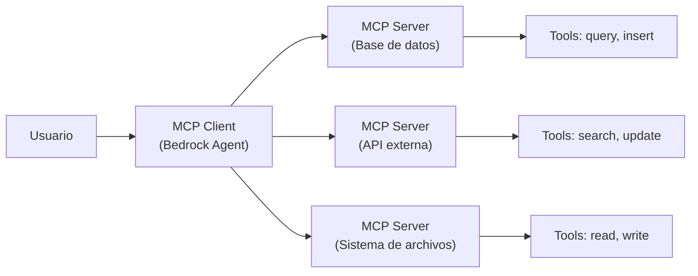

import { FaAws } from "react-icons/fa";

# Bedrock Agents y MCP <FaAws />

Esta sesion profundiza en dos temas clave del ecosistema de IA generativa en AWS: la integracion de Amazon Bedrock Agents con el **Model Context Protocol (MCP)** de Anthropic, y el examen oficial de preparacion de AWS Skill Builder para la certificacion AIF-C01.

## 1. Que es MCP (Model Context Protocol)

**Model Context Protocol (MCP)** es un protocolo abierto desarrollado y publicado por Anthropic que estandariza la forma en que las aplicaciones proporcionan contexto a los modelos de lenguaje grandes (LLMs). Antes de MCP, cada integracion entre un modelo de IA y una fuente de datos o herramienta externa requeria una implementacion personalizada, lo que generaba un ecosistema fragmentado y dificil de mantener.

MCP resuelve este problema estableciendo un estandar comun que cualquier aplicacion puede implementar para conectarse con modelos de IA de forma uniforme, independientemente del proveedor del modelo o del tipo de herramienta.

### La analogia del USB-C

La forma mas intuitiva de entender MCP es mediante una analogia: **MCP es como el USB-C para las aplicaciones de IA**. De la misma forma que USB-C proporciona un conector estandarizado para conectar dispositivos a una amplia variedad de perifericos y accesorios (monitores, discos duros, cargadores, etc.), MCP proporciona una interfaz estandarizada para conectar modelos de IA a diferentes fuentes de datos y herramientas.

Antes de USB-C, existian decenas de conectores diferentes (mini-USB, micro-USB, Lightning, DisplayPort, etc.) y cada combinacion de dispositivo y periferico requeria un cable especifico. MCP elimina esa misma fragmentacion en el mundo de la IA: en lugar de construir una integracion a medida para cada combinacion de modelo y herramienta, se implementa el protocolo MCP una sola vez y se obtiene compatibilidad con todo el ecosistema.

:::info Protocolo abierto
MCP es un protocolo abierto, lo que significa que cualquier empresa u organizacion puede implementarlo en sus productos. No esta limitado a los modelos de Anthropic; puede utilizarse con cualquier LLM que soporte el protocolo.
:::

## 2. Arquitectura de MCP

La arquitectura de MCP se compone de varios elementos que trabajan juntos para facilitar la comunicacion entre los modelos de IA y las herramientas externas:

### Clientes MCP (MCP Clients)

Los clientes MCP son las aplicaciones que albergan el modelo de IA y que necesitan conectarse a herramientas externas. Por ejemplo, un chatbot empresarial, un asistente de codigo o un agente de IA como Amazon Bedrock Agents. El cliente es el punto de entrada que recibe las solicitudes del usuario y coordina la interaccion con los servidores MCP.

### Servidores MCP (MCP Servers)

Los servidores MCP son los componentes que exponen las herramientas y fuentes de datos a los modelos de IA. Cada servidor implementa el protocolo MCP y ofrece un conjunto de capacidades especificas. Por ejemplo, un servidor MCP podria proporcionar acceso a una base de datos, a un sistema de archivos, a una API REST o a un servicio en la nube.

### Tools (Herramientas)

Las herramientas son las funcionalidades concretas que un servidor MCP expone al modelo. Cada herramienta tiene una descripcion, parametros de entrada y un tipo de salida bien definidos. El modelo puede decidir que herramienta invocar en funcion de la solicitud del usuario, similar a como un agente decide que accion tomar.

### Resources (Recursos)

Los recursos son fuentes de datos que el servidor MCP pone a disposicion del modelo como contexto adicional. A diferencia de las herramientas (que ejecutan acciones), los recursos proporcionan informacion que el modelo puede consultar para enriquecer sus respuestas.

## 3. MCP con Amazon Bedrock Agents

Amazon Bedrock Agents soporta la integracion con servidores MCP, lo que permite a los agentes conectarse a una amplia variedad de herramientas y fuentes de datos utilizando el protocolo estandarizado. Esta integracion amplifica significativamente las capacidades de los agentes, ya que pueden aprovechar cualquier servidor MCP existente sin necesidad de desarrollar integraciones personalizadas.

En la practica, esto significa que un Bedrock Agent puede:

- Conectarse a bases de datos empresariales a traves de servidores MCP
- Interactuar con APIs de terceros de forma estandarizada
- Acceder a sistemas de archivos y repositorios de documentos
- Utilizar herramientas especializadas desarrolladas por la comunidad

La combinacion de Bedrock Agents con MCP representa un avance importante hacia agentes de IA verdaderamente interoperables, capaces de operar en entornos empresariales complejos con multiples sistemas y fuentes de datos.

:::tip Recursos de referencia
Para profundizar en la integracion de MCP con Bedrock Agents, consulta los siguientes recursos:

- **Documentacion AWS**: [MCP and Amazon Bedrock](https://community.aws/content/2uFvyCPQt7KcMxD9ldsJyjZM1Wp/model-context-protocol-mcp-and-amazon-bedrock)
- **Blog AWS**: [Harness the power of MCP servers with Amazon Bedrock Agents](https://aws.amazon.com/es/blogs/machine-learning/harness-the-power-of-mcp-servers-with-amazon-bedrock-agents/)
- **Repositorio de ejemplos**: [amazon-bedrock-agent-samples](https://github.com/awslabs/amazon-bedrock-agent-samples)
- **Directorio de servidores MCP**: [mcp.so](https://mcp.so/)
:::

## 4. Examen oficial de preparacion en AWS Skill Builder

Ademas del contenido teorico sobre MCP y Bedrock Agents, esta sesion incluye la realizacion del examen de preparacion oficial de AWS Skill Builder para la certificacion AIF-C01.

| Parametro | Valor |
|-----------|-------|
| Curso | Exam Prep Official Pretest: AWS Certified AI Practitioner (AIF-C01) |
| Numero de preguntas | 65 |
| Tiempo disponible | 100 minutos |
| Puntuacion para aprobar | 70% |

Este examen de preparacion es proporcionado directamente por AWS y constituye la herramienta de evaluacion mas fiel al examen real. Las preguntas estan redactadas por el mismo equipo que crea el examen de certificacion oficial, por lo que el nivel de dificultad y el estilo de las preguntas son representativos de lo que encontraras en el examen real.

:::info Diferencia con los simulacros anteriores
A diferencia de los simulacros realizados en sesiones anteriores, este examen de preparacion es el recurso oficial de AWS. La puntuacion minima para aprobarlo es del 70%, que es tambien el umbral del examen real. Utiliza este resultado como indicador fiable de tu preparacion actual.
:::

## 5. Laboratorio: Financial Insights with Multimodal Agents

El laboratorio practico de esta sesion es **"AWS SimuLearn: Financial Insights with Multimodal Agents"**, disponible en AWS Skill Builder. Este laboratorio se centra en la construccion de agentes multimodales capaces de procesar y analizar informacion financiera a partir de multiples tipos de datos (texto, tablas, graficos, etc.).

Los agentes multimodales representan una evolucion importante respecto a los agentes basados unicamente en texto, ya que pueden comprender y razonar sobre informacion presentada en diferentes formatos. En el contexto financiero, esto significa que un agente puede analizar simultaneamente informes en PDF, hojas de calculo con datos numericos y graficos de tendencias para generar insights coherentes.

Este laboratorio refuerza varios conceptos clave para el examen:

- **Procesamiento multimodal**: como los modelos manejan diferentes tipos de entrada
- **Agentes autonomos**: como un agente descompone tareas complejas en pasos manejables
- **Aplicaciones empresariales de IA**: casos de uso reales de IA generativa en el sector financiero

---

## Resumen

Esta sesion cubre el Model Context Protocol (MCP) como estandar de interoperabilidad para aplicaciones de IA, su integracion con Amazon Bedrock Agents, el examen oficial de preparacion de AWS Skill Builder y un laboratorio practico con agentes multimodales aplicados al analisis financiero.
