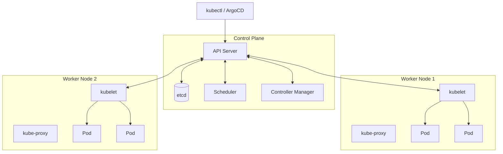

import { SiKubernetes } from "react-icons/si";

# Conceptos Básicos de Kubernetes

Kubernetes <SiKubernetes /> es la plataforma sobre la que operamos en este curso. Si vienes con experiencia previa de CE2/RA2, este material te servirá de repaso y referencia. Si es tu primer contacto, léelo despacio: estos conceptos son el lenguaje que usaremos durante todo el curso.

---

## 1. ¿Qué es Kubernetes?

Kubernetes (K8s) es una **plataforma de orquestación de contenedores** de código abierto, originalmente desarrollada por Google y donada a la CNCF en 2014. En términos prácticos, es el sistema que se encarga de ejecutar tus contenedores, mantenerlos vivos y gestionar su ciclo de vida a escala.

### El modelo declarativo

Lo que diferencia a Kubernetes de otros sistemas es su **naturaleza declarativa**. Tú no le dices a Kubernetes *cómo* hacer las cosas. Le dices *qué quieres que ocurra* y Kubernetes trabaja continuamente para que el estado real del sistema coincida con el estado deseado que has declarado.

```
Tú declaras:  "Quiero 3 réplicas de mi aplicación corriendo"
K8s hace:     Lanza 3 pods. Si uno muere, lanza otro. Siempre.
```

### ¿Por qué es la base de GitOps?

GitOps y Kubernetes encajan perfectamente porque ambos son declarativos:

- En Git almacenas manifiestos YAML que describen el **estado deseado**
- Kubernetes trabaja continuamente para alcanzar ese estado deseado
- ArgoCD/Flux actúan como el puente: leen Git y aplican los manifiestos a Kubernetes

El resultado es un sistema donde Git manda, Kubernetes obedece, y cualquier divergencia se corrige automáticamente.

---

## 2. Arquitectura

Kubernetes sigue una arquitectura de **control plane + worker nodes**. El control plane toma decisiones sobre el clúster, y los worker nodes ejecutan las cargas de trabajo.

### Control Plane

| Componente | Función |
|------------|---------|
| **API Server** | Punto de entrada para todas las operaciones. Todo (kubectl, ArgoCD, CI/CD) habla con el API Server. |
| **etcd** | Base de datos distribuida key-value donde se almacena todo el estado del clúster. La fuente de verdad de K8s. |
| **Scheduler** | Decide en qué nodo ejecutar cada pod según recursos disponibles, afinidades y restricciones. |
| **Controller Manager** | Ejecuta los controladores (Deployment, ReplicaSet, etc.) que reconcilian el estado deseado con el real. |

### Worker Nodes

| Componente | Función |
|------------|---------|
| **kubelet** | Agente que corre en cada nodo. Recibe instrucciones del API Server y gestiona los contenedores. |
| **kube-proxy** | Gestiona las reglas de red en cada nodo para implementar los Services de Kubernetes. |
| **Container Runtime** | Ejecuta los contenedores (containerd, CRI-O). Docker ya no se usa directamente. |

### Diagrama de arquitectura



---

## 3. Los recursos principales

En Kubernetes, todo es un **recurso** definido en YAML. Estos son los recursos con los que trabajarás constantemente:

### Pod

El **Pod** es la unidad mínima de despliegue en Kubernetes. Un Pod contiene uno o más contenedores que comparten red y almacenamiento. En la práctica, casi nunca creas Pods directamente — los gestiona el Deployment.

```yaml
apiVersion: v1
kind: Pod
metadata:
  name: mi-app
  namespace: default
spec:
  containers:
  - name: app
    image: nginx:1.25
    ports:
    - containerPort: 80
    resources:
      requests:
        memory: "64Mi"
        cpu: "250m"
      limits:
        memory: "128Mi"
        cpu: "500m"
```

:::info requests vs limits
- **requests**: lo que el Scheduler usa para decidir en qué nodo colocar el pod. El contenedor está garantizado de obtener esto.
- **limits**: el máximo que puede consumir. Si lo supera, el contenedor es terminado (OOMKilled) o throttled.

Siempre define ambos en producción.
:::

### Deployment

El **Deployment** es el recurso más común para aplicaciones stateless. Gestiona un conjunto de Pods idénticos, garantiza que el número deseado esté siempre corriendo, y facilita actualizaciones rolling sin downtime.

```yaml
apiVersion: apps/v1
kind: Deployment
metadata:
  name: mi-app
  namespace: default
spec:
  replicas: 3
  selector:
    matchLabels:
      app: mi-app
  template:
    metadata:
      labels:
        app: mi-app
    spec:
      containers:
      - name: app
        image: ghcr.io/salvamiguel/mi-app:v1.2.0
        ports:
        - containerPort: 3000
```

Cuando cambias la imagen (`v1.2.0` → `v1.3.0`), el Deployment crea nuevos Pods con la nueva imagen mientras mantiene los antiguos funcionando, luego los va eliminando. Eso es un **rolling update**.

### Service

Los Pods tienen IPs efímeras que cambian cuando se reinician. El **Service** proporciona una IP estable y un DNS name para acceder a un conjunto de Pods, seleccionándolos por labels.

```yaml
apiVersion: v1
kind: Service
metadata:
  name: mi-app
spec:
  selector:
    app: mi-app
  ports:
  - port: 80
    targetPort: 3000
  type: ClusterIP  # también: NodePort, LoadBalancer
```

| Tipo | Uso |
|------|-----|
| `ClusterIP` | Solo accesible dentro del clúster (comunicación entre servicios) |
| `NodePort` | Expone el servicio en un puerto del nodo (útil en desarrollo) |
| `LoadBalancer` | Crea un load balancer externo (cloud providers) |
| `Ingress` | Enrutamiento HTTP/HTTPS basado en hostname/path (no es un Service, es su propio recurso) |

### ConfigMap y Secret

Separa la configuración del código. No hardcodees URLs, puertos o credenciales en la imagen del contenedor.

**ConfigMap** — para configuración no sensible:

```yaml
apiVersion: v1
kind: ConfigMap
metadata:
  name: mi-app-config
data:
  DATABASE_URL: "postgres://db:5432/mydb"
  LOG_LEVEL: "info"
```

**Secret** — para datos sensibles (base64 encoded, no cifrado):

```yaml
apiVersion: v1
kind: Secret
metadata:
  name: mi-app-secret
type: Opaque
data:
  API_KEY: dGhpcyBpcyBub3QgYSByZWFsIGtleQ==  # base64
```

:::warning Los Secrets de Kubernetes no son seguros por defecto
`base64` es codificación, no cifrado. Cualquiera con acceso a etcd puede leer los secrets. Para GitOps, nunca comitas Secrets en texto plano. Usa **Sealed Secrets**, **External Secrets Operator** o **Vault**.
:::

---

## 4. Namespaces

Los **Namespaces** son la forma de dividir un clúster en espacios virtuales aislados. Permiten que múltiples equipos o entornos coexistan en el mismo clúster con límites de acceso y recursos independientes.

```bash
# Crear namespaces para diferentes entornos
kubectl create namespace dev
kubectl create namespace staging
kubectl create namespace prod

# Trabajar en un namespace específico
kubectl get pods -n dev
kubectl get all -n argocd

# Ver todos los recursos de todos los namespaces
kubectl get pods --all-namespaces
kubectl get pods -A   # forma corta
```

En GitOps, es común tener:

```
clúster/
├── namespace: argocd          # herramienta de GitOps
├── namespace: cert-manager    # gestión de certificados TLS
├── namespace: ingress-nginx   # ingress controller
├── namespace: dev             # entorno de desarrollo
├── namespace: staging         # entorno de staging
└── namespace: prod            # entorno de producción
```

---

## 5. kubectl: comandos esenciales

`kubectl` es la CLI para interactuar con el clúster. En GitOps, la usarás principalmente para observar y diagnosticar — los cambios deben ir por Git, no por `kubectl apply` manual.

```bash
# Ver recursos
kubectl get pods
kubectl get deployments
kubectl get services
kubectl get all -n mi-namespace

# Salida detallada con más información
kubectl get pods -o wide

# Salida en YAML (ver el estado real del recurso)
kubectl get deployment mi-app -o yaml

# Describir un recurso (eventos, condiciones, configuración)
# Muy útil para diagnosticar pods que no arrancan
kubectl describe pod mi-pod-abc123
kubectl describe node worker-1

# Logs del contenedor
kubectl logs mi-pod-abc123
kubectl logs -f mi-pod-abc123   # follow (como tail -f)
kubectl logs mi-pod-abc123 --previous  # logs del contenedor anterior (si crasheó)

# Ejecutar comando en un pod (debugging)
kubectl exec -it mi-pod-abc123 -- /bin/sh
kubectl exec -it mi-pod-abc123 -- bash

# Aplicar manifiestos (lo que hace ArgoCD automáticamente)
kubectl apply -f deployment.yaml
kubectl apply -f k8s/          # aplicar todos los YAMLs de un directorio

# Borrar recursos
kubectl delete -f deployment.yaml
kubectl delete pod mi-pod-abc123

# Port-forward: acceder a un servicio interno desde tu máquina
kubectl port-forward svc/mi-app 8080:80
kubectl port-forward pod/mi-pod-abc123 8080:3000
```

### Flujo de diagnóstico habitual

```bash
# 1. Ver el estado general
kubectl get pods -n mi-namespace

# 2. Si hay un pod en CrashLoopBackOff o Error
kubectl describe pod <nombre> -n mi-namespace

# 3. Ver los logs
kubectl logs <nombre> -n mi-namespace

# 4. Si el pod no arranca, ver eventos del namespace
kubectl get events -n mi-namespace --sort-by=.lastTimestamp
```

---

## 6. Labels y Selectors

Los **labels** son pares clave-valor que se asignan a cualquier recurso de Kubernetes. Son el mecanismo principal de organización y selección.

```yaml
metadata:
  labels:
    app: mi-app
    version: v1.2.0
    environment: production
    tier: backend
```

Los **selectors** son consultas que filtran recursos por sus labels:

```yaml
# En un Service: selecciona los pods con app=mi-app
spec:
  selector:
    app: mi-app

# En kubectl: filtrar por label
kubectl get pods -l app=mi-app
kubectl get pods -l environment=production,tier=backend
```

Los labels conectan los recursos entre sí:
- Un **Service** encuentra sus Pods por labels
- Un **Deployment** gestiona los Pods que matchean su selector
- Las **Network Policies** aplican a Pods por labels
- ArgoCD usa labels para organizar sus Applications

---

## 7. Clúster local para desarrollo

Para el curso necesitas un clúster de Kubernetes local. Hay dos opciones principales:

```bash
# kind (Kubernetes in Docker) — recomendado para el curso
brew install kind
kind create cluster --name edem-gitops

# Crear un clúster con múltiples nodos (más realista)
cat <<EOF | kind create cluster --name edem-gitops --config=-
kind: Cluster
apiVersion: kind.x-k8s.io/v1alpha4
nodes:
- role: control-plane
- role: worker
- role: worker
EOF

# Ver los clústeres kind disponibles
kind get clusters

# Eliminar el clúster cuando no lo necesites
kind delete cluster --name edem-gitops
```

```bash
# minikube — alternativa
brew install minikube
minikube start --memory=4096 --cpus=2

# Habilitar addons útiles
minikube addons enable ingress
minikube addons enable metrics-server

# Parar y arrancar sin perder datos
minikube stop
minikube start
```

```bash
# Verificar que el clúster está funcionando
kubectl cluster-info
kubectl get nodes
kubectl get pods -A   # ver todos los pods del sistema
```

:::tip Para el curso
Se usará **kind** como clúster local. Es más ligero, se integra bien con Docker y permite crear clústeres multi-nodo fácilmente. Asegúrate de tener al menos **8GB de RAM** disponibles y Docker Desktop corriendo antes de empezar.

Si tienes menos de 8GB de RAM, puedes usar un clúster single-node:
```bash
kind create cluster --name edem-gitops
```
:::

---

## Recursos adicionales

- [Kubernetes Documentation](https://kubernetes.io/es/docs/home/) — documentación oficial en español
- [kubectl Cheat Sheet](https://kubernetes.io/docs/reference/kubectl/cheatsheet/) — referencia rápida de comandos
- [Play with Kubernetes](https://labs.play-with-k8s.com/) — clúster de prueba online gratuito
- [Kubernetes The Hard Way](https://github.com/kelseyhightower/kubernetes-the-hard-way) — para entender qué hay debajo

import LabActions from '@site/src/components/shared/LabActions';

<LabActions repo="https://github.com/salvamiguel/materials" codespace={true} />
