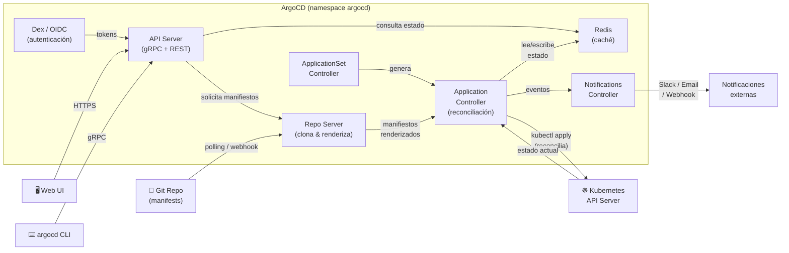

import LabActions from '@site/src/components/shared/LabActions';
import Drawio from '@theme/Drawio';
import argoArchitecture from '!!raw-loader!./argo.drawio';
import { SiArgo } from "react-icons/si";

# ArgoCD: Implementación GitOps 

ArgoCD <SiArgo /> es el controlador GitOps más usado en el ecosistema Kubernetes. Se instala dentro del clúster, observa repositorios Git y reconcilia continuamente el estado deseado (Git) con el estado real del clúster.

## 1. ¿Qué es ArgoCD?

ArgoCD es un **controlador de entrega continua declarativo** para Kubernetes que sigue el patrón GitOps de forma nativa.

Su funcionamiento se basa en tres principios:

- **Observa Git**: hace polling o recibe webhooks de tu repositorio de configuración.
- **Compara estados**: detecta diferencias entre lo que hay en Git y lo que hay en el clúster.
- **Reconcilia**: aplica los cambios necesarios para que el clúster coincida con Git.

<Drawio content={argoArchitecture} />

:::info Arquitectura interna
ArgoCD se compone de varios servicios: el **Application Controller** (reconciliación), el **API Server** (CLI y UI), el **Repository Server** (clona y renderiza manifiestos) y **Redis** (caché de estado).
:::

<details>
<summary>Ver versión detallada</summary>



</details>


## 2. Instalación en clúster local

La instalación oficial se realiza aplicando el manifiesto estable publicado en el repositorio de ArgoCD:

```bash
# Crear namespace dedicado
kubectl create namespace argocd

# Instalar ArgoCD (versión estable)
kubectl apply -n argocd -f \
  https://raw.githubusercontent.com/argoproj/argo-cd/stable/manifests/install.yaml

# Esperar a que todos los pods estén Running
kubectl wait --for=condition=Ready pods --all -n argocd --timeout=120s
```

Una vez instalado, expón la UI localmente con port-forward:

```bash
# Acceder a la UI en https://localhost:8080
kubectl port-forward svc/argocd-server -n argocd 8080:443
```

Obtén la contraseña del admin inicial:

```bash
kubectl -n argocd get secret argocd-initial-admin-secret \
  -o jsonpath="{.data.password}" | base64 -d && echo
```

:::tip Cambia la contraseña inicial
Tras el primer login, cambia la contraseña desde la UI o con `argocd account update-password`. El secret `argocd-initial-admin-secret` puede eliminarse una vez cambiada.
:::

:::warning HTTPS con certificado autofirmado
La UI de ArgoCD usa HTTPS con un certificado autofirmado. El navegador mostrará un aviso de seguridad — puedes aceptarlo en local. En producción, configura un certificado real con cert-manager.
:::

## 3. El recurso Application

El recurso central de ArgoCD es el `Application`. Define **qué desplegar**, **desde dónde** y **hacia dónde**:

```yaml
apiVersion: argoproj.io/v1alpha1
kind: Application
metadata:
  name: mi-app
  namespace: argocd          # Siempre en el namespace de ArgoCD
spec:
  project: default           # Proyecto ArgoCD (control de acceso y políticas)

  source:
    repoURL: https://github.com/salvamiguel/materials
    targetRevision: HEAD     # Branch, tag o commit SHA
    path: k8s/overlays/dev   # Directorio dentro del repo con los manifiestos

  destination:
    server: https://kubernetes.default.svc   # Clúster destino (local en este caso)
    namespace: mi-app-dev                    # Namespace donde se despliegan los recursos

  syncPolicy:
    automated:
      prune: true      # Elimina recursos borrados de Git
      selfHeal: true   # Corrige cambios manuales (drift)
    syncOptions:
      - CreateNamespace=true   # Crea el namespace si no existe
```

**Desglose de campos:**

| Campo | Descripción |
|-------|-------------|
| `project` | Agrupa aplicaciones y aplica políticas RBAC |
| `source.repoURL` | URL del repositorio Git (HTTPS o SSH) |
| `source.targetRevision` | `HEAD` sigue la rama; también acepta tags (`v1.2.0`) o SHAs |
| `source.path` | Directorio con los manifiestos Kubernetes |
| `destination.server` | URL del API server del clúster destino |
| `destination.namespace` | Namespace donde se crean los recursos |
| `syncPolicy.automated` | Activa la sincronización automática sin intervención manual |
| `prune` | Si está en `true`, borra recursos que ya no están en Git |
| `selfHeal` | Revierte cambios manuales en el clúster (anti-drift) |
| `CreateNamespace` | No falla si el namespace de destino no existe aún |

:::info Sync manual por defecto
Sin `syncPolicy.automated`, ArgoCD detecta diferencias pero no las aplica. Requiere sync manual desde la UI o CLI. Esto es habitual en producción para mayor control.
:::

## 4. Sincronización: automática vs manual

### Sincronización automática

Con `automated: {}` activado, ArgoCD aplica cambios en cuanto los detecta en Git (polling cada ~3 minutos, o inmediatamente con webhook configurado).

```yaml
syncPolicy:
  automated:
    prune: true
    selfHeal: true
```

- **`prune: true`**: si eliminas un `Deployment` de Git, ArgoCD lo borra del clúster. Sin esta opción, los recursos huérfanos permanecen indefinidamente.
- **`selfHeal: true`**: si alguien hace `kubectl edit` directamente sobre el clúster, ArgoCD lo detecta y revierte al estado de Git. Es el núcleo del patrón GitOps.

### Sincronización manual

Útil cuando se quiere revisión humana antes de aplicar, especialmente en producción:

```yaml
syncPolicy: {}  # Sin automated — el sync solo ocurre cuando se ordena
```

Se lanza desde la UI (botón **Sync**) o desde la CLI:

```bash
argocd app sync mi-app
```

:::tip Cuándo usar sync manual
En producción crítica, muchos equipos prefieren sync manual con aprobación de un SRE. En dev/staging, el sync automático acelera el ciclo de feedback sin fricciones.
:::

## 5. Health checks y Sync Status

ArgoCD expone dos dimensiones de estado independientes para cada aplicación:

### Sync Status

| Estado | Significado |
|--------|-------------|
| `Synced` | El clúster coincide exactamente con Git |
| `OutOfSync` | Hay diferencias entre Git y lo que hay desplegado |
| `Unknown` | No se puede determinar el estado (error de acceso al repo o clúster) |

### Health Status

| Estado | Significado |
|--------|-------------|
| `Healthy` | Todos los recursos funcionan correctamente |
| `Progressing` | Recursos arrancando (pods iniciando, rollout en curso) |
| `Degraded` | Algún recurso ha fallado (`CrashLoopBackOff`, `ImagePullBackOff`, etc.) |
| `Missing` | El recurso no existe en el clúster pero sí está definido en Git |
| `Suspended` | Recurso pausado intencionadamente (ej. CronJob suspendido) |

ArgoCD incluye health checks nativos para `Deployment`, `StatefulSet`, `DaemonSet`, `Service`, `Ingress`, `PVC` y otros tipos estándar. Para recursos custom (CRDs), puedes definir **Custom Health Checks** en Lua.

## 6. Gestión de Secrets

:::danger Nunca pongas secrets en Git en texto plano
Git conserva el historial completo. Si haces commit de un secret, aunque lo borres en un commit posterior, el valor queda expuesto para siempre en el historial. Herramientas como `git-secrets` o `trufflehog` pueden detectar estas fugas.
:::

Las soluciones más habituales para gestionar secrets con GitOps son:

### Sealed Secrets (Bitnami)
Cifra el secret con la clave pública del clúster. El YAML cifrado es seguro para subir a Git. Solo el clúster (que tiene la clave privada) puede descifrarlo.

```bash
# Cifrar un secret existente con kubeseal
kubectl create secret generic mi-secret \
  --from-literal=password=supersecreta \
  --dry-run=client -o yaml | kubeseal -o yaml > mi-sealed-secret.yaml

# El archivo resultante es seguro para commitear
git add mi-sealed-secret.yaml && git commit -m "feat: add sealed secret"
```

### External Secrets Operator
Sincroniza secrets desde un proveedor externo (AWS Secrets Manager, GCP Secret Manager, HashiCorp Vault, Azure Key Vault) hacia Kubernetes Secrets de forma automática.

### Vault Agent Injector (HashiCorp)
Inyecta secrets de Vault directamente en los pods como variables de entorno o archivos montados, sin que los valores pasen por Kubernetes Secrets.

:::tip Recomendación para el curso
Para los laboratorios usaremos **Sealed Secrets** por su simplicidad. En entornos empresariales, **External Secrets Operator** integrado con AWS Secrets Manager o GCP Secret Manager es el patrón más adoptado.
:::

## 7. ApplicationSets

`ApplicationSet` es un recurso que genera múltiples `Application` de forma programática a partir de una plantilla. Es la solución para gestionar docenas de aplicaciones o clústeres desde una sola definición.

```yaml
apiVersion: argoproj.io/v1alpha1
kind: ApplicationSet
metadata:
  name: mis-apps-por-entorno
  namespace: argocd
spec:
  generators:
  - list:
      elements:
      - cluster: dev
        url: https://dev.k8s.example.com
      - cluster: staging
        url: https://staging.k8s.example.com
      - cluster: prod
        url: https://prod.k8s.example.com
  template:
    metadata:
      name: '{{cluster}}-mi-app'
    spec:
      project: default
      source:
        repoURL: https://github.com/salvamiguel/materials
        targetRevision: HEAD
        path: 'k8s/overlays/{{cluster}}'
      destination:
        server: '{{url}}'
        namespace: mi-app
      syncPolicy:
        automated:
          prune: true
          selfHeal: true
```

Con este `ApplicationSet`, ArgoCD crea automáticamente tres `Application` (una por entorno). Los generadores disponibles incluyen: `List`, `Git` (directorios del repo), `Cluster`, `Matrix` y `Merge`.

## 8. CLI de ArgoCD

La CLI de ArgoCD permite gestionar todo desde la terminal sin tocar la UI:

```bash
# Autenticarse contra el servidor ArgoCD
argocd login localhost:8080 --username admin --insecure

# Listar todas las aplicaciones con su estado
argocd app list

# Ver el estado detallado de una app
argocd app get mi-app

# Sincronizar manualmente una app
argocd app sync mi-app

# Ver el historial de despliegues (con IDs de revisión)
argocd app history mi-app

# Hacer rollback a una revisión anterior (usar el ID del historial)
argocd app rollback mi-app 2

# Ver diferencias entre Git y el estado actual del clúster
argocd app diff mi-app

# Crear una Application directamente desde la CLI
argocd app create mi-app \
  --repo https://github.com/salvamiguel/materials \
  --path k8s/overlays/dev \
  --dest-server https://kubernetes.default.svc \
  --dest-namespace mi-app-dev \
  --sync-policy automated

# Eliminar una Application sin borrar los recursos del clúster
argocd app delete mi-app --cascade=false
```

:::info Instalación de la CLI
```bash
# macOS
brew install argocd

# Linux
curl -sSL -o argocd \
  https://github.com/argoproj/argo-cd/releases/latest/download/argocd-linux-amd64
chmod +x argocd && sudo mv argocd /usr/local/bin/
```
:::
