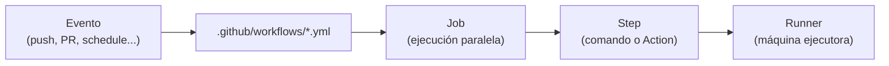
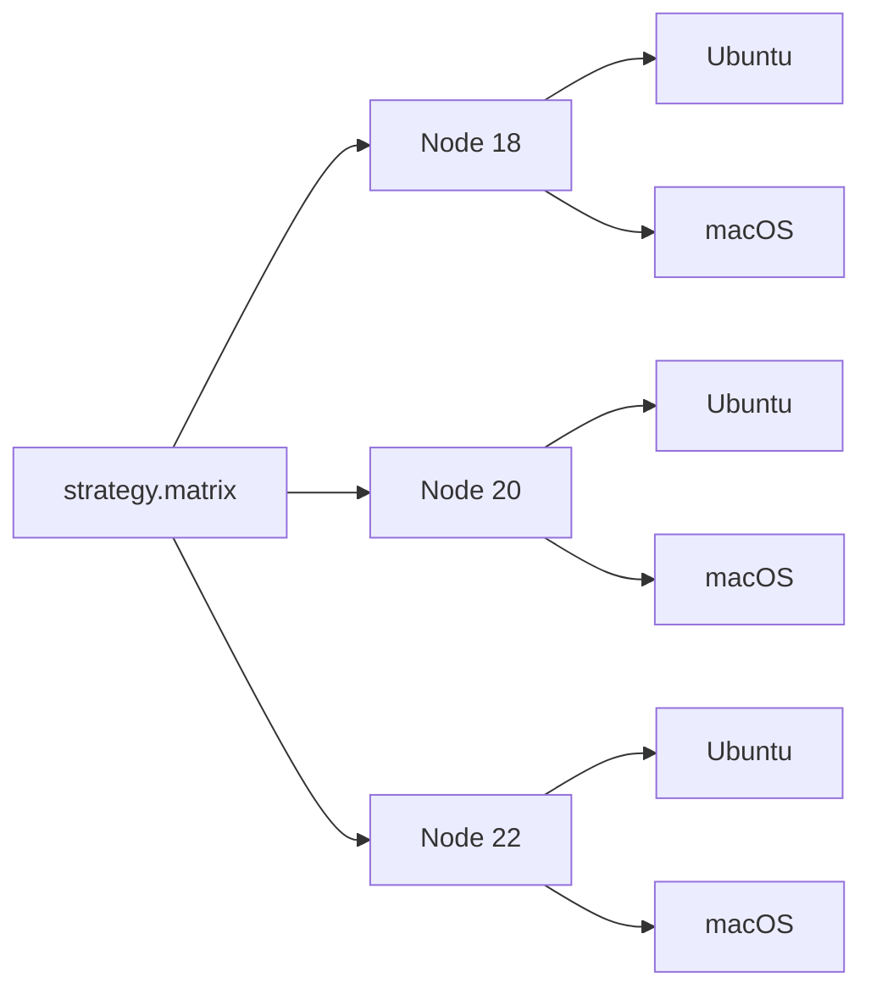
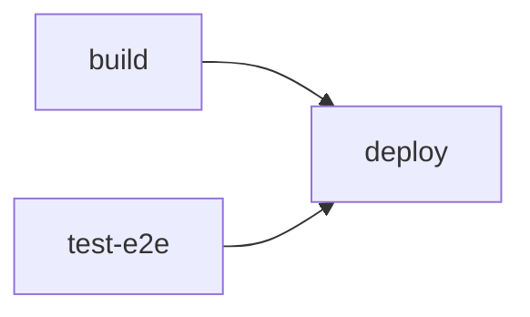
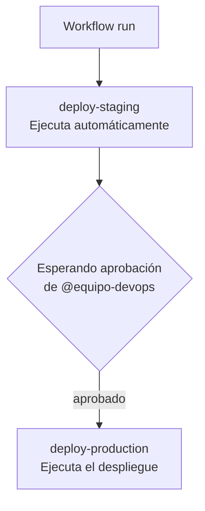

import GitOpsFlow from '@site/src/components/demos/gitops/GitOpsFlow';
import GHActionsAnatomy from '@site/src/components/demos/gitops/GHActionsAnatomy';
import { SiGithubactions } from "react-icons/si";

# GitHub Actions: Pipelines CI/CD

GitHub Actions <SiGithubactions /> es la plataforma de automatización nativa de GitHub que permite construir pipelines de CI/CD directamente en el repositorio, sin necesidad de herramientas externas como Jenkins o CircleCI.

---

## 1. ¿Qué es GitHub Actions?

GitHub Actions es una **plataforma de automatización basada en eventos** integrada en GitHub. Cada vez que ocurre algo en el repositorio (un push, una pull request, la creación de un issue...) GitHub puede ejecutar automáticamente un conjunto de tareas definidas en archivos YAML.

### Arquitectura: de evento a runner



| Concepto | Descripción |
|---|---|
| **Event** | Acción que dispara el workflow: `push`, `pull_request`, `schedule`, etc. |
| **Workflow** | Archivo YAML en `.github/workflows/` que define la automatización completa. |
| **Job** | Grupo de steps que se ejecutan en el mismo runner. Los jobs son paralelos por defecto. |
| **Step** | Unidad mínima: un comando de shell (`run`) o una Action reutilizable (`uses`). |
| **Runner** | Máquina virtual (Linux, Windows, macOS) donde se ejecutan los jobs. GitHub ofrece runners gratuitos. |

:::info Filosofía GitOps
En GitOps, **el repositorio es la fuente de verdad**. GitHub Actions hace que cualquier cambio en el repo desencadene automáticamente el despliegue al entorno correspondiente. No hay intervención manual fuera del repositorio.
:::

<GitOpsFlow />


---

## 2. Anatomía de un Workflow

El siguiente ejemplo es un pipeline de CI completo para una aplicación Node.js. Haz clic en cada sección del código para explorar qué hace y por qué.

<GHActionsAnatomy />

### Desglose de las claves principales

| Clave | Nivel | Descripción |
|---|---|---|
| `on` | Workflow | Define qué eventos disparan el workflow. Puede ser un string, lista o mapa con filtros. |
| `jobs` | Workflow | Mapa de todos los jobs del workflow. Clave = ID del job. |
| `runs-on` | Job | Sistema operativo del runner: `ubuntu-latest`, `windows-latest`, `macos-latest`. |
| `steps` | Job | Lista ordenada de pasos. Se ejecutan secuencialmente en el mismo runner. |
| `uses` | Step | Referencia a una Action externa o reutilizable. Formato: `owner/repo@ref`. |
| `run` | Step | Comando de shell. Por defecto usa `bash` en Linux/macOS y `pwsh` en Windows. |
| `with` | Step | Parámetros de entrada para una Action (equivale a argumentos de función). |
| `name` | Step/Job | Nombre descriptivo que aparece en los logs de GitHub Actions. |

:::tip
Siempre fija las versiones de las Actions con `@v4`, `@v5`, etc. — nunca uses `@main` o `@latest` en producción. Un cambio en la Action podría romper tu pipeline sin aviso.
:::

---

## 3. Eventos y Triggers

Los eventos (`on`) controlan cuándo se ejecuta un workflow. Pueden ser eventos del repositorio, programados o manuales.

### Tabla de eventos principales

| Evento | Cuándo se dispara | Uso típico |
|---|---|---|
| `push` | Al hacer push de commits o tags | CI en cada commit |
| `pull_request` | Al abrir, sincronizar o cerrar una PR | Validación antes de merge |
| `workflow_dispatch` | Manualmente desde la UI o la API | Despliegues manuales |
| `schedule` | Por cron, independientemente de commits | Tests nocturnos, backups |
| `repository_dispatch` | Via API externa (webhook personalizado) | Integración con sistemas externos |

### Ejemplos YAML

**`push` con filtros de rama y path:**
```yaml
on:
  push:
    branches:
      - main
      - 'release/**'    # Glob: cualquier rama release/x.y.z
    paths:
      - 'src/**'        # Solo si cambia algo dentro de src/
      - 'package.json'
```

**`pull_request` con tipos de actividad:**
```yaml
on:
  pull_request:
    branches: [main]
    types: [opened, synchronize, reopened]
```

**`workflow_dispatch` con inputs:**
```yaml
on:
  workflow_dispatch:
    inputs:
      environment:
        description: 'Entorno de despliegue'
        required: true
        default: 'staging'
        type: choice
        options: [staging, production]
      dry_run:
        description: 'Ejecutar en modo dry-run'
        type: boolean
        default: false
```

**`schedule` con expresión cron:**
```yaml
on:
  schedule:
    # Todos los días laborables a las 02:00 UTC
    - cron: '0 2 * * 1-5'
```

**`repository_dispatch` para integración externa:**
```yaml
on:
  repository_dispatch:
    types: [deploy-triggered]   # Tipo personalizado enviado via API
```

```bash
# Llamada a la API para disparar el evento
curl -X POST \
  -H "Authorization: token $GITHUB_TOKEN" \
  -H "Content-Type: application/json" \
  https://api.github.com/repos/OWNER/REPO/dispatches \
  -d '{"event_type": "deploy-triggered", "client_payload": {"version": "1.2.3"}}'
```

:::note
El evento `pull_request` ejecuta el workflow con los permisos del **fork** (lectura), no del repositorio base. Para workflows que necesitan escribir (comentarios, despliegues), usa `pull_request_target` con cuidado.
:::

---

## 4. Actions del Marketplace

El Marketplace de GitHub tiene miles de Actions reutilizables. Estas son las más importantes para cualquier pipeline moderno:

### `actions/checkout@v5`

Descarga el código del repositorio en el runner. Es el primer step de casi cualquier job.

```yaml
- uses: actions/checkout@v5
  with:
    # Por defecto descarga la rama/commit del evento
    fetch-depth: 0          # Historial completo (necesario para algunos tools)
    ref: ${{ github.sha }}  # SHA exacto del commit
```

### `actions/setup-node@v4`

Instala y configura una versión específica de Node.js.

```yaml
- uses: actions/setup-node@v4
  with:
    node-version: 20
    cache: 'npm'            # Cachea node_modules automáticamente
```

### `actions/cache@v4`

Caché manual para dependencias o builds costosos.

```yaml
- uses: actions/cache@v4
  with:
    path: ~/.m2/repository
    key: ${{ runner.os }}-maven-${{ hashFiles('**/pom.xml') }}
    restore-keys: |
      ${{ runner.os }}-maven-
```

### `actions/upload-artifact@v4` y `download-artifact@v4`

Comparten archivos entre jobs del mismo workflow.

```yaml
# En el job de build:
- uses: actions/upload-artifact@v4
  with:
    name: build-output
    path: dist/
    retention-days: 7

# En el job de deploy:
- uses: actions/download-artifact@v4
  with:
    name: build-output
    path: dist/
```

### `docker/build-push-action@v6`

Construye y sube imágenes Docker a cualquier registry (Docker Hub, GHCR, ECR...).

```yaml
- uses: docker/setup-buildx-action@v3

- uses: docker/login-action@v3
  with:
    registry: ghcr.io
    username: ${{ github.actor }}
    password: ${{ secrets.GITHUB_TOKEN }}

- uses: docker/build-push-action@v6
  with:
    context: .
    push: true
    tags: ghcr.io/${{ github.repository }}:${{ github.sha }}
    cache-from: type=gha
    cache-to: type=gha,mode=max
```

---

## 5. Secrets y Variables de Entorno

GitHub Actions distingue entre **secrets** (valores sensibles, cifrados) y **variables** (valores de configuración, visibles).

### Secrets: valores sensibles

Los secrets se configuran en `Settings → Secrets and variables → Actions` del repositorio u organización. Son cifrados y nunca aparecen en los logs.

```yaml
- name: Push to Docker Hub
  env:
    DOCKER_TOKEN: ${{ secrets.DOCKER_TOKEN }}
  run: echo "$DOCKER_TOKEN" | docker login -u myuser --password-stdin
```

### Variables: valores de configuración

Las variables son visibles en los logs y se usan para configuración no sensible.

```yaml
- name: Set environment
  run: echo "DEPLOY_ENV=${{ vars.ENVIRONMENT }}" >> $GITHUB_ENV

- name: Use variable
  run: echo "Desplegando en $DEPLOY_ENV"
```

### `GITHUB_TOKEN`: el token automático

GitHub genera automáticamente un token con permisos limitados al repositorio para cada ejecución del workflow. No necesitas configurar nada.

```yaml
- uses: peaceiris/actions-gh-pages@v4
  with:
    github_token: ${{ secrets.GITHUB_TOKEN }}
    publish_dir: ./build
```

Puedes ajustar los permisos del token en el workflow:

```yaml
permissions:
  contents: write       # Para hacer push
  packages: write       # Para subir a GHCR
  pull-requests: write  # Para comentar en PRs
```

### Variables de entorno del sistema

GitHub expone variables de entorno predefinidas en todos los runners:

```yaml
- run: |
    echo "Repositorio: $GITHUB_REPOSITORY"
    echo "Rama: $GITHUB_REF_NAME"
    echo "SHA: $GITHUB_SHA"
    echo "Actor: $GITHUB_ACTOR"
    echo "Run ID: $GITHUB_RUN_ID"
```

:::warning Inyección de comandos
**Nunca** uses `${{ github.event.* }}` directamente dentro de un `run:`. Los datos de eventos pueden contener caracteres maliciosos que se ejecutarían en el shell.

```yaml
# PELIGROSO - nunca hagas esto:
- run: echo "PR title: ${{ github.event.pull_request.title }}"

# SEGURO - pasa el valor como variable de entorno:
- name: Print PR title
  env:
    PR_TITLE: ${{ github.event.pull_request.title }}
  run: echo "PR title: $PR_TITLE"
```

Esto se aplica a cualquier dato de entrada externa: títulos de PR, nombres de ramas, mensajes de commit, etc.
:::

---

## 6. Matrices de Ejecución

Las matrices (`strategy.matrix`) permiten ejecutar el mismo job con diferentes combinaciones de parámetros. Ideal para testear en múltiples versiones o sistemas operativos.

```yaml
jobs:
  test:
    name: Test (Node ${{ matrix.node-version }} / ${{ matrix.os }})
    runs-on: ${{ matrix.os }}

    strategy:
      fail-fast: false        # No cancelar otros jobs si uno falla
      matrix:
        node-version: [18, 20, 22]
        os: [ubuntu-latest, macos-latest]

    steps:
      - uses: actions/checkout@v5
      - uses: actions/setup-node@v4
        with:
          node-version: ${{ matrix.node-version }}
      - run: npm ci
      - run: npm test
```

Con esta configuración, GitHub Actions genera **6 jobs en paralelo** (3 versiones × 2 sistemas operativos):



### Exclusiones e inclusiones

```yaml
strategy:
  matrix:
    node-version: [18, 20, 22]
    os: [ubuntu-latest, windows-latest, macos-latest]
    exclude:
      # No testear Node 18 en macOS (costoso y no prioritario)
      - os: macos-latest
        node-version: 18
    include:
      # Añadir una combinación especial con variable extra
      - os: ubuntu-latest
        node-version: 20
        coverage: true
```

---

## 7. Caché de Dependencias

La caché reduce el tiempo de ejecución evitando descargar dependencias en cada run.

```yaml
- uses: actions/cache@v4
  with:
    path: ~/.npm                                           # Qué cachear
    key: ${{ runner.os }}-node-${{ hashFiles('**/package-lock.json') }}
    restore-keys: |
      ${{ runner.os }}-node-                              # Fallback si no hay hit exacto
```

### Cómo funciona la clave de caché

- **`key`**: clave exacta. Si coincide, se restaura la caché sin ejecutar la descarga.
- **`restore-keys`**: claves de fallback (prefijo). Si no hay hit exacto, usa la caché más reciente que empiece por ese prefijo.
- **`hashFiles`**: genera un hash de los archivos de lock. Si `package-lock.json` cambia, la clave cambia y se descarga de nuevo.

### Ejemplos para otros ecosistemas

**Python / pip:**
```yaml
- uses: actions/cache@v4
  with:
    path: ~/.cache/pip
    key: ${{ runner.os }}-pip-${{ hashFiles('**/requirements*.txt') }}
    restore-keys: ${{ runner.os }}-pip-
```

**Java / Maven:**
```yaml
- uses: actions/cache@v4
  with:
    path: ~/.m2/repository
    key: ${{ runner.os }}-maven-${{ hashFiles('**/pom.xml') }}
    restore-keys: ${{ runner.os }}-maven-
```

**Docker layers:**
```yaml
- uses: docker/build-push-action@v6
  with:
    cache-from: type=gha    # GitHub Actions Cache como backend de caché Docker
    cache-to: type=gha,mode=max
```

:::tip
`actions/setup-node@v4`, `actions/setup-python@v5` y equivalentes tienen caché integrada con el parámetro `cache:`. Úsala antes que `actions/cache@v4` manual cuando esté disponible.
:::

---

## 8. Artefactos entre Jobs

Los jobs de un workflow no comparten sistema de archivos — cada uno corre en un runner independiente. Los **artefactos** son la forma de pasar archivos entre jobs.

### Patrón build → test → deploy

```yaml
jobs:
  build:
    name: Build
    runs-on: ubuntu-latest
    steps:
      - uses: actions/checkout@v5
      - uses: actions/setup-node@v4
        with:
          node-version: 20
          cache: npm
      - run: npm ci
      - run: npm run build

      # Subir el artefacto para que otros jobs lo usen
      - uses: actions/upload-artifact@v4
        with:
          name: dist-files
          path: dist/
          retention-days: 1    # No necesitamos guardarlo más tiempo

  test-e2e:
    name: E2E Tests
    runs-on: ubuntu-latest
    needs: build              # Esperar a que build termine primero

    steps:
      - uses: actions/checkout@v5

      # Descargar el artefacto del job anterior
      - uses: actions/download-artifact@v4
        with:
          name: dist-files
          path: dist/

      - run: npm ci
      - run: npm run test:e2e

  deploy:
    name: Deploy to Staging
    runs-on: ubuntu-latest
    needs: [build, test-e2e]  # Esperar a AMBOS jobs anteriores

    steps:
      - uses: actions/download-artifact@v4
        with:
          name: dist-files
          path: dist/

      - name: Deploy
        run: |
          # Aquí iría el comando de despliegue real
          rsync -avz dist/ user@staging-server:/var/www/html/
```

### Flujo de dependencias



El operador `needs` convierte el grafo de jobs en paralelo en un DAG (grafo dirigido acíclico) con dependencias explícitas.

---

## 9. Reutilización: Composite Actions y Reusable Workflows

Cuando varios workflows repiten los mismos pasos, puedes extraerlos en componentes reutilizables.

### Composite Actions

Una Composite Action agrupa varios steps en una Action personalizada que puedes referenciar con `uses`.

```yaml
# .github/actions/setup-project/action.yml
name: 'Setup Project'
description: 'Checkout, setup Node.js, install dependencies'

inputs:
  node-version:
    description: 'Node.js version'
    required: false
    default: '20'

runs:
  using: 'composite'
  steps:
    - uses: actions/checkout@v5
    - uses: actions/setup-node@v4
      with:
        node-version: ${{ inputs.node-version }}
        cache: npm
    - run: npm ci
      shell: bash
```

Uso en cualquier workflow del mismo repositorio:

```yaml
steps:
  - uses: ./.github/actions/setup-project
    with:
      node-version: 22
```

### Reusable Workflows

Los Reusable Workflows son workflows completos que otros workflows pueden llamar.

```yaml
# .github/workflows/deploy-template.yml
name: Deploy Template

on:
  workflow_call:              # Hace este workflow reutilizable
    inputs:
      environment:
        required: true
        type: string
    secrets:
      deploy-key:
        required: true

jobs:
  deploy:
    runs-on: ubuntu-latest
    environment: ${{ inputs.environment }}
    steps:
      - uses: actions/checkout@v5
      - name: Deploy
        env:
          DEPLOY_KEY: ${{ secrets.deploy-key }}
        run: ./scripts/deploy.sh ${{ inputs.environment }}
```

Llamada desde otro workflow:

```yaml
# .github/workflows/production.yml
jobs:
  deploy-prod:
    uses: ./.github/workflows/deploy-template.yml
    with:
      environment: production
    secrets:
      deploy-key: ${{ secrets.PROD_DEPLOY_KEY }}
```

:::info Cuándo usar cada uno
- **Composite Action**: cuando reutilizas un grupo de steps dentro de un job.
- **Reusable Workflow**: cuando reutilizas un job completo con su runner, entorno y lógica de aprobación.
:::

---

## 10. Entornos (Environments) y Aprobaciones

Los **Environments** en GitHub Actions permiten configurar reglas de protección y aprobaciones manuales para despliegues críticos.

### Configuración en el workflow

```yaml
jobs:
  deploy-staging:
    name: Deploy to Staging
    runs-on: ubuntu-latest
    environment:
      name: staging
      url: https://staging.example.com    # URL que aparece en la PR
    steps:
      - uses: actions/checkout@v5
      - name: Deploy to staging
        run: ./scripts/deploy.sh staging

  deploy-production:
    name: Deploy to Production
    runs-on: ubuntu-latest
    needs: deploy-staging
    environment:
      name: production
      url: https://example.com
    steps:
      - uses: actions/checkout@v5
      - name: Deploy to production
        run: ./scripts/deploy.sh production
```

### Configurar aprobaciones en GitHub

En `Settings → Environments → production`:

1. **Required reviewers**: personas o equipos que deben aprobar antes de que el job ejecute.
2. **Wait timer**: tiempo de espera obligatorio (útil para dar margen de cancelación).
3. **Deployment branches**: solo ramas específicas pueden desplegar a este entorno (ej: solo `main`).



### Secretos por entorno

Los entornos tienen su propio almacén de secrets, separados de los del repositorio. Esto permite usar la misma clave `DATABASE_URL` con valores diferentes en staging y production.

```
Settings → Environments → staging  → Secrets → DATABASE_URL = postgres://staging...
Settings → Environments → production → Secrets → DATABASE_URL = postgres://prod...
```

:::tip Buenas prácticas
- Usa **branch protection** en `main` para que solo PRs con todos los checks en verde puedan hacer merge.
- Combina entornos con **Reusable Workflows** para que el mismo código de despliegue funcione en staging y production con configuración diferente.
- Registra los despliegues con la API de Deployments de GitHub para tener trazabilidad completa.
:::

---

## 11. Caso Real: El Pipeline de Este Sitio

Este mismo sitio de materiales que estás leyendo se despliega automáticamente con GitHub Actions cada vez que se hace un push a `main`.

Puedes inspeccionar el pipeline real en el repositorio:

```
.github/workflows/deploy.yml
```

El workflow sigue este flujo:

1. **Trigger**: push a `main`
2. **Build**: instala dependencias con `npm ci`, ejecuta `npm run build` (Docusaurus genera el HTML estático)
3. **Deploy**: sube el contenido de `build/` a GitHub Pages usando `peaceiris/actions-gh-pages`

Es un ejemplo concreto de **GitOps aplicado a documentación**: el contenido vive en Git, y cualquier cambio aprobado en la rama principal se refleja automáticamente en producción sin intervención manual.

:::info Explora el código
Abre el fichero `.github/workflows/deploy.yml` en el repositorio de materiales para ver el YAML real, incluyendo cómo se usa `GITHUB_TOKEN` para los permisos de escritura en GitHub Pages.
:::


## Resumen

| Concepto | Clave |
|---|---|
| **Workflow** | Archivo YAML en `.github/workflows/`. Se dispara por eventos. |
| **Job** | Unidad paralela. Corre en un runner limpio. Usa `needs` para dependencias. |
| **Step** | `run` para comandos, `uses` para Actions del Marketplace. |
| **Secrets** | Cifrados, nunca en logs. Pásalos siempre como `env:`, no interpolados en `run:`. |
| **Matrix** | Multiplica jobs por combinaciones de variables. |
| **Caché** | Reduce tiempos con `actions/cache@v4` o caché integrada en `setup-*`. |
| **Artefactos** | Comparten archivos entre jobs con `upload-artifact` / `download-artifact`. |
| **Environments** | Aprobaciones manuales y secrets por entorno para despliegues seguros. |

---

