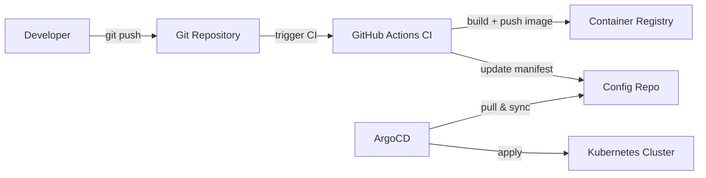

import LabActions from '@site/src/components/shared/LabActions';
import { IoGitCompare } from "react-icons/io5";

# Fundamentos de GitOps 


GitOps <IoGitCompare /> es una metodología que lleva los principios de desarrollo de software — control de versiones, colaboración, revisión de código y despliegue continuo — a la gestión de infraestructura y operaciones. El resultado es un modelo en el que **Git se convierte en la fuente única de verdad** para el estado deseado de todo el sistema.

---

## 1. ¿Qué es GitOps?

GitOps es el resultado de aplicar las prácticas de DevOps a la gestión de infraestructura y aplicaciones usando Git como mecanismo central de operación. El término fue acuñado por Weaveworks en 2017, y desde entonces ha sido adoptado por la Cloud Native Computing Foundation (CNCF) como uno de los patrones de referencia para operaciones en entornos Kubernetes.

La definición formal más aceptada es la de **OpenGitOps**, un proyecto de la CNCF que establece cuatro principios fundamentales que todo sistema GitOps debe cumplir:

### Principio 1: Declarativo

El estado deseado del sistema se describe de forma **declarativa**. En lugar de escribir scripts que especifiquen los pasos para llegar a un estado concreto (enfoque imperativo), se define directamente el resultado final: cuántas réplicas debe tener un deployment, qué imagen de contenedor debe correr, qué recursos de red deben existir. Kubernetes Manifests, Helm Charts y Kustomize son ejemplos de formatos declarativos.

### Principio 2: Versionado e inmutable

El estado deseado se almacena en un sistema de **control de versiones** que garantiza la inmutabilidad y el historial completo de cambios. Git cumple ambas condiciones: cada commit es una instantánea inmutable del estado en un momento dado, y el historial completo de cambios está siempre disponible. Esto hace posible saber quién cambió qué, cuándo y por qué, simplemente consultando el log de Git.

### Principio 3: Pull automático

Los agentes de software **observan el repositorio de manera continua** y se encargan de llevar el sistema real al estado definido en Git. En lugar de que un sistema externo empuje cambios al clúster, es un agente que vive dentro del propio clúster quien detecta diferencias y las aplica. Este modelo "pull" es fundamental para la seguridad: el clúster nunca necesita exponer un endpoint al exterior.

### Principio 4: Reconciliación continua

El sistema **reconcilia continuamente** el estado real con el estado deseado. Si alguien modifica manualmente un recurso en producción (drift), el agente GitOps lo detecta y lo corrige automáticamente para que vuelva a coincidir con lo que dicta Git. El sistema converge siempre hacia el estado deseado, sin intervención manual.

:::info OpenGitOps
El proyecto [OpenGitOps](https://opengitops.dev/) es un grupo de trabajo dentro de la CNCF que define y mantiene los principios formales de GitOps. No está ligado a ninguna herramienta específica: los principios aplican igualmente a ArgoCD, Flux o cualquier otra implementación.
:::

---

## 2. GitOps vs CI/CD tradicional

El CI/CD tradicional sigue un modelo **push**: cuando el pipeline de CI termina, empuja los cambios directamente al clúster usando credenciales almacenadas en el sistema de CI. GitOps invierte este flujo: un agente dentro del clúster **observa** el repositorio y aplica los cambios cuando detecta diferencias.

| Aspecto | CI/CD tradicional (Push) | GitOps (Pull) |
|---------|--------------------------|---------------|
| **Quién aplica cambios** | El sistema de CI (Jenkins, GitHub Actions, GitLab CI) ejecuta `kubectl apply` desde fuera del clúster | Un agente dentro del clúster (ArgoCD, Flux) observa Git y aplica los cambios |
| **Fuente de verdad** | El estado del clúster puede diferir de lo que hay en el repositorio | Git **siempre** es la fuente de verdad; el clúster debe reflejar exactamente lo que hay en el repo |
| **Auditoría** | Los cambios pueden aplicarse manualmente sin dejar rastro en Git | Cada cambio pasa obligatoriamente por un commit; el historial Git es el registro de auditoría completo |
| **Rollback** | Requiere un pipeline dedicado o intervención manual (`kubectl rollout undo`) | Un `git revert` o `git reset` devuelve el sistema al estado anterior en segundos |
| **Drift detection** | No existe detección automática; el clúster puede divergir del repositorio sin que nadie lo note | El agente comprueba continuamente si el estado real coincide con el deseado y alerta o corrige automáticamente |
| **Seguridad** | Las credenciales del clúster deben estar accesibles desde el sistema de CI (secret externo, superficie de ataque mayor) | El agente vive dentro del clúster; ningún sistema externo necesita credenciales de Kubernetes |

:::warning El problema del drift en CI/CD push
En un modelo push, nadie impide que un operador haga `kubectl edit deployment` directamente en producción. Ese cambio no queda en Git, no pasa por revisión y puede contradecir lo que el pipeline desplegaría la próxima vez que se ejecute. Este fenómeno se llama **configuration drift** y es una de las principales fuentes de incidentes en producción.
:::

---

## 3. ¿Por qué GitOps?

### Auditoría completa

En GitOps, **todo cambio en producción es un commit**. No hay atajos: si quieres cambiar el número de réplicas de un deployment, debes editar el manifiesto en Git, hacer commit y esperar a que el agente lo aplique. El resultado es un historial completo y auditable de quién cambió qué, cuándo y con qué justificación (el mensaje del commit o la descripción del PR).

Esto es especialmente relevante en entornos regulados (banca, salud, administración pública) donde la trazabilidad de cambios en producción es un requisito legal.

### Rollback trivial

Revertir un cambio problemático en producción es tan sencillo como ejecutar:

```bash
git revert HEAD
git push origin main
```

El agente GitOps detectará el nuevo commit y aplicará el estado anterior en cuestión de segundos. No hace falta conocer los comandos exactos de `kubectl rollout`, ni recordar qué imagen se estaba ejecutando antes, ni buscar en los logs del pipeline cuál fue la última versión estable.

### Reconciliación continua

El agente GitOps no aplica cambios solo cuando hay un nuevo commit: también **comprueba periódicamente** que el estado real del clúster coincide con el estado en Git. Si detecta una divergencia (alguien modificó un recurso manualmente, un nodo falló y un pod quedó en estado incorrecto, etc.), el agente la corrige automáticamente.

Este comportamiento convierte la reconciliación en un mecanismo de auto-reparación: el sistema tiende continuamente hacia el estado definido como correcto.

### Seguridad mejorada

En el modelo push, las credenciales de Kubernetes deben estar disponibles en el sistema de CI. Esto significa que están expuestas fuera del clúster y son un objetivo potencial para atacantes. Si el sistema de CI se ve comprometido, el atacante obtiene acceso completo al clúster.

En GitOps, **el agente vive dentro del clúster** y es él quien inicia la conexión hacia afuera (hacia Git). El clúster no necesita exponer ningún puerto adicional, y las credenciales de Kubernetes nunca salen del clúster. La superficie de ataque se reduce drásticamente.

:::tip GitOps y compliance
La combinación de auditoría completa vía Git + aprobaciones mediante Pull Requests + reconciliación automática cubre muchos de los controles exigidos por normativas como SOC 2, ISO 27001 o PCI DSS relacionados con la gestión de cambios en entornos de producción.
:::

---

## 4. Ecosistema de herramientas

Existen varias herramientas que implementan el modelo GitOps. Las tres principales dentro del ecosistema CNCF son:

| Herramienta | Descripción | Cuándo usarlo | Popularidad CNCF |
|-------------|-------------|---------------|------------------|
| **ArgoCD** | Controlador GitOps declarativo para Kubernetes con interfaz web muy visual. Permite gestionar múltiples clústeres desde un panel centralizado, con visualización en tiempo real del estado de cada aplicación. | Equipos que valoran la observabilidad y la UI. Ideal para adopción de GitOps en organizaciones que empiezan. Muy usado en entornos enterprise. | Proyecto Graduado CNCF. Uno de los proyectos de mayor crecimiento en 2023-2024. |
| **Flux** | Conjunto de controladores GitOps nativos de Kubernetes (operadores). Sigue la filosofía "GitOps Toolkit": componentes pequeños y componibles. Menos UI que ArgoCD, más orientado a automatización y CLI. | Equipos con experiencia en Kubernetes que prefieren integración nativa con el ecosistema (Helm, Kustomize, OCI). Buena opción para pipelines completamente automatizados. | Proyecto Graduado CNCF. Creado por Weaveworks, quienes acuñaron el término GitOps. |
| **Jenkins X** | Plataforma GitOps completa que incluye CI/CD + gestión de entornos + preview environments. Construida sobre Kubernetes, Jenkins X automatiza todo el ciclo de vida desde el commit hasta producción. | Organizaciones que quieren una solución completa "batteries included" y no quieren componer herramientas individualmente. Curva de aprendizaje alta. | Proyecto Incubating CNCF. Menos adopción que ArgoCD y Flux en nuevos proyectos. |

:::info ArgoCD vs Flux: la pregunta frecuente
Ambas herramientas son excelentes y están en producción en miles de organizaciones. La diferencia principal es filosófica: **ArgoCD** prioriza la visibilidad y la experiencia de usuario, con una UI rica y opinionated. **Flux** prioriza la composabilidad y la integración nativa con Kubernetes. En este curso usaremos ArgoCD por su curva de aprendizaje más suave y su excelente interfaz para visualizar el estado del clúster.
:::

---

## 5. El flujo GitOps básico

El siguiente diagrama ilustra el flujo completo de un cambio en un sistema GitOps real, desde que el desarrollador hace un push hasta que el cambio llega al clúster de Kubernetes:



Cada paso tiene un rol bien definido:

1. **Developer → Git Repository**: el desarrollador hace push de código a la rama principal o abre un Pull Request. Este es el único punto de entrada al sistema.

2. **Git Repository → GitHub Actions CI**: el pipeline de CI se dispara automáticamente. Su responsabilidad es únicamente construir, testear y publicar artefactos. El CI **no toca el clúster**.

3. **CI → Container Registry**: la imagen de Docker se construye, se etiqueta con el SHA del commit y se publica en el registry (Docker Hub, GitHub Container Registry, ECR...).

4. **CI → Config Repo**: el pipeline actualiza el manifiesto de Kubernetes (deployment.yaml) con la nueva etiqueta de imagen. Este es el único cambio que hace el CI en Git.

5. **ArgoCD → Config Repo**: ArgoCD observa continuamente el repositorio de configuración. Cuando detecta un nuevo commit, calcula la diferencia con el estado actual del clúster.

6. **ArgoCD → Kubernetes Cluster**: ArgoCD aplica los cambios necesarios para que el clúster refleje exactamente el estado definido en Git.

:::tip Separación de repositorios (app repo vs config repo)
Es una práctica habitual mantener el código de la aplicación y los manifiestos de Kubernetes en **repositorios separados**. Esto permite:
- Auditar cambios de infraestructura sin ruido de cambios de código.
- Dar permisos de lectura/escritura a diferentes equipos de forma independiente.
- Reutilizar los mismos manifiestos para varios entornos (dev, staging, producción) con mínimas diferencias.
:::

---

## 6. Este sitio como ejemplo real de GitOps

Este sitio de Docusaurus no es solo material didáctico: **es en sí mismo un ejemplo de despliegue automatizado con GitHub Actions**. Cada vez que se hace un push a la rama `main` del repositorio, el workflow `.github/workflows/deploy.yml` se dispara automáticamente, construye el sitio y lo despliega en GitHub Pages.

El flujo es simple pero ilustra perfectamente los principios de GitOps:

- **Declarativo**: la configuración del sitio (contenidos, estructura, componentes) está definida en archivos en el repositorio.
- **Versionado**: cada cambio en el sitio es un commit. Se puede ver exactamente qué cambió, cuándo y quién lo hizo.
- **Automatizado**: no hay ningún paso manual entre el commit y el despliegue. GitHub Actions lo gestiona todo.
- **Auditable**: el historial de Git es el historial de despliegues.

Puedes inspeccionar el workflow directamente en el repositorio:

import GitHubCode from '@site/src/components/shared/GitHubCode';

<GitHubCode
  url="https://github.com/salvamiguel/materials/blob/main/.github/workflows/deploy.yml"
  language="yaml"
/>

<LabActions title="Mira el repo de esta web" repo="https://github.com/salvamiguel/materials" codespace={false} fork={false} />


Cada vez que este sitio se actualiza con nuevo contenido, ese despliegue queda registrado en el historial de Git y en la pestaña "Actions" de GitHub. Es posible ver exactamente qué commit provocó cada despliegue, cuánto tardó y si tuvo éxito.

:::tip Ejercicio mental
Antes de instalar ArgoCD o Flux, observa cómo funciona el despliegue de este sitio. Es el mismo patrón GitOps: commit en Git → automatización detecta el cambio → artefacto se publica/despliega. La única diferencia con un sistema GitOps completo sobre Kubernetes es quién ejecuta el paso final y desde dónde lo hace.
:::

