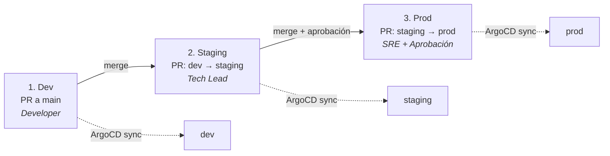

import LabActions from '@site/src/components/shared/LabActions';

# Multi-entorno con Kustomize

Gestionar múltiples entornos (dev, staging, prod) es uno de los mayores retos en GitOps. Kustomize ofrece un mecanismo nativo de Kubernetes para reutilizar manifiestos base y personalizar cada entorno sin duplicar código.

:::tip Repositorios de ejemplo reales
Los ejemplos de esta seccion usan los repositorios reales de la demo de status:
- **Repositorio de la applicación**: gitops-status-demo-app
- **Repositorio de la configuración**: gitops-status-demo-config

Puedes clonarlos y ejecutar el flujo completo en local con `kind`.
:::

<LabActions title="Repositorio de la aplicación (docker & go)" repo="https://github.com/salvamiguel/gitops-status-demo-app" codespace={false} fork={false} />
<LabActions title="Repositorio de la configuración (kustomize & argocd)" repo="https://github.com/salvamiguel/gitops-status-demo-config" codespace={false} fork={false} />


## 1. El problema del multi-entorno

En cualquier proyecto real necesitas desplegar la misma aplicación en al menos tres entornos con configuraciones distintas:

| Parámetro | Dev | Staging | Prod |
|-----------|-----|---------|------|
| Réplicas | 1 | 2 | 5 |
| Recursos CPU | 100m | 250m | 500m |
| Image tag | `latest` | `v1.2.0-rc1` | `v1.2.0` |
| Variables de entorno | Debug ON | Debug OFF | Debug OFF |
| Ingress hostname | `dev.app.com` | `staging.app.com` | `app.com` |

Las alternativas ingenuas son problemáticas:

- **Copiar y pegar manifiestos**: duplicación masiva, los cambios hay que aplicarlos N veces.
- **Scripts de sed/envsubst**: frágiles, difíciles de mantener y de revisar en PRs.
- **Helm**: potente pero complejo; introduce templates con lógica que puede ser difícil de auditar.

**Kustomize** resuelve esto con un patrón de `base + overlays` que es declarativo, nativo en `kubectl` y fácil de revisar en código.

## 2. Kustomize: base + overlays

### Estructura de directorios

```
k8s/
├── base/
│   ├── kustomization.yaml      # Lista de recursos base
│   ├── deployment.yaml         # Deployment genérico
│   └── service.yaml            # Service genérico
└── overlays/
    ├── dev/
    │   ├── kustomization.yaml  # Extiende base con parches dev
    │   └── patch-replicas.yaml # Ajuste de réplicas para dev
    ├── staging/
    │   └── kustomization.yaml  # Extiende base con parches staging
    └── prod/
        ├── kustomization.yaml  # Extiende base con parches prod
        └── patch-replicas.yaml # Ajuste de réplicas para prod
```

### base/kustomization.yaml

import GitHubCode from '@site/src/components/shared/GitHubCode';

<GitHubCode
  title="Define los recursos comunes a todos los entornos: k8s/base/kustomization.yaml"
  url="https://github.com/salvamiguel/gitops-status-demo-config/blob/main/k8s/base/kustomization.yaml"
  language="yaml"
/>

### base/deployment.yaml

<GitHubCode
  title="Deployment genérico sin valores específicos de entorno: k8s/base/deployment.yaml"
  url="https://github.com/salvamiguel/gitops-status-demo-config/blob/main/k8s/base/deployment.yaml"
  language="yaml"
/>

### overlays/dev/kustomization.yaml

El overlay de dev extiende la base y aplica sus parches específicos:

<GitHubCode
  title="El overlay de dev extiende la base y aplica sus parches específicos: k8s/overlays/dev/kustomization.yaml"
  url="https://github.com/salvamiguel/gitops-status-demo-config/blob/main/k8s/overlays/dev/kustomization.yaml"
  language="yaml"
/>

### overlays/dev/patch-replicas.yaml

Parche estratégico que solo modifica los campos que cambian entre entornos:
<GitHubCode
  title="Parche estratégico que solo modifica los campos que cambian entre entornos: k8s/overlays/dev/kustomization.yaml"
  url="https://github.com/salvamiguel/gitops-status-demo-config/blob/main/k8s/overlays/dev/kustomization.yaml"
  language="yaml"
/>

### overlays/prod/kustomization.yaml

<GitHubCode
  title="El overlay de producción con las configuraciones específicas: k8s/overlays/prod/kustomization.yaml"
  url="https://github.com/salvamiguel/gitops-status-demo-config/blob/main/k8s/overlays/prod/kustomization.yaml"
  language="yaml"
/>

### overlays/prod/patch-replicas.yaml

<GitHubCode
  title="El overlay de producción con configuración de alta disponibilidad: k8s/overlays/prod/patch-replicas.yaml"
  url="https://github.com/salvamiguel/gitops-status-demo-config/blob/main/k8s/overlays/prod/patch-replicas.yaml"
  language="yaml"
/>

:::tip Parches estratégicos vs JSON patches
Kustomize soporta dos tipos de parches: los **estratégicos** (como los de arriba, que fusionan inteligentemente) y los **JSON patches** (`patchesJson6902`), que son más precisos para modificar elementos específicos de listas. Para la mayoría de casos, los parches estratégicos son suficientes.
:::

## 3. Comandos Kustomize

Kustomize está integrado directamente en `kubectl` desde la versión 1.14 con el flag `-k`:

```bash
# Previsualizar el resultado completo del overlay sin aplicarlo
kubectl kustomize overlays/dev

# Aplicar el overlay directamente al clúster
kubectl apply -k overlays/dev

# Aplicar el overlay de producción
kubectl apply -k overlays/prod

# Comparar la salida entre entornos (muy útil para revisión)
diff <(kubectl kustomize overlays/dev) <(kubectl kustomize overlays/prod)

# Eliminar todos los recursos de un overlay
kubectl delete -k overlays/dev

# Guardar la salida renderizada en un archivo para auditoria
kubectl kustomize overlays/prod > rendered-prod.yaml
```

:::info Kustomize standalone vs integrado en kubectl
La versión integrada en `kubectl` (`kubectl kustomize`) puede ir por detrás de la versión standalone. Si necesitas las últimas funcionalidades, instala `kustomize` directamente:
```bash
# macOS
brew install kustomize  
```
```bash
# Linux o Windows (WSL)
curl -s "https://raw.githubusercontent.com/kubernetes-sigs/kustomize/master/hack/install_kustomize.sh" | bash  # Linux
```
:::

## 4. Promoción entre entornos con PRs

En GitOps, la **promoción entre entornos** se realiza mediante Pull Requests, no ejecutando scripts manualmente. Este es el flujo recomendado:



**El flujo concreto para promover de dev a staging:**

1. La CI construye y publica la imagen con el SHA del commit.
2. La CI abre automáticamente un PR actualizando el image tag en `overlays/staging/kustomization.yaml`.
3. Un tech lead revisa el PR (puede incluir resultados de tests de integración).
4. Al hacer merge, ArgoCD detecta el cambio y sincroniza staging.
5. Tras validación en staging, se repite el proceso para prod.

:::note Por qué PRs y no merges directos
Los PRs en el config repo actúan como **registro de auditoría** y **punto de aprobación humana**. Cualquier cambio en producción queda documentado con quién lo aprobó, cuándo y por qué.
:::

## 5. ArgoCD + Kustomize

ArgoCD detecta automáticamente que un directorio usa Kustomize cuando encuentra un `kustomization.yaml`. No requiere configuración adicional:

```yaml
apiVersion: argoproj.io/v1alpha1
kind: Application
metadata:
  name: gitops-status-demo-dev
  namespace: argocd
spec:
  project: default
  source:
    repoURL: https://github.com/salvamiguel/gitops-status-demo-config
    targetRevision: HEAD
    path: k8s/overlays/dev     # ArgoCD detecta Kustomize automáticamente

  destination:
    server: https://kubernetes.default.svc
    namespace: status-dev

  syncPolicy:
    automated:
      prune: true
      selfHeal: true
    syncOptions:
      - CreateNamespace=true
```

Para producción, con sync manual:

```yaml
apiVersion: argoproj.io/v1alpha1
kind: Application
metadata:
  name: gitops-status-demo-prod
  namespace: argocd
spec:
  project: default
  source:
    repoURL: https://github.com/salvamiguel/gitops-status-demo-config
    targetRevision: HEAD
    path: k8s/overlays/prod

  destination:
    server: https://kubernetes.default.svc
    namespace: status-prod

  # Sin syncPolicy.automated — sync manual con aprobación
  syncPolicy:
    syncOptions:
      - CreateNamespace=true
```

:::tip ArgoCD con múltiples entornos y ApplicationSet
En lugar de crear una `Application` por entorno manualmente, puedes usar un `ApplicationSet` con el generador `Git` o `List` para generar las tres aplicaciones automáticamente desde una sola definición. Ver la sección de ApplicationSets en el tema de ArgoCD.
:::

