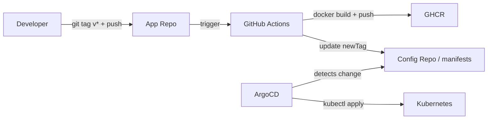
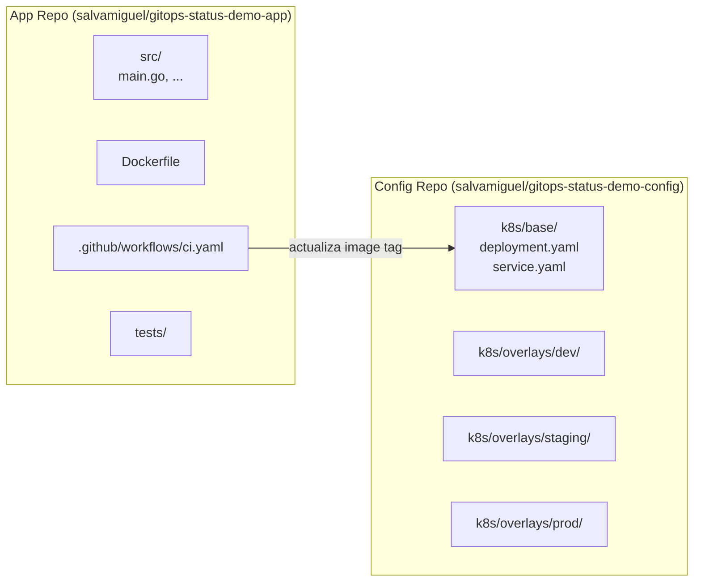

import LabActions from '@site/src/components/shared/LabActions';

# Pipeline End-to-End

Hasta ahora hemos visto cada pieza del puzzle de forma independiente. En este tema unimos todo: el código fuente, la integración continua, el registro de imágenes, los manifiestos de Kubernetes y ArgoCD en un único flujo automatizado de principio a fin.

:::tip Repositorios reales
Este pipeline esta implementado en repositorios reales que puedes clonar y ejecutar:
- **App repo**: [gitops-status-demo-app](https://github.com/salvamiguel/gitops-status-demo-app) — contiene el codigo Go y el workflow de GitHub Actions
- **Config repo**: [gitops-status-demo-config](https://github.com/salvamiguel/gitops-status-demo-config) — contiene los manifiestos Kustomize y las Applications de ArgoCD

Sigue las instrucciones del README del config repo para montar el entorno local con `kind`.
:::

## 1. El flujo completo

Este es el flujo GitOps completo desde que un desarrollador publica un tag de versión hasta que el cambio llega al clúster de Kubernetes:


```mermaid
graph LR
  Dev[Developer] -->|git tag v* + push| AppRepo[App Repo]
  AppRepo -->|trigger| CI[GitHub Actions]
  CI -->|docker build + push| Registry[GHCR]
  CI -->|update newTag| ConfigRepo[Config Repo / manifests]
  ArgoCD[ArgoCD] -->|detects change| ConfigRepo
  ArgoCD -->|kubectl apply| K8s[Kubernetes]
```

**Descripción de cada paso:**

| Paso | Actor | Acción | Resultado |
|------|-------|--------|-----------|
| 1 | Developer | `git tag v1.2.0` y `git push origin v1.2.0` en el app repo | Dispara el pipeline de CI |
| 2 | GitHub Actions | Tests, build multiarquitectura y push de la imagen | Imagen publicada en GHCR con la versión, el SHA y `latest` |
| 3 | GitHub Actions | Actualiza `newTag` en `k8s/base/kustomization.yaml` del config repo | Nuevo commit en el repo de manifiestos |
| 4 | ArgoCD | Detecta el nuevo commit en el config repo | Compara con el estado actual del clúster |
| 5 | ArgoCD | `kubectl apply` de los manifiestos actualizados | Nueva versión desplegada en Kubernetes |

:::info El pull model de GitOps
A diferencia del modelo push tradicional (donde la CI hace `kubectl apply` directamente), en GitOps ArgoCD **tira** (pull) de los cambios desde el clúster. Esto significa que las credenciales del clúster nunca salen de él — el clúster no es accesible desde el exterior para despliegues.
:::

## 2. El workflow completo de GitHub Actions

Este es el workflow real del app repo ([`.github/workflows/ci.yaml`](https://github.com/salvamiguel/gitops-status-demo-app/blob/main/.github/workflows/ci.yaml)). No se dispara con cada push, sino al publicar un **tag de versión** (`v1.2.0`), de modo que cada despliegue corresponde a una versión con nombre:

```yaml
name: CI/CD Pipeline

on:
  push:
    tags:
      - 'v*'

env:
  IMAGE_NAME: ghcr.io/${{ github.repository }}

jobs:
  test:
    runs-on: ubuntu-latest
    steps:
      - uses: actions/checkout@v5
      - name: Set up Go
        uses: actions/setup-go@v5
        with:
          go-version: '1.24'
      - name: Run tests
        run: make test

  build-and-push:
    needs: test
    runs-on: ubuntu-latest
    permissions:
      contents: read
      packages: write      # Necesario para publicar en GHCR
    steps:
      - uses: actions/checkout@v5
      - name: Extract version from tag
        run: echo "VERSION=${GITHUB_REF#refs/tags/}" >> $GITHUB_ENV
      - name: Set up QEMU
        uses: docker/setup-qemu-action@v3
      - name: Set up Docker Buildx
        uses: docker/setup-buildx-action@v3
      - name: Log in to GHCR
        uses: docker/login-action@v3
        with:
          registry: ghcr.io
          username: ${{ github.actor }}
          password: ${{ secrets.GITHUB_TOKEN }}
      - name: Build and push image
        uses: docker/build-push-action@v6
        with:
          push: true
          platforms: linux/amd64,linux/arm64
          build-args: VERSION=${{ env.VERSION }}
          tags: |
            ${{ env.IMAGE_NAME }}:${{ env.VERSION }}
            ${{ env.IMAGE_NAME }}:sha-${{ github.sha }}
            ${{ env.IMAGE_NAME }}:latest
          cache-from: type=gha
          cache-to: type=gha,mode=max

  update-manifests:
    needs: build-and-push
    runs-on: ubuntu-latest
    steps:
      - uses: actions/checkout@v5
        with:
          repository: salvamiguel/gitops-status-demo-config
          token: ${{ secrets.CONFIG_REPO_TOKEN }}
      - name: Update image tag in manifests
        run: |
          VERSION="${GITHUB_REF#refs/tags/}"
          sed -i "s|newTag:.*|newTag: ${VERSION}|" k8s/base/kustomization.yaml
          echo "Updated image tag to ${VERSION}"
          cat k8s/base/kustomization.yaml
      - name: Commit and push
        run: |
          VERSION="${GITHUB_REF#refs/tags/}"
          git config user.email "ci@github.com"
          git config user.name "GitHub Actions"
          git add k8s/base/kustomization.yaml
          git diff --cached --quiet && echo "No changes to commit" && exit 0
          git commit -m "chore: update image to ${VERSION}
          Triggered by: ${{ github.repository }}@${{ github.sha }}
          Actor: ${{ github.actor }}
          Workflow: ${{ github.workflow }}"
          git push
```

Para publicar una versión basta con:

```bash
git tag v1.2.0
git push origin v1.2.0
```

### Desglose del workflow

**Job `test`:** ejecuta `make test` con Go 1.24. Si falla, no se construye ninguna imagen.

**Job `build-and-push`:**

- `needs: test`: solo construye si los tests pasan.
- Extrae la versión del tag (`v1.2.0`) a la variable `VERSION`.
- `setup-qemu-action` y `setup-buildx-action` permiten construir la imagen para `linux/amd64` y `linux/arm64` (Mac con Apple Silicon incluido).
- `docker/login-action@v3`: autentica en GHCR usando el `GITHUB_TOKEN` automático.
- `docker/build-push-action@v6`: publica tres tags: la versión (`v1.2.0`), el SHA del commit (`sha-…`, inmutable) y `latest`.
- `cache-from/cache-to`: utiliza la caché de GitHub Actions para acelerar builds sucesivos.

**Job `update-manifests`:**

- `needs: build-and-push`: solo actualiza la configuración si la imagen se publicó correctamente.
- Hace checkout del **config repo** (no del app repo) con el token `CONFIG_REPO_TOKEN`. Usa un **fine-grained personal access token** con permiso *Contents: Read and write* solo sobre `gitops-status-demo-config`, o mejor aún una **GitHub App** instalada en ese repo; evita los tokens clásicos con acceso a todos tus repositorios.
- `sed -i`: cambia `newTag` en `k8s/base/kustomization.yaml`. Como es la base, el cambio llega a los tres overlays: dev y staging se sincronizan solos y prod espera a un sync manual.
- `git diff --cached --quiet`: si el tag ya estaba puesto, no crea un commit vacío.
- Commit con un mensaje que incluye quién disparó el pipeline y desde qué repo.

:::tip SHA en lugar de latest para producción
Desplegar una versión (`v1.2.0`) o el SHA del commit garantiza **inmutabilidad**: siempre sabes exactamente qué código está desplegado. Nunca uses `:latest` en producción porque puede cambiar en cualquier momento sin que Git lo registre.
:::

## 3. Separación app repo / config repo

Este patrón es una best practice fundamental en GitOps y tiene razones sólidas:

### Por qué separar los repositorios

**Historial limpio y auditabilidad:**
- El config repo contiene **solo** cambios de configuración e infraestructura.
- Es fácil ver qué versión estaba desplegada en cada momento.
- El historial del app repo no se contamina con commits de "update image tag".

**Permisos y control de acceso:**
- Los desarrolladores hacen push al app repo pero no necesariamente al config repo.
- El config repo puede requerir revisión de un SRE o tech lead antes del merge.
- ArgoCD solo necesita acceso de lectura al config repo.

**Ciclos de vida independientes:**
- Puedes actualizar la configuración de infraestructura sin tocar el código.
- Puedes hacer rollback de la config sin afectar el código fuente.

**Separación de concerns:**


```mermaid
graph LR
  subgraph "App Repo (salvamiguel/gitops-status-demo-app)"
    src["src/<br/>main.go, ..."]
    Dockerfile
    CI[".github/workflows/ci.yaml"]
    tests["tests/"]
  end

  subgraph "Config Repo (salvamiguel/gitops-status-demo-config)"
    base["k8s/base/<br/>deployment.yaml<br/>service.yaml"]
    dev["k8s/overlays/dev/"]
    staging["k8s/overlays/staging/"]
    prod["k8s/overlays/prod/"]
  end

  CI -->|"actualiza image tag"| base
```

:::note Monorepo como alternativa
Es posible tener el app repo y el config repo en el mismo repositorio, con ArgoCD apuntando a una subdirectorio específico. Este enfoque simplifica la operación en equipos pequeños pero puede complicar el acceso granular en equipos grandes.
:::

## 4. Observabilidad del flujo

Un pipeline GitOps sin observabilidad es como conducir sin instrumentación. Estos son los puntos clave de visibilidad:

### ArgoCD Notifications

ArgoCD puede enviar notificaciones a Slack, Teams, email u otros canales cuando el estado de una aplicación cambia:

```yaml
# En el ConfigMap argocd-notifications-cm
apiVersion: v1
kind: ConfigMap
metadata:
  name: argocd-notifications-cm
  namespace: argocd
data:
  trigger.on-sync-succeeded: |
    - when: app.status.sync.status == 'Synced'
      send: [app-sync-succeeded]
  trigger.on-health-degraded: |
    - when: app.status.health.status == 'Degraded'
      send: [app-health-degraded]
  template.app-sync-succeeded: |
    message: |
      App {{.app.metadata.name}} sincronizada.
      Revision: {{.app.status.sync.revision}}
  template.app-health-degraded: |
    slack:
      attachments: |
        [{
          "color": "#E96D76",
          "title": "{{.app.metadata.name}} degradada",
          "text": "La aplicacion ha entrado en estado Degraded"
        }]
```

### GitHub Actions status checks en PRs

Configura los checks de CI como **required status checks** en la rama principal:

1. Ve a **Settings → Branches → Branch protection rules**.
2. Activa **Require status checks to pass before merging**.
3. Añade los jobs del workflow como checks requeridos.

Esto bloquea el merge de cualquier PR cuyo pipeline falle — garantizando que solo código que pasa los tests llega al config repo.

### kubectl get events

Para debugging rápido durante un despliegue:

```bash
# Ver todos los eventos del namespace en tiempo real
kubectl get events -n status-prod --watch

# Ver eventos ordenados por tiempo
kubectl get events -n status-prod --sort-by='.lastTimestamp'

# Ver logs del pod que está fallando
kubectl logs -n status-prod -l app=gitops-status-demo --tail=100 -f

# Ver el estado detallado del deployment
kubectl describe deployment gitops-status-demo -n status-prod
```

:::tip Integra Prometheus + Grafana
Para una observabilidad completa del pipeline, instrumenta tu aplicación con métricas de Prometheus y crea un dashboard en Grafana que muestre error rate, latencia y tasa de despliegues exitosos. Esto te permite correlacionar los deploys con el comportamiento de la aplicación.
:::

## 5. Patrones empresariales

### Semantic versioning de imágenes

En producción, las imágenes deben tener tags significativos, no solo SHAs:

```yaml
# En el workflow de GitHub Actions
- name: Extract version from tag
  if: startsWith(github.ref, 'refs/tags/')
  run: echo "VERSION=${GITHUB_REF#refs/tags/}" >> $GITHUB_ENV

- name: Build and push with semver tag
  uses: docker/build-push-action@v6
  with:
    push: true
    tags: |
      ${{ env.IMAGE_NAME }}:${{ github.sha }}
      ${{ env.IMAGE_NAME }}:${{ env.VERSION }}
      ${{ env.IMAGE_NAME }}:latest
```

Estrategia de tags recomendada:

| Tag | Ejemplo | Cuándo se crea | Uso |
|-----|---------|----------------|-----|
| SHA | `sha-a1b2c3d` | Cada commit a main | Dev / staging |
| Semver | `v1.2.3` | Al crear un Git tag | Producción |
| `latest` | `latest` | Cada commit a main | Solo desarrollo |

### PRs automáticos para promoción entre entornos

En lugar de que la CI actualice el config repo directamente, puede abrir un PR para que un humano revise y apruebe la promoción:

```yaml
- name: Open PR to promote to staging
  uses: peter-evans/create-pull-request@v6
  with:
    token: ${{ secrets.CONFIG_REPO_TOKEN }}
    commit-message: "chore: update gitops-status-demo to ${{ github.sha }}"
    title: "Promote gitops-status-demo ${{ github.sha }} to staging"
    body: |
      ## Promotion Request

      **App**: gitops-status-demo
      **New version**: `${{ github.sha }}`
      **Source**: ${{ github.repository }}@${{ github.sha }}

      ### Checklist
      - [ ] Tests pasados en CI
      - [ ] Revisión de cambios
      - [ ] Validado en dev
    branch: promote/gitops-status-demo-${{ github.sha }}
    base: main
```

### ArgoCD Image Updater

ArgoCD Image Updater es un componente adicional que automatiza la actualización del image tag en el config repo, eliminando el paso del `sed` en la CI:

```yaml
# Anotaciones en la Application de ArgoCD
apiVersion: argoproj.io/v1alpha1
kind: Application
metadata:
  name: gitops-status-demo
  annotations:
    # Actualizar automáticamente cuando haya nueva imagen con semver
    argocd-image-updater.argoproj.io/image-list: gitops-status-demo=ghcr.io/salvamiguel/gitops-status-demo-app
    argocd-image-updater.argoproj.io/gitops-status-demo.update-strategy: semver
    argocd-image-updater.argoproj.io/gitops-status-demo.allow-tags: regexp:^v[0-9]+\.[0-9]+\.[0-9]+$
    argocd-image-updater.argoproj.io/write-back-method: git
```

Con Image Updater, el flujo se simplifica: la CI solo necesita publicar la imagen en el registry. ArgoCD Image Updater detecta la nueva imagen, actualiza el manifiesto en Git y ArgoCD sincroniza automáticamente.

:::info Resumen del pipeline GitOps
El pipeline GitOps completo conecta todas las piezas del curso:
1. **Git** como fuente de verdad (UD1)
2. **GitHub Actions** para CI (UD2)
3. **ArgoCD** como controlador GitOps (UD3)
4. **Kustomize** para multi-entorno (UD3)
5. **Argo Rollouts** para estrategias de despliegue avanzadas (UD4)

El resultado es un sistema donde cualquier cambio en producción pasa por Git, tiene un responsable, un timestamp y puede revertirse en segundos.
:::

