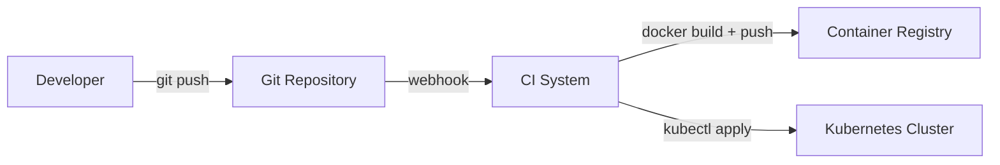
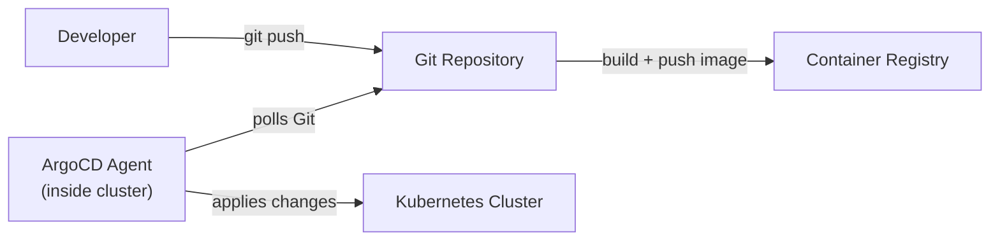
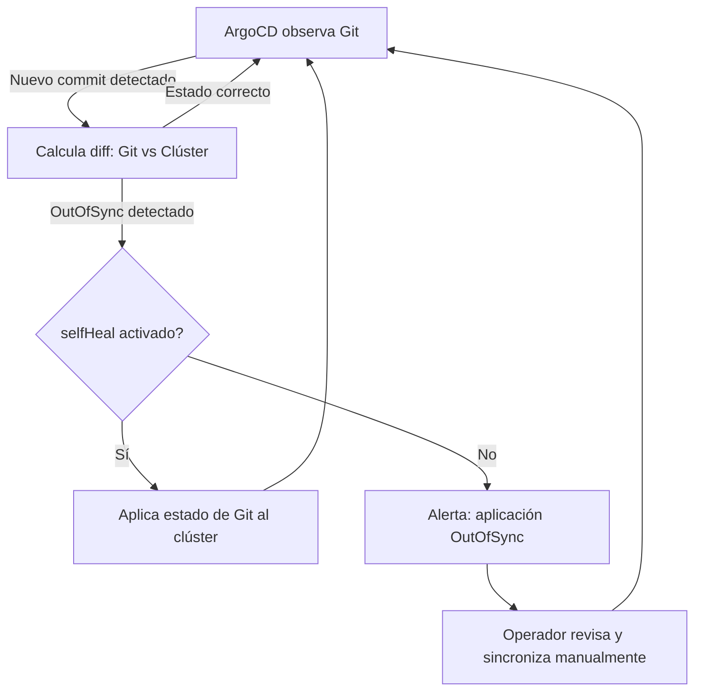

import LabActions from '@site/src/components/shared/LabActions';
import PullVsPushDiagram from '@site/src/components/demos/gitops/PullVsPushDiagram';

# Pull vs Push: los dos modelos de despliegue

Antes de adoptar GitOps, es fundamental entender por qué existe y qué problema concreto resuelve. Toda la diferencia se reduce a una pregunta: **¿quién inicia la conexión con el clúster de Kubernetes para aplicar cambios?** La respuesta a esa pregunta define el modelo de despliegue y tiene consecuencias profundas en seguridad, observabilidad y operabilidad.

---

## 1. El modelo Push (CI/CD tradicional)

En el modelo push, el **sistema de CI/CD es el actor activo**. Cuando el pipeline termina correctamente, toma las credenciales del clúster y ejecuta directamente los comandos necesarios para desplegar la nueva versión.

### Cómo funciona

El flujo típico en un modelo push es el siguiente:



En la práctica, el pipeline de GitHub Actions o Jenkins contiene pasos similares a estos:

```yaml title="Ejemplo de pipeline push con GitHub Actions"
name: Deploy (Push model)

on:
  push:
    branches: [main]

jobs:
  deploy:
    runs-on: ubuntu-latest
    steps:
      - uses: actions/checkout@v4

      - name: Build and push Docker image
        run: |
          docker build -t ghcr.io/myorg/myapp:${{ github.sha }} .
          docker push ghcr.io/myorg/myapp:${{ github.sha }}

      - name: Configure kubectl
        uses: azure/setup-kubectl@v3

      - name: Set kubeconfig
        run: |
          echo "${{ secrets.KUBECONFIG }}" | base64 -d > kubeconfig.yaml
          export KUBECONFIG=kubeconfig.yaml

      - name: Deploy to Kubernetes
        run: |
          kubectl set image deployment/myapp \
            myapp=ghcr.io/myorg/myapp:${{ github.sha }}
          kubectl rollout status deployment/myapp
```

El pipeline necesita `secrets.KUBECONFIG`, un secreto que contiene las credenciales completas del clúster, almacenadas en el sistema de CI.

### Ventajas del modelo push

- **Simplicidad conceptual**: el flujo es lineal y fácil de entender. El pipeline ejecuta los pasos uno a uno y cualquier desarrollador con experiencia en CI/CD lo entiende inmediatamente.
- **Compatible con cualquier clúster**: funciona con cualquier destino de despliegue que tenga una API accesible: Kubernetes on-premises, EKS, GKE, AKS, VMs con SSH, servicios cloud...
- **Sin dependencias adicionales**: no hace falta instalar ni gestionar herramientas adicionales en el clúster. Todo el control está en el sistema de CI.
- **Feedback inmediato**: el resultado del despliegue aparece directamente en los logs del pipeline.

### Desventajas del modelo push

- **Las credenciales del clúster viven fuera del clúster**: el secreto `KUBECONFIG` (o un Service Account token) debe estar accesible desde el sistema de CI. Si ese sistema se ve comprometido, el atacante obtiene acceso directo a producción.
- **Sin detección de drift**: si alguien modifica manualmente un recurso en el clúster después del despliegue, el pipeline no lo sabe. El clúster puede divergir silenciosamente del estado en Git.
- **Sin reconciliación**: el pipeline solo actúa cuando hay un commit. Si el estado del clúster cambia por causas externas (un operador borra un ConfigMap, un nodo falla), nadie lo corrige automáticamente.
- **Estado fuera de Git**: el estado real del clúster en producción no está necesariamente documentado en ningún repositorio. Lo que hay en Git puede no coincidir con lo que está desplegado.

:::warning Riesgo real: escape de credenciales
En julio de 2023, el grupo de seguridad de GitHub publicó que miles de organizaciones tenían tokens de acceso a Kubernetes almacenados en secretos de GitHub Actions con permisos excesivos. En el modelo push, estas credenciales son un objetivo prioritario para cualquier atacante que consiga acceso al entorno de CI.
:::

---

## 2. El modelo Pull (GitOps)

En el modelo pull, el **agente GitOps es el actor activo** y vive dentro del propio clúster. Este agente observa continuamente el repositorio Git y, cuando detecta cambios, los aplica internamente. La conexión siempre se inicia desde dentro del clúster hacia afuera, no al revés.

### Cómo funciona



El CI sigue existiendo, pero su responsabilidad se reduce: **solo construye y publica artefactos**. Nunca toca el clúster directamente. El despliegue es responsabilidad exclusiva del agente GitOps.

En ArgoCD, la configuración de una aplicación GitOps se declara así:

```yaml title="ArgoCD Application manifest"
apiVersion: argoproj.io/v1alpha1
kind: Application
metadata:
  name: myapp
  namespace: argocd
spec:
  project: default
  source:
    repoURL: https://github.com/myorg/myapp-config.git
    targetRevision: main
    path: manifests/production
  destination:
    server: https://kubernetes.default.svc
    namespace: myapp
  syncPolicy:
    automated:
      prune: true       # Elimina recursos que ya no están en Git
      selfHeal: true    # Corrige cambios manuales automáticamente
    syncOptions:
      - CreateNamespace=true
```

Con esta configuración, ArgoCD observa el repositorio `myapp-config` y aplica automáticamente cualquier cambio que detecte en la carpeta `manifests/production`. Si alguien modifica manualmente un recurso en el clúster (`selfHeal: true`), ArgoCD lo detecta y lo revierte.

### Ventajas del modelo pull

- **Seguridad mejorada**: el clúster no necesita exponer ningún endpoint de gestión al exterior. El agente inicia todas las conexiones desde dentro. Las credenciales de Kubernetes nunca salen del clúster.
- **Detección de drift automática**: el agente comprueba continuamente el estado real del clúster y lo compara con el estado en Git. Si detecta una diferencia, puede alertar o corregirla automáticamente.
- **Reconciliación continua**: el sistema converge constantemente hacia el estado deseado, sin necesidad de un nuevo commit. Los errores transitorios se corrigen solos.
- **Git como fuente de verdad real**: el estado del clúster en cualquier momento es exactamente lo que hay en Git (dentro de un margen de tiempo del ciclo de reconciliación).
- **Auditoría natural**: cada cambio en producción requiere un commit en Git. No hay forma de saltarse esta restricción.

### Desventajas del modelo pull

- **Complejidad de configuración inicial**: instalar y configurar ArgoCD o Flux requiere tiempo y conocimiento del ecosistema Kubernetes. No es un paso trivial para equipos que empiezan.
- **Curva de aprendizaje**: los equipos acostumbrados al modelo push necesitan cambiar su modelo mental sobre cómo funciona el despliegue. El feedback no viene del pipeline, sino de la UI o CLI de la herramienta GitOps.
- **Latencia en el ciclo de sincronización**: el agente no aplica cambios instantáneamente; lo hace según su ciclo de polling (configurable, típicamente cada 3 minutos en ArgoCD). Para sincronizaciones urgentes, se puede forzar manualmente.
- **Gestión de secretos más compleja**: los secretos de aplicación no pueden almacenarse en texto plano en Git. Es necesario usar herramientas adicionales como Sealed Secrets, External Secrets Operator o SOPS.

<PullVsPushDiagram />

---

## 3. Comparativa detallada

| Aspecto | Modelo Push | Modelo Pull (GitOps) |
|---------|-------------|----------------------|
| **Dirección del deploy** | El CI empuja cambios al clúster (fuera → dentro) | El agente dentro del clúster observa Git y aplica (dentro → fuera solo para leer) |
| **Acceso al clúster** | El sistema de CI necesita credenciales del clúster almacenadas como secretos externos | El agente vive en el clúster; ningún sistema externo necesita credenciales de Kubernetes |
| **Fuente de verdad** | Ambigua: el CI conoce lo que desplegó, pero el clúster puede haber cambiado | Git siempre. El clúster converge al estado definido en el repositorio |
| **Detección de drift** | No existe. El clúster puede divergir silenciosamente del repositorio | Continua. El agente detecta cualquier divergencia y puede corregirla automáticamente |
| **Rollback** | Requiere ejecutar un nuevo pipeline o usar `kubectl rollout undo` | `git revert` + `git push`. El agente aplica el estado anterior automáticamente |
| **Auditoría** | Parcial: los logs del CI registran despliegues, pero los cambios manuales en el clúster no se reflejan en Git | Completa: cada cambio en producción es un commit en Git. El historial Git es el registro de auditoría |
| **Complejidad inicial** | Baja: solo hace falta un secreto con las credenciales del clúster en el CI | Alta: requiere instalar y configurar una herramienta GitOps (ArgoCD, Flux) y adaptar los workflows |
| **Ejemplo de herramienta** | GitHub Actions + kubectl, Jenkins + Helm, GitLab CI + Argo Workflows | ArgoCD, Flux, Jenkins X |

---

## 4. ¿Cuándo usar cada modelo?

No existe un modelo universalmente mejor. La elección depende del contexto, el equipo y los requisitos del proyecto.

### Usa el modelo Push cuando:

- El proyecto es **pequeño o no usa Kubernetes**. Para desplegar en una VM o un servicio PaaS, el modelo push es perfectamente válido y mucho más sencillo.
- El equipo está **empezando con CI/CD** y necesita victorias rápidas. Añadir GitOps demasiado pronto puede abrumar a un equipo que todavía no domina los fundamentos.
- No hay requisitos estrictos de **compliance o auditoría**. Si no hay una normativa que exija trazabilidad completa de cambios en producción, el modelo push puede ser suficiente.
- El clúster es **efímero o de corta duración** (por ejemplo, un entorno de testing que se crea y destruye por cada PR).

### Usa el modelo Pull (GitOps) cuando:

- La infraestructura corre en **Kubernetes** y el equipo ya tiene experiencia con él.
- Hay **múltiples entornos** (dev, staging, producción) y es necesario garantizar la consistencia entre ellos.
- El equipo es grande y **varias personas** pueden hacer cambios en producción. El modelo GitOps garantiza que todos los cambios pasan por revisión.
- Hay requisitos de **compliance** (SOC 2, ISO 27001, PCI DSS) que exigen trazabilidad completa de cambios en producción.
- La seguridad es una prioridad y se quiere **minimizar la superficie de ataque** eliminando credenciales de Kubernetes de sistemas externos.

:::tip La transición habitual
La mayoría de organizaciones empiezan con el modelo push porque es más sencillo. La transición a GitOps suele producirse cuando el equipo crece, los entornos proliferan o aparecen incidentes causados por drift o cambios manuales en producción. No es necesario hacer la transición de golpe: muchos equipos empiezan adoptando GitOps solo en producción, mientras mantienen el modelo push en entornos de desarrollo.
:::

---

## 5. Drift y reconciliación

### ¿Qué es el drift?

El **configuration drift** es la divergencia entre el estado definido en el repositorio (el estado deseado) y el estado real del sistema en producción. Es uno de los problemas más insidiosos en operaciones, porque suele ser invisible y acumulativo.

El drift puede producirse por muchas razones:

- Un operador modifica directamente un recurso en el clúster para resolver una urgencia: `kubectl edit deployment myapp`.
- Un proceso automático (HPA, cluster-autoscaler) modifica recursos que también están gestionados por manifiestos.
- Un administrador aplica un parche de seguridad directamente en el clúster sin actualizar el repositorio.
- Un cambio de configuración se aplica en staging pero se olvida en producción.

Con el tiempo, el drift hace que los entornos sean cada vez menos predecibles. El manifiesto en Git deja de ser una descripción fiable de lo que está corriendo en producción.

### Cómo detecta y corrige el drift ArgoCD

ArgoCD compara continuamente el estado del clúster con el estado en Git. Cuando detecta una diferencia, marca la aplicación como **OutOfSync** y, dependiendo de la configuración, puede:

1. **Solo alertar**: mostrar el estado OutOfSync en la UI y notificar, pero no actuar.
2. **Auto-sincronizar**: aplicar automáticamente los cambios de Git para devolver el clúster al estado deseado (`selfHeal: true`).

### Escenario real: drift detectado y corregido

Supón que ArgoCD está gestionando un deployment con 3 réplicas, tal como está definido en Git:

```yaml title="deployment.yaml en Git"
apiVersion: apps/v1
kind: Deployment
metadata:
  name: myapp
spec:
  replicas: 3
  # ...
```

Un operador, preocupado por la carga durante un pico de tráfico, escala manualmente el deployment:

```bash
kubectl scale deployment myapp --replicas=10
```

Este cambio no está en Git. ArgoCD lo detecta en el próximo ciclo de reconciliación:

```
Application myapp is OutOfSync

Expected state (Git):    replicas: 3
Actual state (cluster):  replicas: 10

Diff:
  spec.replicas: 3 → 10
```

Si `selfHeal: true` está activado, ArgoCD revierte automáticamente el cambio y restaura las 3 réplicas definidas en Git. Si no está activado, muestra la alerta para que un humano tome la decisión.

:::warning El cambio manual se pierde
Si el operador quiere que el cambio sea permanente, la forma correcta de hacerlo es **editar el manifiesto en Git y hacer commit**. Un cambio aplicado directamente con `kubectl` en un entorno gestionado por GitOps es temporal: ArgoCD lo revertirá en el próximo ciclo.
:::

Este comportamiento puede parecer restrictivo, pero es exactamente el punto: GitOps garantiza que **Git es la única forma de cambiar el estado de producción**. Cualquier cambio que no pase por Git es transitorio y será corregido.

### El ciclo de reconciliación



El intervalo de polling por defecto en ArgoCD es de 3 minutos, pero se puede reducir o activar notificaciones webhook desde Git para sincronizaciones casi instantáneas.

