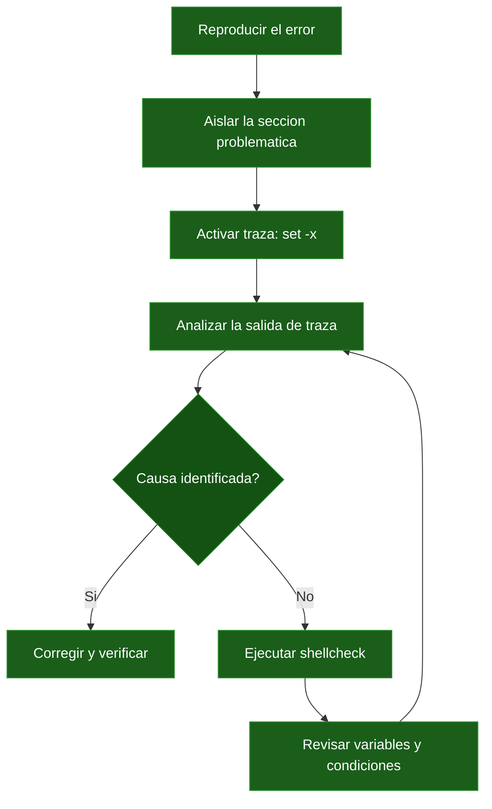

# Automatizacion y Manejo de Errores

## 1. Manejo robusto de errores

### El problema: Bash no falla por defecto

Uno de los errores mas comunes entre quienes empiezan a escribir scripts en Bash es asumir que el script se detendrá cuando algo vaya mal. **No es asi.** Por defecto, Bash ejecuta cada linea sin importar si la anterior ha fallado. Esto puede tener consecuencias desastrosas.

Observa este ejemplo aparentemente inocente:

```bash
#!/usr/bin/env bash

cd "$DIRECTORIO_DESTINO"
rm -rf *
```

Si la variable `DIRECTORIO_DESTINO` no esta definida o contiene una ruta invalida, el `cd` fallara silenciosamente. Bash continuara ejecutando `rm -rf *` **en el directorio actual**, que podria ser tu home, la raiz del proyecto o cualquier otro lugar. El resultado: archivos eliminados de forma irreversible en un lugar que no era el previsto.

Este no es un caso hipotetico. Es un patron que ha causado incidentes reales en produccion, incluyendo casos documentados donde empresas han perdido datos criticos por scripts que asumian que una variable estaria definida.

La solucion es configurar Bash para que sea estricto con los errores. Veamos las tres opciones fundamentales.

---

### `set -e`: salir inmediatamente ante un error

Cuando activas `set -e` (tambien conocido como `errexit`), Bash terminara la ejecucion del script en cuanto un comando devuelva un codigo de salida distinto de cero:

```bash
#!/usr/bin/env bash
set -e

echo "Paso 1: descargando archivo..."
curl -O https://ejemplo.com/datos.tar.gz   # Si falla, el script se detiene aqui

echo "Paso 2: descomprimiendo..."
tar xzf datos.tar.gz

echo "Paso 3: procesando..."
./procesar_datos.sh
```

Sin `set -e`, si `curl` falla (servidor caido, URL incorrecta), Bash seguiria con `tar` sobre un archivo que no existe, y luego intentaria ejecutar `procesar_datos.sh` con datos corruptos o inexistentes. Con `set -e`, el script se detiene en el momento exacto del fallo.

:::warning Excepciones de set -e
`set -e` **no** se activa en los siguientes contextos:

- Dentro de condiciones `if`: `if ! comando_que_falla; then ...` no provoca la salida.
- En el lado izquierdo de `&&` o `||`: `comando_que_falla || echo "fallo"` no termina el script.
- Dentro de subshells en ciertos contextos.
- En comandos dentro de una sustitucion de proceso.

Esto significa que `set -e` no es una red de seguridad absoluta. Debes combinarlo con las otras opciones que veremos a continuacion.
:::

---

### `set -u`: variables no definidas son errores

`set -u` (tambien conocido como `nounset`) hace que Bash trate cualquier referencia a una variable no definida como un error fatal:

```bash
#!/usr/bin/env bash
set -u

echo "Directorio de destino: $DIRECTORIO_DESTINO"
# Si DIRECTORIO_DESTINO no esta definida:
# bash: DIRECTORIO_DESTINO: unbound variable
```

Volvamos al ejemplo peligroso del inicio. Con `set -u` activo:

```bash
#!/usr/bin/env bash
set -u

cd "$DIRECTORIO_DESTINO"    # ERROR: unbound variable -> el script se detiene
rm -rf *                     # Nunca se ejecuta
```

El script se detiene antes de llegar al `rm`. La catastrofe se ha evitado.

:::tip Variables opcionales con valor por defecto
Si necesitas una variable que puede o no estar definida, usa la sintaxis de valor por defecto:

```bash
# Usa /tmp si DIRECTORIO_TEMPORAL no esta definida
DIRECTORIO_TEMPORAL="${DIRECTORIO_TEMPORAL:-/tmp}"

# Usa cadena vacia si PREFIJO no esta definida
PREFIJO="${PREFIJO:-}"
```

Esto es compatible con `set -u` porque proporcionas un valor alternativo en lugar de acceder a una variable inexistente.
:::

---

### `set -o pipefail`: detectar errores en pipes

Sin `pipefail`, el codigo de salida de una tuberia (pipe) es el codigo de salida del **ultimo** comando. Esto significa que errores intermedios se pierden:

```bash
#!/usr/bin/env bash
set -e

# Sin pipefail: si curl falla pero wc tiene exito, el pipe "tiene exito"
curl -s https://api.ejemplo.com/datos | grep "activo" | wc -l
echo "Este mensaje aparece incluso si curl fallo"
```

Con `pipefail`, el codigo de salida del pipe es el del **ultimo comando que fallo** (o cero si todos tuvieron exito):

```bash
#!/usr/bin/env bash
set -eo pipefail

# Ahora si curl falla, todo el pipe falla
curl -s https://api.ejemplo.com/datos | grep "activo" | wc -l
echo "Este mensaje solo aparece si TODOS los comandos del pipe tuvieron exito"
```

---

### La santa trinidad: `set -euo pipefail`

La combinacion de las tres opciones proporciona una base solida para cualquier script:

```bash
#!/usr/bin/env bash
set -euo pipefail
```

:::tip Primera linea despues del shebang
Convierte `set -euo pipefail` en tu primera linea despues del shebang (`#!/usr/bin/env bash`). Hazlo por habito, sin pensar, como ponerse el cinturon de seguridad al subir al coche. Cada script que escribas deberia empezar asi:

```bash
#!/usr/bin/env bash
set -euo pipefail

# Tu codigo aqui...
```

Este simple habito te ahorrara horas de debugging y evitara incidentes en produccion.
:::

| Opcion | Efecto | Sin ella... |
|--------|--------|-------------|
| `set -e` | Termina el script si un comando falla | El script sigue ejecutandose con datos corruptos o estado inconsistente |
| `set -u` | Termina si se usa una variable no definida | Variables vacias pueden causar comportamiento impredecible (`rm -rf $VACIA/`) |
| `set -o pipefail` | Detecta fallos en cualquier parte del pipe | Solo se detecta el fallo del ultimo comando del pipe |

---

### `trap`: ejecutar codigo al salir o ante errores

El comando `trap` permite registrar una funcion o comando que se ejecutara cuando el script reciba una senal o cuando termine. Es el mecanismo fundamental para hacer **limpieza garantizada**.

**Sintaxis:**

```bash
trap 'comando_o_funcion' SENAL
```

**Senales comunes:**

| Senal | Cuando se dispara |
|-------|-------------------|
| `EXIT` | Siempre que el script termina (normal o con error) |
| `ERR` | Cuando un comando devuelve un codigo de salida distinto de cero |
| `INT` | Cuando el usuario pulsa Ctrl+C |
| `TERM` | Cuando el proceso recibe una senal de terminacion (`kill`) |

**Patron de limpieza (el mas habitual):**

```bash
#!/usr/bin/env bash
set -euo pipefail

TEMP_DIR=$(mktemp -d)
TEMP_FILE=$(mktemp)

cleanup() {
  echo "Realizando limpieza..."
  rm -rf "$TEMP_DIR"
  rm -f "$TEMP_FILE"
  echo "Limpieza completada."
}

trap cleanup EXIT

# El resto de tu script...
# No importa como termine (exito, error, Ctrl+C):
# cleanup() se ejecutara SIEMPRE
echo "Trabajando con archivos temporales en $TEMP_DIR..."
cp datos.csv "$TEMP_DIR/"
procesar "$TEMP_DIR/datos.csv" > "$TEMP_FILE"
mv "$TEMP_FILE" resultado_final.csv
```

La clave es que `trap cleanup EXIT` garantiza que la funcion `cleanup` se ejecuta **siempre**, ya sea que el script termine con exito, falle por un error, o el usuario lo interrumpa con Ctrl+C. Esto evita dejar archivos temporales huerfanos en el sistema.

:::warning trap ERR y set -e
Cuando usas `set -e`, el trap `ERR` no siempre se dispara como esperas. En funciones llamadas dentro de condiciones `if` o tras `&&`/`||`, `ERR` no se activa. Para limpieza fiable, usa **siempre** `EXIT` en lugar de `ERR`. Si necesitas informacion sobre el error, combinalo con el codigo de salida:

```bash
cleanup() {
  local exit_code=$?
  if [ $exit_code -ne 0 ]; then
    echo "[ERROR] Script terminado con codigo: $exit_code" >&2
  fi
  rm -rf "$TEMP_DIR"
}
trap cleanup EXIT
```
:::

---

### Funcion personalizada de manejo de errores

Para scripts mas complejos, resulta util definir una funcion de error reutilizable que imprima mensajes formateados y termine con un codigo de salida especifico:

```bash
#!/usr/bin/env bash
set -euo pipefail

error() {
  echo "[ERROR] $1" >&2
  exit "${2:-1}"
}

# Uso
[ -f "$CONFIG_FILE" ] || error "Archivo de configuracion no encontrado: $CONFIG_FILE" 2
[ -d "$OUTPUT_DIR" ] || error "Directorio de salida no existe: $OUTPUT_DIR" 3

command -v jq > /dev/null || error "Se requiere 'jq'. Instala con: apt install jq" 4
```

La notacion `${2:-1}` significa: usa el segundo argumento si se proporciona; si no, usa `1` como valor por defecto. El redireccionamiento `>&2` envia el mensaje a **stderr** en lugar de stdout, que es la convencion correcta para mensajes de error.

---

## 2. Logging en scripts

### Por que importa el logging

Cuando un script se ejecuta en un cron job a las 3 de la manana, no hay nadie delante de la terminal para ver que ha pasado. Si algo falla, la unica forma de diagnosticar el problema es a traves de los logs. Un script sin logging es como conducir de noche sin faros: funciona hasta que te estrellas y no sabes por que.

En produccion, el logging cumple varias funciones:

- **Diagnostico**: entender que paso cuando algo fallo.
- **Auditoria**: saber que acciones se ejecutaron, cuando y con que resultado.
- **Monitorizacion**: detectar patrones de error o degradacion del rendimiento.
- **Cumplimiento**: en algunos entornos regulados, los logs son un requisito legal.

---

### Funciones basicas de logging

Una biblioteca de logging minima para Bash incluye funciones para distintos niveles de severidad:

```bash
#!/usr/bin/env bash
set -euo pipefail

# Fichero de log (opcional, puedes redirigir toda la salida)
LOG_FILE="/var/log/mi_script.log"

log() {
  local nivel="$1"
  shift
  local mensaje="$*"
  local timestamp
  timestamp=$(date '+%Y-%m-%d %H:%M:%S')
  echo "[$timestamp] [$nivel] $mensaje" | tee -a "$LOG_FILE"
}

info()  { log "INFO"  "$@"; }
warn()  { log "WARN"  "$@" >&2; }
error() { log "ERROR" "$@" >&2; }
```

**Uso:**

```bash
info "Iniciando proceso de backup..."
info "Conectando a la base de datos en $DB_HOST"

if ! pg_dump "$DB_NAME" > "$BACKUP_FILE" 2>&1; then
  error "Fallo al crear el dump de la base de datos"
  exit 1
fi

info "Backup completado: $BACKUP_FILE ($(du -h "$BACKUP_FILE" | cut -f1))"
warn "El backup ocupa mas de 1GB, considerar rotacion"
```

**Salida:**

```
[2025-03-15 03:00:01] [INFO] Iniciando proceso de backup...
[2025-03-15 03:00:01] [INFO] Conectando a la base de datos en db-prod-01
[2025-03-15 03:00:47] [INFO] Backup completado: /backups/db_2025-03-15.sql.gz (847M)
[2025-03-15 03:00:47] [WARN] El backup ocupa mas de 1GB, considerar rotacion
```

---

### Timestamps

Los timestamps son **imprescindibles** en cualquier log. Sin ellos, es imposible correlacionar eventos o medir cuanto tardo una operacion.

El formato recomendado es ISO 8601:

```bash
# Formato basico: 2025-03-15 14:30:45
date '+%Y-%m-%d %H:%M:%S'

# Con zona horaria: 2025-03-15T14:30:45+01:00
date '+%Y-%m-%dT%H:%M:%S%z'

# Solo para nombres de archivo (sin caracteres especiales): 20250315_143045
date '+%Y%m%d_%H%M%S'
```

---

### Redireccion global de la salida

Para redirigir **toda** la salida del script (stdout y stderr) a un fichero de log sin perder la salida en la terminal, puedes usar la siguiente tecnica al inicio del script:

```bash
#!/usr/bin/env bash
set -euo pipefail

LOG_FILE="/var/log/mi_script_$(date '+%Y%m%d_%H%M%S').log"

# Redirigir toda la salida a un fichero Y a la terminal
exec > >(tee -a "$LOG_FILE") 2>&1

echo "Este mensaje aparece en la terminal Y en el fichero de log"
```

`exec > >(tee -a "$LOG_FILE") 2>&1` redirige stdout a traves de `tee` (que escribe tanto en la terminal como en el fichero) y redirige stderr a stdout para que tambien se capture.

---

### Ejemplo completo: biblioteca de logging

```bash
#!/usr/bin/env bash
set -euo pipefail

# ============================================================
# Biblioteca de logging para scripts de produccion
# ============================================================

readonly SCRIPT_NAME=$(basename "$0")
readonly LOG_DIR="/var/log/scripts"
readonly LOG_FILE="${LOG_DIR}/${SCRIPT_NAME%.sh}_$(date '+%Y%m%d').log"

# Crear directorio de logs si no existe
mkdir -p "$LOG_DIR"

# Nivel minimo de log (DEBUG=0, INFO=1, WARN=2, ERROR=3)
LOG_LEVEL="${LOG_LEVEL:-1}"

_log() {
  local nivel_num="$1"
  local nivel_txt="$2"
  shift 2
  local mensaje="$*"

  # Filtrar por nivel minimo
  if (( nivel_num < LOG_LEVEL )); then
    return
  fi

  local timestamp
  timestamp=$(date '+%Y-%m-%d %H:%M:%S')
  local linea="[$timestamp] [$nivel_txt] [$SCRIPT_NAME] $mensaje"

  # Escribir en fichero siempre
  echo "$linea" >> "$LOG_FILE"

  # Escribir en terminal segun el nivel
  if (( nivel_num >= 2 )); then
    echo "$linea" >&2
  else
    echo "$linea"
  fi
}

debug() { _log 0 "DEBUG" "$@"; }
info()  { _log 1 "INFO"  "$@"; }
warn()  { _log 2 "WARN"  "$@"; }
error() { _log 3 "ERROR" "$@"; }

# Ejemplo de uso
info "Script iniciado con PID $$"
debug "Variables de entorno: HOME=$HOME, USER=${USER:-desconocido}"
```

---

## 3. Debugging de scripts

### `set -x`: modo traza

El modo traza es la herramienta de debugging mas fundamental en Bash. Cuando esta activo, Bash imprime cada comando **antes de ejecutarlo**, precedido por el prefijo de traza (`+` por defecto):

```bash
#!/usr/bin/env bash
set -euo pipefail
set -x

nombre="mundo"
echo "Hola, $nombre"
resultado=$((2 + 3))
```

**Salida:**

```
+ nombre=mundo
+ echo 'Hola, mundo'
Hola, mundo
+ resultado=5
```

Para activar la traza solo en una seccion concreta del script, usa `set -x` para activarla y `set +x` para desactivarla:

```bash
#!/usr/bin/env bash
set -euo pipefail

info "Procesando datos..."

# Solo trazar esta seccion problematica
set -x
resultado=$(calcular_total "$FICHERO_DATOS")
procesar_resultado "$resultado"
set +x

info "Continuando con el resto del script..."
```

---

### `bash -n`: verificacion de sintaxis

El flag `-n` hace que Bash lea el script completo y compruebe la sintaxis **sin ejecutar ningun comando**:

```bash
bash -n mi_script.sh
```

Si la sintaxis es correcta, no produce salida. Si hay un error, lo reporta:

```
mi_script.sh: line 47: syntax error near unexpected token `fi'
mi_script.sh: line 47: `fi'
```

Esto es util para detectar errores de sintaxis (parentesis sin cerrar, `fi` sin `if`, comillas desparejadas) antes de ejecutar el script. Es una comprobacion rapida, pero no detecta errores logicos ni de ejecucion.

---

### `PS4`: personalizar el prefijo de traza

La variable `PS4` controla el prefijo que aparece en el modo traza (`set -x`). Por defecto es `+`, pero puedes personalizarlo para incluir informacion util como el fichero, numero de linea y nombre de funcion:

```bash
#!/usr/bin/env bash
set -euo pipefail

export PS4='+${BASH_SOURCE[0]}:${LINENO}: ${FUNCNAME[0]:+${FUNCNAME[0]}(): }'
set -x

procesar() {
  local archivo="$1"
  echo "Procesando $archivo..."
}

procesar "datos.csv"
```

**Salida:**

```
+mi_script.sh:10: main(): procesar datos.csv
+mi_script.sh:7: procesar(): local archivo=datos.csv
+mi_script.sh:8: procesar(): echo 'Procesando datos.csv...'
Procesando datos.csv...
```

Ahora cada linea de traza muestra el fichero, la linea y la funcion. Esto es invaluable cuando debuggeas scripts grandes con multiples ficheros y funciones.

---

### `BASH_XTRACEFD`: redirigir la traza a un fichero

Por defecto, la salida de `set -x` va a stderr, mezclándose con los mensajes de error del script. Puedes redirigirla a un fichero separado usando `BASH_XTRACEFD`:

```bash
#!/usr/bin/env bash
set -euo pipefail

# Abrir un file descriptor para la traza
exec 4>/tmp/debug_traza.log
BASH_XTRACEFD=4

export PS4='+${BASH_SOURCE[0]}:${LINENO}: '
set -x

# El script funciona normal en la terminal,
# pero la traza se escribe en /tmp/debug_traza.log
echo "Este mensaje va a stdout"
echo "Los errores van a stderr" >&2
# La traza va a /tmp/debug_traza.log
```

---

### ShellCheck: analisis estatico

ShellCheck es una herramienta de analisis estatico que detecta errores comunes, malas practicas y fallos sutiles en scripts de Bash. Es, sin exageracion, la herramienta mas importante para mejorar la calidad de tus scripts.

**Instalacion:**

```bash
# Debian/Ubuntu
sudo apt install shellcheck

# macOS
brew install shellcheck

# Fedora/RHEL
sudo dnf install ShellCheck
```

**Uso basico:**

```bash
shellcheck mi_script.sh
```

**Ejemplo de salida:**

```
In mi_script.sh line 12:
  cd $DIRECTORIO
     ^---------^ SC2086 (info): Double quote to prevent globbing and word splitting.

In mi_script.sh line 15:
  cat archivo.txt | grep "patron"
                  ^-- SC2002 (style): Useless use of cat. Consider 'grep "patron" archivo.txt' instead.

In mi_script.sh line 23:
  [ $resultado == "ok" ]
    ^--------^ SC2086 (info): Double quote to prevent globbing and word splitting.
               ^-- SC2039 (warning): In POSIX sh, == in place of = is undefined.
```

:::info ShellCheck: la herramienta imprescindible
ShellCheck detecta cientos de patrones problematicos, desde variables sin entrecomillar hasta usos incorrectos de arrays, condiciones ambiguas y errores de portabilidad. Integra ShellCheck en tu flujo de trabajo:

- **En el editor**: la extension de ShellCheck para VSCode muestra los avisos en tiempo real mientras escribes.
- **En CI/CD**: ejecuta `shellcheck *.sh` en tu pipeline para rechazar scripts con problemas.
- **En pre-commit hooks**: automatiza la comprobacion antes de cada commit.

Es gratuito, open source, y no hay excusa para no usarlo.
:::

**Errores comunes que ShellCheck detecta:**

| Codigo | Problema | Solucion |
|--------|----------|----------|
| SC2086 | Variable sin entrecomillar | Usar `"$variable"` en lugar de `$variable` |
| SC2002 | Uso innecesario de `cat` | Usar `grep "patron" archivo` en lugar de `cat archivo \| grep "patron"` |
| SC2006 | Uso de backticks para sustitucion | Usar `$(comando)` en lugar de `` `comando` `` |
| SC2034 | Variable asignada pero no usada | Eliminar o exportar la variable |
| SC2155 | Declarar y asignar en la misma linea | Separar: `local var; var=$(comando)` |
| SC2164 | `cd` sin verificar el resultado | Usar `cd "$dir" \|\| exit 1` |

---

### Flujo de trabajo de debugging

Cuando te enfrentas a un script que no funciona como esperas, sigue este proceso sistematico:



1. **Reproducir**: ejecuta el script en las mismas condiciones en las que falla. Si solo falla en cron, revisa las variables de entorno.
2. **Aislar**: comenta secciones del script para reducir el area del problema.
3. **Trazar**: activa `set -x` en la seccion sospechosa.
4. **Analizar**: revisa la salida de traza linea por linea, comparando lo que esperabas con lo que realmente ocurre.
5. **Corregir**: aplica el fix y ejecuta de nuevo para verificar.

---

## 4. Cron: programacion de tareas

### Que es cron

Cron es un demonio (servicio en segundo plano) presente en todos los sistemas Unix/Linux que ejecuta comandos de forma programada. Es la herramienta estandar para automatizar tareas repetitivas: backups nocturnos, rotacion de logs, health checks periodicos, limpieza de ficheros temporales, etc.

Cron lee las tablas de tareas programadas (llamadas **crontabs**) y ejecuta los comandos en los momentos especificados. Cada usuario del sistema puede tener su propia crontab, y existe una crontab global del sistema en `/etc/crontab`.

---

### Sintaxis de expresiones cron

Una expresion cron consta de **cinco campos** que definen cuando se ejecuta el comando:

```
 ┌───────────── minuto (0-59)
 │ ┌───────────── hora (0-23)
 │ │ ┌───────────── dia del mes (1-31)
 │ │ │ ┌───────────── mes (1-12)
 │ │ │ │ ┌───────────── dia de la semana (0-7, donde 0 y 7 son domingo)
 │ │ │ │ │
 │ │ │ │ │
 * * * * *  comando_a_ejecutar
```

**Caracteres especiales:**

| Caracter | Significado | Ejemplo |
|----------|-------------|---------|
| `*` | Cualquier valor | `* * * * *` = cada minuto |
| `,` | Lista de valores | `0,15,30,45 * * * *` = minutos 0, 15, 30, 45 |
| `-` | Rango de valores | `9-17 * * * *` = de las 9 a las 17 |
| `/` | Incremento | `*/15 * * * *` = cada 15 minutos |

**Ejemplos practicos:**

| Expresion | Significado |
|-----------|-------------|
| `0 9 * * 1-5` | De lunes a viernes a las 9:00 |
| `*/15 * * * *` | Cada 15 minutos |
| `0 0 1 * *` | El primer dia de cada mes a medianoche |
| `30 2 * * 0` | Cada domingo a las 2:30 |
| `0 */4 * * *` | Cada 4 horas (en punto) |
| `0 8 * * 1` | Cada lunes a las 8:00 |
| `0 0 * * *` | Cada dia a medianoche |
| `0 9,13 * * 1-5` | Lunes a viernes a las 9:00 y a las 13:00 |

---

### Comandos de crontab

```bash
# Editar tu crontab personal
crontab -e

# Listar tus tareas programadas
crontab -l

# Eliminar TODA tu crontab (usar con precaucion)
crontab -r

# Ver la crontab de otro usuario (requiere permisos de root)
sudo crontab -u usuario -l
```

Cuando ejecutas `crontab -e`, se abre un editor de texto con tu crontab. Cada linea es una tarea programada con el formato:

```bash
# minuto hora dia_mes mes dia_semana comando
0 3 * * * /home/usuario/scripts/backup.sh >> /var/log/backup.log 2>&1
```

---

### Consideraciones del entorno

:::warning Cron tiene un entorno minimo
Uno de los errores mas frecuentes es que un script funciona perfecto cuando lo ejecutas manualmente en la terminal, pero falla cuando cron lo ejecuta. La razon: **cron ejecuta los comandos con un entorno minimo**, con un `PATH` muy limitado (normalmente solo `/usr/bin:/bin`).

Esto significa que comandos como `docker`, `node`, `python3`, `aws` o cualquier herramienta instalada fuera de las rutas basicas **no se encontrara**.

Soluciones:

```bash
# Opcion 1: Definir PATH al inicio del script
#!/usr/bin/env bash
export PATH="/usr/local/bin:/usr/bin:/bin:/usr/sbin:/sbin:$PATH"

# Opcion 2: Usar rutas absolutas
/usr/local/bin/docker compose up -d
/usr/bin/python3 /home/user/scripts/procesar.py

# Opcion 3: Definir PATH en la crontab (antes de las tareas)
PATH=/usr/local/bin:/usr/bin:/bin:/usr/sbin:/sbin
0 3 * * * /home/user/scripts/backup.sh
```
:::

Ademas de `PATH`, ten en cuenta que:

- **No hay terminal interactiva**: no uses `read`, `select` ni ningun comando que espere entrada del usuario.
- **No hay variables de sesion**: `$HOME`, `$USER` y `$SHELL` pueden no estar definidas. Definelas explicitamente o usa rutas absolutas.
- **La salida se pierde**: si no rediriges stdout y stderr, cron intentara enviar la salida por email al usuario. Si el sistema no tiene un MTA configurado, se pierde sin mas. Siempre redirige:

```bash
# Redirigir stdout y stderr al log
0 3 * * * /home/user/scripts/backup.sh >> /var/log/backup.log 2>&1

# Descartar toda la salida (no recomendado, dificulta el debugging)
0 3 * * * /home/user/scripts/backup.sh > /dev/null 2>&1
```

---

### Buenas practicas para cron jobs

**1. Prevenir ejecuciones simultaneas con `flock`**

Si un cron job tarda mas de lo esperado y se solapa con la siguiente ejecucion, puedes obtener resultados imprevisibles (backups corruptos, dobles escrituras, condiciones de carrera). Usa `flock` para garantizar que solo una instancia se ejecuta a la vez:

```bash
# En la crontab
*/5 * * * * /usr/bin/flock -n /tmp/mi_script.lock /home/user/scripts/mi_script.sh

# O dentro del propio script
#!/usr/bin/env bash
set -euo pipefail

LOCK_FILE="/tmp/${0##*/}.lock"
exec 200>"$LOCK_FILE"
flock -n 200 || { echo "Ya hay una instancia ejecutandose"; exit 1; }
```

**2. Loggear todo**

```bash
0 3 * * * /home/user/scripts/backup.sh >> /var/log/backup_$(date +\%Y\%m\%d).log 2>&1
```

Nota el `\%` en la expresion de `date`: dentro de una crontab, el `%` tiene un significado especial (nueva linea), por lo que hay que escaparlo con `\`.

**3. Usar rutas absolutas siempre**

```bash
# Mal
0 3 * * * cd scripts && ./backup.sh

# Bien
0 3 * * * /home/user/scripts/backup.sh
```

**4. Probar manualmente primero**

Antes de programar un cron job, ejecuta el script manualmente simulando el entorno de cron:

```bash
# Simular el entorno limitado de cron
env -i HOME="$HOME" /bin/bash /home/user/scripts/backup.sh
```

**5. Monitorizar la ejecucion**

Verifica que tus cron jobs se ejecutan realmente. Puedes comprobar el log del sistema:

```bash
# Ver ejecuciones recientes de cron
grep CRON /var/log/syslog | tail -20

# O en sistemas con systemd
journalctl -u cron --since "1 hour ago"
```

---

## 5. Automatizacion de tareas operativas

### Tareas comunes de automatizacion

En la operacion diaria de sistemas, hay un conjunto de tareas que se repiten constantemente y que son candidatas ideales para automatizacion:

| Tarea | Frecuencia tipica | Riesgo de hacerla manual |
|-------|-------------------|--------------------------|
| **Backups** | Diaria/horaria | Olvidarse, formato inconsistente, sin rotacion |
| **Health checks** | Cada pocos minutos | Deteccion tardia de caidas |
| **Rotacion de logs** | Diaria/semanal | Disco lleno, perdida de logs antiguos |
| **Limpieza de temporales** | Semanal | Acumulacion de ficheros huerfanos |
| **Provisioning** | Puntual | Configuracion inconsistente entre maquinas |

---

### Ejemplo completo: script de backup

Este script realiza un backup completo con manejo de errores, logging, compresion y rotacion:

```bash
#!/usr/bin/env bash
set -euo pipefail

# ============================================================
# Script de backup con manejo de errores, logging y rotacion
# Uso: ./backup.sh [directorio_origen] [directorio_destino]
# ============================================================

# --- Configuracion ---
readonly ORIGEN="${1:-/var/www/app}"
readonly DESTINO="${2:-/backups}"
readonly RETENER_DIAS=30
readonly FECHA=$(date '+%Y%m%d_%H%M%S')
readonly NOMBRE_BACKUP="backup_${FECHA}.tar.gz"
readonly LOG_FILE="${DESTINO}/backup.log"

# --- Funciones de logging ---
log() {
  local nivel="$1"; shift
  echo "[$(date '+%Y-%m-%d %H:%M:%S')] [$nivel] $*" | tee -a "$LOG_FILE"
}
info()  { log "INFO"  "$@"; }
warn()  { log "WARN"  "$@"; }
error() { log "ERROR" "$@" >&2; }

# --- Limpieza garantizada ---
TEMP_FILE=""
cleanup() {
  local exit_code=$?
  if [ -n "$TEMP_FILE" ] && [ -f "$TEMP_FILE" ]; then
    rm -f "$TEMP_FILE"
    info "Archivo temporal eliminado"
  fi
  if [ $exit_code -ne 0 ]; then
    error "Backup FALLIDO con codigo de salida: $exit_code"
  fi
}
trap cleanup EXIT

# --- Validaciones ---
info "=== Inicio del backup ==="
info "Origen: $ORIGEN | Destino: $DESTINO"

[ -d "$ORIGEN" ] || { error "Directorio origen no existe: $ORIGEN"; exit 1; }
mkdir -p "$DESTINO" || { error "No se pudo crear directorio destino: $DESTINO"; exit 1; }

# Verificar espacio disponible (minimo 1GB)
espacio_disponible=$(df -BG "$DESTINO" | awk 'NR==2 {print $4}' | tr -d 'G')
if (( espacio_disponible < 1 )); then
  error "Espacio insuficiente en $DESTINO: ${espacio_disponible}GB disponibles"
  exit 1
fi
info "Espacio disponible en destino: ${espacio_disponible}GB"

# --- Crear backup ---
TEMP_FILE="${DESTINO}/.backup_en_progreso_${FECHA}.tar.gz"
info "Creando backup comprimido..."

tar czf "$TEMP_FILE" -C "$(dirname "$ORIGEN")" "$(basename "$ORIGEN")" 2>&1 | \
  while IFS= read -r linea; do info "tar: $linea"; done

# Mover a ubicacion final (operacion atomica en el mismo filesystem)
mv "$TEMP_FILE" "${DESTINO}/${NOMBRE_BACKUP}"
TEMP_FILE=""  # Ya no necesitamos limpiar el temporal

tamano=$(du -h "${DESTINO}/${NOMBRE_BACKUP}" | cut -f1)
info "Backup creado: ${NOMBRE_BACKUP} ($tamano)"

# --- Rotacion: eliminar backups antiguos ---
info "Eliminando backups con mas de $RETENER_DIAS dias..."
eliminados=$(find "$DESTINO" -name "backup_*.tar.gz" -mtime +"$RETENER_DIAS" -delete -print | wc -l)
info "Backups eliminados: $eliminados"

# --- Resumen ---
total_backups=$(find "$DESTINO" -name "backup_*.tar.gz" | wc -l)
info "Total de backups almacenados: $total_backups"
info "=== Backup completado con exito ==="
```

---

### Ejemplo completo: script de health check

Este script comprueba la disponibilidad de multiples servicios y genera un reporte:

```bash
#!/usr/bin/env bash
set -euo pipefail

# ============================================================
# Health check de servicios con alertas
# Uso: ./healthcheck.sh
# ============================================================

# --- Configuracion ---
readonly ENDPOINTS=(
  "https://api.ejemplo.com/health"
  "https://web.ejemplo.com"
  "https://admin.ejemplo.com/login"
)
readonly SERVICIOS_LOCALES=("nginx" "postgresql" "redis-server")
readonly DISCO_UMBRAL_PORCENT=85
readonly TIMEOUT=10
readonly LOG_FILE="/var/log/healthcheck.log"

# --- Funciones ---
log() {
  echo "[$(date '+%Y-%m-%d %H:%M:%S')] $*" | tee -a "$LOG_FILE"
}

alerta() {
  log "[ALERTA] $*"
  # Aqui puedes integrar notificaciones: email, Slack webhook, PagerDuty, etc.
  # curl -s -X POST "https://hooks.slack.com/services/XXX" \
  #   -H 'Content-type: application/json' \
  #   -d "{\"text\": \"ALERTA: $*\"}"
}

errores=0

# --- Verificar endpoints HTTP ---
log "=== Verificacion de endpoints ==="
for url in "${ENDPOINTS[@]}"; do
  http_code=$(curl -s -o /dev/null -w "%{http_code}" --max-time "$TIMEOUT" "$url" || echo "000")

  if [ "$http_code" -ge 200 ] && [ "$http_code" -lt 400 ]; then
    log "[OK] $url -> HTTP $http_code"
  else
    log "[FALLO] $url -> HTTP $http_code"
    alerta "Endpoint no disponible: $url (HTTP $http_code)"
    ((errores++)) || true
  fi
done

# --- Verificar servicios locales ---
log "=== Verificacion de servicios locales ==="
for servicio in "${SERVICIOS_LOCALES[@]}"; do
  if systemctl is-active --quiet "$servicio" 2>/dev/null; then
    log "[OK] Servicio $servicio esta activo"
  else
    log "[FALLO] Servicio $servicio NO esta activo"
    alerta "Servicio caido: $servicio"
    ((errores++)) || true
  fi
done

# --- Verificar espacio en disco ---
log "=== Verificacion de espacio en disco ==="
while IFS= read -r linea; do
  uso=$(echo "$linea" | awk '{print $5}' | tr -d '%')
  punto_montaje=$(echo "$linea" | awk '{print $6}')

  if (( uso > DISCO_UMBRAL_PORCENT )); then
    log "[WARN] Disco $punto_montaje al ${uso}%"
    alerta "Disco casi lleno: $punto_montaje al ${uso}%"
    ((errores++)) || true
  else
    log "[OK] Disco $punto_montaje al ${uso}%"
  fi
done < <(df -h | grep '^/dev/' | grep -v 'tmpfs')

# --- Resumen ---
log "=== Resumen ==="
if [ "$errores" -eq 0 ]; then
  log "Todos los checks pasaron correctamente"
else
  log "Se detectaron $errores problemas"
  alerta "Health check completado con $errores errores"
  exit 1
fi
```

---

### Ejemplo completo: rotacion de logs

```bash
#!/usr/bin/env bash
set -euo pipefail

# ============================================================
# Rotacion de logs: comprimir antiguos, eliminar muy antiguos
# ============================================================

readonly LOG_DIR="/var/log/app"
readonly COMPRIMIR_DIAS=1     # Comprimir logs con mas de 1 dia
readonly ELIMINAR_DIAS=90     # Eliminar logs con mas de 90 dias

log() { echo "[$(date '+%Y-%m-%d %H:%M:%S')] $*"; }

log "Iniciando rotacion de logs en $LOG_DIR..."

# Comprimir logs antiguos que aun no estan comprimidos
comprimidos=0
while IFS= read -r -d '' archivo; do
  gzip "$archivo"
  ((comprimidos++)) || true
done < <(find "$LOG_DIR" -name "*.log" -mtime +"$COMPRIMIR_DIAS" -print0)
log "Logs comprimidos: $comprimidos"

# Eliminar logs muy antiguos
eliminados=$(find "$LOG_DIR" -name "*.log.gz" -mtime +"$ELIMINAR_DIAS" -delete -print | wc -l)
log "Logs eliminados: $eliminados"

# Reporte del estado actual
tamano_total=$(du -sh "$LOG_DIR" | cut -f1)
log "Tamano total del directorio de logs: $tamano_total"
log "Rotacion completada"
```

:::tip Scripts de automatizacion en control de versiones
Trata tus scripts de automatizacion como cualquier otro codigo: almacenalos en un repositorio Git, revisalos con pull requests, documentalos y testeados. Un script de backup sin testear es casi tan peligroso como no tener backup: cuando lo necesites de verdad, puede que no funcione.

Estructura recomendada:

```
scripts/
  backup/
    backup.sh
    restore.sh
    README.md
  monitoring/
    healthcheck.sh
    alertas.sh
  mantenimiento/
    rotacion_logs.sh
    limpieza_tmp.sh
```
:::

---

## 6. Buenas practicas para scripts de produccion

Un script que funciona en tu maquina no es necesariamente un script listo para produccion. La diferencia esta en la robustez, la mantenibilidad y la previsibilidad. Esta lista recoge los criterios que deberia cumplir cualquier script antes de desplegarse en un entorno de produccion:

| Criterio | Descripcion | Ejemplo |
|----------|-------------|---------|
| `set -euo pipefail` | Modo estricto de errores | Primera linea despues del shebang |
| Validar entradas | Comprobar argumentos, variables, ficheros | `[ -f "$CONFIG" ] \|\| error "Config no encontrada"` |
| Usar funciones | Organizar el codigo en bloques logicos | `backup_database()`, `rotate_logs()` |
| Logging con timestamps | Registrar cada accion significativa | `[2025-03-15 03:00:01] [INFO] Backup iniciado` |
| Limpieza con `trap` | Eliminar temporales siempre | `trap cleanup EXIT` |
| Usar ShellCheck | Analisis estatico antes de desplegar | `shellcheck script.sh` en CI |
| Incluir `--help` | Documentar el uso del script | `usage()` al recibir `-h` o `--help` |
| Entrecomillar variables | Prevenir word splitting y globbing | `"$variable"` en lugar de `$variable` |
| Codigos de salida significativos | Diferenciar tipos de error | `exit 1` (error general), `exit 2` (uso incorrecto) |
| Testar en entorno limpio | Verificar que no depende de tu configuracion local | `env -i bash script.sh` |

**Ejemplo de template para scripts de produccion:**

```bash
#!/usr/bin/env bash
set -euo pipefail

# ============================================================
# nombre_script.sh — Descripcion breve del proposito
# Autor: Tu Nombre
# Fecha: 2025-03-15
# Uso: ./nombre_script.sh [opciones] argumento
# ============================================================

readonly VERSION="1.0.0"
readonly SCRIPT_DIR="$(cd "$(dirname "${BASH_SOURCE[0]}")" && pwd)"
readonly SCRIPT_NAME="$(basename "$0")"

# --- Funciones de utilidad ---
usage() {
  cat <<EOF
Uso: $SCRIPT_NAME [opciones] <argumento>

Descripcion breve de lo que hace el script.

Opciones:
  -h, --help      Mostrar esta ayuda
  -v, --version   Mostrar la version
  -d, --debug     Activar modo debug

Ejemplos:
  $SCRIPT_NAME /ruta/al/directorio
  $SCRIPT_NAME --debug /ruta/al/directorio
EOF
}

error() { echo "[ERROR] $1" >&2; exit "${2:-1}"; }
info()  { echo "[INFO]  $1"; }

cleanup() {
  # Limpieza de recursos temporales
  :
}
trap cleanup EXIT

# --- Parseo de argumentos ---
DEBUG=false

while [[ $# -gt 0 ]]; do
  case "$1" in
    -h|--help)    usage; exit 0 ;;
    -v|--version) echo "$VERSION"; exit 0 ;;
    -d|--debug)   DEBUG=true; set -x; shift ;;
    -*)           error "Opcion desconocida: $1" 2 ;;
    *)            break ;;
  esac
done

# --- Validaciones ---
[ $# -ge 1 ] || { usage; error "Se requiere al menos un argumento" 2; }

# --- Logica principal ---
main() {
  info "Iniciando $SCRIPT_NAME v$VERSION..."
  # Tu codigo aqui
  info "Completado."
}

main "$@"
```

---

## 7. Resumen

Estos son los puntos clave de esta unidad:

- **Bash no falla por defecto**: sin configuracion explicita, un script continua ejecutandose despues de un error, lo que puede causar dano real (eliminar ficheros, corromper datos, ejecutar con estado inconsistente).
- **`set -euo pipefail`** es la primera linea que debes escribir en cada script, siempre. Las tres opciones combinadas protegen contra los errores mas comunes: comandos fallidos, variables no definidas y fallos silenciosos en pipes.
- **`trap cleanup EXIT`** garantiza la limpieza de recursos temporales, sin importar como termine el script.
- **El logging** convierte scripts opacos en operaciones observables. Usa timestamps, niveles de severidad y escribe tanto a fichero como a la terminal.
- **ShellCheck** es la herramienta de analisis estatico imprescindible para cualquier script de Bash. Usalo siempre, en tu editor y en CI.
- **Cron** es el programador de tareas estandar en Unix/Linux. Recuerda que ejecuta con un entorno minimo: usa rutas absolutas, define `PATH`, redirige la salida y previene ejecuciones simultaneas con `flock`.
- **La automatizacion** de tareas operativas (backups, health checks, rotacion de logs) reduce errores humanos y garantiza la consistencia. Trata los scripts de automatizacion como codigo: versionados, testeados y documentados.


El flujo de un script robusto siempre sigue el mismo patron:

1. **Modo estricto** (`set -euo pipefail`): el script falla rapido ante cualquier error.
2. **Limpieza garantizada** (`trap`): los recursos temporales se liberan siempre.
3. **Logging**: cada accion queda registrada con timestamp y nivel de severidad.
4. **Analisis estatico** (ShellCheck): los problemas se detectan antes de ejecutar.
5. **Programacion** (cron): la ejecucion se automatiza de forma fiable.
6. **Produccion**: un script que cumple estos criterios esta listo para funcionar sin supervision.
