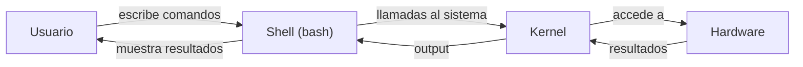

import { VscTerminalBash } from "react-icons/vsc";
import InstallExtension from '@site/src/components/shared/InstallExtension';


# Introduccion a Bash

## 1. Que es el Shell? <VscTerminalBash />

### El intermediario entre tu y el sistema operativo

Cuando abres una terminal en Linux, macOS o Windows (WSL), lo que aparece no es directamente el sistema operativo: es un **shell**, un programa interprete que recibe tus comandos en forma de texto, los interpreta y le pide al kernel del sistema operativo que los ejecute. El shell es, en esencia, una interfaz de texto entre el usuario y el nucleo del sistema.

Este concepto es fundamental: el shell no ejecuta nada por si mismo. Su trabajo es traducir lo que escribes en llamadas al sistema operativo. Cuando ejecutas `ls -la /home`, el shell interpreta ese texto, localiza el binario `ls`, le pasa los argumentos `-la` y `/home`, y muestra en pantalla el resultado que devuelve el kernel.

El shell cumple dos funciones principales:

- **Interprete de comandos interactivo**: cuando escribes comandos uno a uno en la terminal y ves los resultados inmediatamente.
- **Lenguaje de scripting**: cuando escribes una secuencia de comandos en un archivo y los ejecutas todos de una vez. Esto es lo que convierte al shell en una herramienta de automatizacion.

### Tipos de shell

No existe un unico shell. A lo largo de la historia de Unix y Linux han aparecido varios, cada uno con sus particularidades. Los mas relevantes son:

| Shell | Nombre completo | POSIX | Por defecto en | Caracteristicas principales |
|-------|----------------|-------|----------------|----------------------------|
| **bash** | Bourne Again Shell | Parcial (superset) | La mayoria de distribuciones Linux, macOS (hasta Catalina) | El estandar de facto para scripting. Arrays, funciones, aritmetica, manipulacion de strings. Enorme base de scripts existentes. |
| **zsh** | Z Shell | Parcial (superset) | macOS (desde Catalina) | Compatible con bash en gran medida. Autocompletado avanzado, temas, plugins (Oh My Zsh). Mejor experiencia interactiva. |
| **sh** | Bourne Shell / POSIX shell | Si | Sistemas Unix clasicos, `/bin/sh` como enlace simbolico | Shell minimo y portable. En muchos sistemas modernos, `/bin/sh` apunta a `dash` o `bash` en modo POSIX. |
| **dash** | Debian Almquist Shell | Si | Debian/Ubuntu como `/bin/sh` | Extremadamente rapido y ligero. No tiene arrays ni muchas extensiones de bash. Usado para scripts de arranque del sistema por su velocidad. |

### Modo interactivo vs no interactivo

Un shell puede ejecutarse en dos modos, y entender la diferencia es importante para el scripting:

- **Interactivo**: el shell espera que el usuario escriba comandos. Muestra un prompt (`$`, `#`, o personalizado), procesa cada linea y muestra la salida. Es lo que usas cuando abres una terminal. Carga archivos de configuracion como `~/.bashrc`.
- **No interactivo**: el shell ejecuta comandos desde un archivo (un script) sin interaccion del usuario. No muestra prompt, no espera entrada y termina cuando se acaban los comandos. Carga `~/.bash_profile` o `~/.profile` dependiendo de la configuracion, pero **no** carga `~/.bashrc` por defecto.

Esta distincion explica por que a veces un script no se comporta igual que cuando ejecutas los comandos manualmente en la terminal: los archivos de configuracion cargados son diferentes.

### Donde se usa bash en el mundo real

Bash no es solo "esa cosa que usas en la terminal". Es una herramienta omnipresente en la infraestructura moderna:

- **Servidores Linux**: practicamente todos los servidores Linux tienen bash instalado. Los scripts de arranque, mantenimiento, backups y monitorizacion suelen estar escritos en bash.
- **CI/CD**: los pipelines de GitHub Actions, GitLab CI, Jenkins y similares ejecutan pasos como comandos bash. Cada `run:` en un workflow de GitHub Actions es, por defecto, un script bash.
- **Contenedores Docker**: los `Dockerfile` usan `RUN` para ejecutar comandos shell. Los entrypoints y healthchecks de contenedores son frecuentemente scripts bash.
- **Cron jobs**: las tareas programadas del sistema se definen como comandos shell que `cron` ejecuta periodicamente.
- **Provisionamiento**: herramientas como Terraform usan `provisioner "local-exec"` para ejecutar scripts bash como parte del despliegue de infraestructura.

:::info Por que bash y no zsh para scripting?
Aunque macOS usa zsh como shell interactivo por defecto desde Catalina (2019), **bash sigue siendo el estandar para scripting**. La razon es simple: bash esta disponible en practicamente todos los servidores Linux, contenedores Docker y pipelines de CI/CD. Un script bash funciona en cualquier sitio. Un script zsh requiere que zsh este instalado, lo cual no esta garantizado en servidores ni en contenedores minimos. En este curso escribiremos scripts en bash por portabilidad.
:::

---

## 2. El shebang y permisos de ejecucion

### La linea mas importante de un script

Todo script bash debe comenzar con una linea especial llamada **shebang** (tambien conocida como hashbang). Esta linea le indica al sistema operativo que interprete debe usar para ejecutar el archivo:

```bash
#!/usr/bin/env bash
```

El shebang se compone de dos partes:
- `#!` -- el marcador magico que el kernel reconoce como indicador de interprete.
- `/usr/bin/env bash` -- el comando que localiza y ejecuta bash.

### Ruta directa vs `env`

Existen dos formas de escribir el shebang:

```bash
#!/bin/bash          # Ruta directa al binario
#!/usr/bin/env bash  # Busca bash en el PATH del usuario
```

La diferencia es crucial para la portabilidad:

| Shebang | Ventaja | Problema |
|---------|---------|----------|
| `#!/bin/bash` | Simple y directo | Asume que bash esta en `/bin/bash`. En algunos sistemas (NixOS, algunos BSDs, macOS con brew) bash esta en otra ruta. |
| `#!/usr/bin/env bash` | Busca bash donde sea que este instalado usando el `PATH` | Funciona en practicamente cualquier sistema Unix/Linux/macOS. |

:::tip Usa siempre `#!/usr/bin/env bash`
La forma portable `#!/usr/bin/env bash` es la recomendada por la comunidad y por herramientas como ShellCheck. Garantiza que tu script funcione independientemente de donde este instalado bash en el sistema. La unica excepcion es si necesitas una version especifica de bash en una ruta concreta.
:::

### Permisos de ejecucion

Un archivo con extension `.sh` no es automaticamente ejecutable. En sistemas Unix/Linux, necesitas otorgar permisos de ejecucion:

```bash
# Dar permisos de ejecucion al propietario
chmod +x mi_script.sh

# Verificar los permisos
ls -la mi_script.sh
# -rwxr-xr-x 1 usuario grupo 256 mar 15 10:00 mi_script.sh
#  ^^^
#  La 'x' indica permiso de ejecucion
```

El sistema de permisos Unix asigna tres tipos de permisos (lectura `r`, escritura `w`, ejecucion `x`) a tres niveles (propietario, grupo, otros). Con `chmod +x` estas anadiendo el permiso de ejecucion para los tres niveles.

### Tres formas de ejecutar un script

Existen tres maneras de ejecutar un script bash, y cada una se comporta de forma diferente:

```bash
# 1. Ejecucion directa (requiere permiso +x y shebang)
./mi_script.sh

# 2. Invocacion explicita del interprete (no requiere +x ni shebang)
bash mi_script.sh

# 3. Sourcing: ejecuta en el shell actual (no requiere +x)
source mi_script.sh
# o su equivalente:
. mi_script.sh
```

La diferencia es fundamental:

| Metodo | Subshell | Requiere `+x` | Requiere shebang | Las variables persisten |
|--------|----------|----------------|-------------------|------------------------|
| `./script.sh` | Si | Si | Si | No -- mueren con el subshell |
| `bash script.sh` | Si | No | No | No -- mueren con el subshell |
| `source script.sh` | No | No | No | Si -- modifican el shell actual |

:::warning Cuidado con `source`
Usar `source` ejecuta el script en tu shell actual. Esto significa que cualquier variable que el script defina, cualquier `cd` que haga, o cualquier `export` que ejecute, **afectara a tu sesion de terminal**. Usa `source` solo cuando necesites que el script modifique tu entorno (por ejemplo, para cargar variables de entorno de un archivo `.env`).
:::

---

## 3. Variables

### Declaracion y asignacion

En bash, las variables se declaran asignandoles un valor. No existen tipos de datos explicitos: todo es, en esencia, una cadena de texto (aunque bash permite operaciones aritmeticas).

La regla mas importante de la sintaxis de variables en bash es: **no puede haber espacios alrededor del `=`**:

```bash
# Correcto
nombre="Juan"
edad=25
ruta=/home/usuario

# INCORRECTO -- bash interpreta esto como un comando
nombre = "Juan"    # Error: intenta ejecutar 'nombre' con argumentos '=' y 'Juan'
nombre ="Juan"     # Error: intenta ejecutar 'nombre' con argumento '=Juan'
nombre= "Juan"     # Ejecuta 'Juan' con la variable nombre vacia temporalmente
```

Este es probablemente el error mas comun de principiantes en bash. El parser del shell interpreta el primer token de una linea como un comando a ejecutar. Si hay un espacio despues de `nombre`, bash piensa que `nombre` es un comando.

### Expansion de variables

Para acceder al valor de una variable, se usa el operador `$`:

```bash
nombre="mundo"

# Ambas formas son validas
echo $nombre        # mundo
echo ${nombre}      # mundo
echo "Hola, ${nombre}!"  # Hola, mundo!
```

Las llaves `${}` son opcionales en casos simples, pero **necesarias** cuando la variable esta adyacente a otros caracteres:

```bash
archivo="informe"

echo "$archivo_final"     # Vacio! Bash busca la variable 'archivo_final'
echo "${archivo}_final"   # informe_final -- correcto
```

:::tip Usa siempre `${variable}` con llaves
Aunque `$variable` funciona en muchos casos, usar siempre `${variable}` con llaves previene errores de ambiguedad y hace el codigo mas legible. Es una buena practica que herramientas como ShellCheck recomiendan.
:::

### `readonly` y `unset`

Bash permite marcar variables como constantes y eliminarlas:

```bash
# Variable de solo lectura (constante)
readonly PI=3.14159
PI=3.0  # Error: PI: readonly variable

# Eliminar una variable
temporal="datos temporales"
unset temporal
echo "$temporal"  # (vacio)

# No se puede hacer unset de una variable readonly
readonly FIJO="inmutable"
unset FIJO  # Error: FIJO: cannot unset: readonly variable
```

### Quoting: comillas simples, dobles y sin comillas

El quoting es uno de los conceptos mas criticos y confusos de bash. Determina como el shell interpreta los caracteres especiales y las variables dentro de una cadena.

| Tipo | Sintaxis | Expande variables | Expande comandos | Expande globbing | Cuando usar |
|------|----------|-------------------|-------------------|------------------|-------------|
| **Sin comillas** | `$var` | Si | Si | Si | Casi nunca -- peligroso. El shell aplica word splitting y globbing. |
| **Comillas dobles** | `"$var"` | Si | Si | No | La opcion por defecto. Protege contra word splitting y globbing. |
| **Comillas simples** | `'$var'` | No | No | No | Cuando quieres texto literal sin ninguna expansion. |

Veamos un ejemplo que ilustra la diferencia:

```bash
nombre="Juan Garcia"
archivos="*.txt"

# Sin comillas -- PELIGROSO
echo $nombre      # Juan Garcia (funciona aqui por casualidad)
echo $archivos    # lista todos los archivos .txt del directorio!

# Comillas dobles -- SEGURO
echo "$nombre"    # Juan Garcia (preserva espacios)
echo "$archivos"  # *.txt (literal, no expande el glob)

# Comillas simples -- LITERAL
echo '$nombre'    # $nombre (no expande la variable)
echo '$archivos'  # $archivos
```

:::danger Siempre entrecomilla tus variables
La ausencia de comillas es la fuente numero uno de bugs en scripts bash. Sin comillas, una variable con espacios se divide en multiples palabras, y los patrones glob se expanden. Ejemplo clasico:

```bash
archivo="mi documento.txt"
rm $archivo     # Ejecuta: rm mi documento.txt (borra 'mi' y 'documento.txt')
rm "$archivo"   # Ejecuta: rm "mi documento.txt" (borra el archivo correcto)
```

Regla: **siempre usa comillas dobles** alrededor de variables, excepto cuando necesites intencionadamente el word splitting (que es raro).
:::

### Operaciones con strings

Bash proporciona una serie de operadores para manipular cadenas de texto directamente, sin necesidad de herramientas externas como `sed` o `awk`:

```bash
nombre="Bash Scripting"

# Longitud de la cadena
echo "${#nombre}"           # 14

# Valor por defecto si la variable esta vacia o no existe
echo "${no_existe:-default}"        # default (usa el valor por defecto)
echo "${no_existe:=asignado}"       # asignado (ademas, asigna la variable)

# Valor alternativo si la variable SI existe
version="2.0"
echo "${version:+disponible}"       # disponible (porque version tiene valor)
echo "${vacia:+disponible}"         # (vacio, porque 'vacia' no tiene valor)

# Error si la variable no existe
echo "${obligatoria:?La variable obligatoria no esta definida}"
# Si 'obligatoria' no existe, imprime el error y sale del script
```

Estas expansiones son extremadamente utiles en scripts para manejar valores por defecto y validar que las variables requeridas estan definidas:

```bash
# Patron comun: variables de configuracion con defaults
DB_HOST="${DB_HOST:-localhost}"
DB_PORT="${DB_PORT:-5432}"
DB_NAME="${DB_NAME:?Debes definir DB_NAME}"  # Falla si no esta definida
```

### Sustitucion de comandos

La sustitucion de comandos permite capturar la salida de un comando y almacenarla en una variable:

```bash
# Sintaxis moderna (recomendada)
fecha=$(date +%Y-%m-%d)
archivos_total=$(ls -1 | wc -l)
usuario_actual=$(whoami)

# Sintaxis clasica con backticks (evitar)
fecha=`date +%Y-%m-%d`
```

:::tip Prefiere `$(comando)` sobre backticks
La sintaxis `$(comando)` es mas legible, se puede anidar facilmente y no tiene problemas con caracteres de escape. Los backticks `` `comando` `` son la forma clasica, pero presentan problemas al anidarlos y son mas dificiles de leer. ShellCheck tambien recomienda `$()`.

```bash
# Anidamiento facil con $()
directorio=$(basename $(dirname $(pwd)))

# Anidamiento problematico con backticks
directorio=`basename \`dirname \\\`pwd\\\`\``
```
:::

---

## 4. Variables especiales y argumentos

### Parametros posicionales

Cuando ejecutas un script con argumentos, bash los asigna automaticamente a variables numeradas llamadas **parametros posicionales**:

```bash
#!/usr/bin/env bash
# script: saludo.sh
# Uso: ./saludo.sh Juan Garcia

echo "Nombre del script: $0"    # ./saludo.sh
echo "Primer argumento: $1"     # Juan
echo "Segundo argumento: $2"    # Garcia
echo "Todos los argumentos: $@" # Juan Garcia
echo "Numero de argumentos: $#" # 2
```

### Tabla de variables especiales

Bash define un conjunto de variables especiales que proporcionan informacion sobre el estado del script y sus argumentos:

| Variable | Descripcion | Ejemplo de uso |
|----------|-------------|----------------|
| `$0` | Nombre del script (tal como fue invocado) | `echo "Uso: $0 [opciones]"` |
| `$1`, `$2`, ... `$9` | Parametros posicionales 1 al 9 | `archivo=$1` |
| `${10}`, `${11}`, ... | Parametros posicionales 10+ (requieren llaves) | `decimo=${10}` |
| `$@` | Todos los argumentos como palabras separadas | `for arg in "$@"; do ...` |
| `$*` | Todos los argumentos como una unica cadena | Rara vez util |
| `$#` | Numero de argumentos | `if [ $# -eq 0 ]; then ...` |
| `$?` | Codigo de salida del ultimo comando (0 = exito) | `if [ $? -ne 0 ]; then ...` |
| `$$` | PID del proceso actual (el script) | `echo "Mi PID: $$"` |
| `$!` | PID del ultimo proceso en segundo plano | `comando & pid=$!` |
| `$-` | Flags activos del shell actual | `echo "Opciones: $-"` |

### La diferencia critica entre `$@` y `$*`

Ambas variables contienen todos los argumentos, pero se comportan de forma muy diferente cuando se usan con comillas dobles:

```bash
#!/usr/bin/env bash
# Llamada: ./test.sh "hola mundo" "adios"

echo "--- Con \"\$@\" (cada argumento es una palabra separada) ---"
for arg in "$@"; do
    echo "  Argumento: '$arg'"
done
# Argumento: 'hola mundo'
# Argumento: 'adios'

echo "--- Con \"\$*\" (todo es una unica cadena) ---"
for arg in "$*"; do
    echo "  Argumento: '$arg'"
done
# Argumento: 'hola mundo adios'
```

Con `"$@"`, cada argumento original se preserva como una entidad separada, incluyendo los espacios internos. Con `"$*"`, todos los argumentos se concatenan en una unica cadena.

:::tip Usa siempre `"$@"` (con comillas dobles)
En el 99% de los casos, `"$@"` es lo que quieres. Preserva los argumentos exactamente como los paso el usuario, respetando espacios y caracteres especiales. `$*` sin comillas o `$@` sin comillas rompen argumentos que contienen espacios.
:::

### El comando `shift`

`shift` elimina el primer parametro posicional y desplaza todos los demas una posicion a la izquierda:

```bash
#!/usr/bin/env bash
echo "Antes de shift: $1 $2 $3"  # uno dos tres
shift
echo "Despues de shift: $1 $2 $3"  # dos tres
shift 2
echo "Despues de shift 2: $1"  # (vacio, ya no quedan)
```

Es especialmente util para procesar opciones en un bucle:

```bash
#!/usr/bin/env bash
while [ $# -gt 0 ]; do
    case "$1" in
        -v|--verbose)
            VERBOSE=true
            shift
            ;;
        -o|--output)
            OUTPUT="$2"
            shift 2
            ;;
        *)
            echo "Opcion desconocida: $1"
            exit 1
            ;;
    esac
done
```

### Ejemplo: script que valida argumentos

Este script demuestra el uso combinado de variables especiales para validar la entrada del usuario:

```bash {3-6,12-16}
#!/usr/bin/env bash

# Validar que se han pasado exactamente 2 argumentos
if [ $# -ne 2 ]; then
    echo "Error: se requieren exactamente 2 argumentos." >&2
    echo "Uso: $0 <nombre> <edad>" >&2
    exit 1
fi

nombre="$1"
edad="$2"

# Validar que la edad es un numero
if ! [[ "$edad" =~ ^[0-9]+$ ]]; then
    echo "Error: la edad debe ser un numero entero." >&2
    exit 1
fi

echo "Hola, ${nombre}. Tienes ${edad} anos."
echo "Script ejecutado: $0"
echo "PID del proceso: $$"
echo "Codigo de salida previo: $?"
```

```bash
# Ejecucion:
$ ./validar.sh Juan 30
Hola, Juan. Tienes 30 anos.
Script ejecutado: ./validar.sh
PID del proceso: 12345
Codigo de salida previo: 0

$ ./validar.sh Juan
Error: se requieren exactamente 2 argumentos.
Uso: ./validar.sh <nombre> <edad>
```

---

## 5. Arrays

### Arrays indexados

Los arrays indexados son listas ordenadas de elementos, accesibles por su posicion numerica (empezando en 0):

```bash
# Declaracion e inicializacion
frutas=("manzana" "platano" "naranja" "uva")

# Declaracion explicita
declare -a numeros
numeros=(10 20 30 40 50)

# Acceso a elementos individuales
echo "${frutas[0]}"    # manzana
echo "${frutas[2]}"    # naranja

# Todos los elementos
echo "${frutas[@]}"    # manzana platano naranja uva

# Numero de elementos
echo "${#frutas[@]}"   # 4

# Longitud de un elemento especifico
echo "${#frutas[0]}"   # 7 (longitud de "manzana")

# Anadir elementos
frutas+=("melon")
echo "${frutas[@]}"    # manzana platano naranja uva melon

# Modificar un elemento
frutas[1]="pera"
echo "${frutas[@]}"    # manzana pera naranja uva melon

# Eliminar un elemento (deja un hueco en el indice)
unset frutas[2]
echo "${frutas[@]}"    # manzana pera uva melon
```

### Iterar sobre arrays

```bash
servidores=("web-01" "web-02" "db-01" "cache-01")

# Iterar sobre los valores
for servidor in "${servidores[@]}"; do
    echo "Comprobando estado de: $servidor"
done

# Iterar sobre los indices
for i in "${!servidores[@]}"; do
    echo "Servidor [$i]: ${servidores[$i]}"
done
```

### Slicing de arrays

```bash
numeros=(0 1 2 3 4 5 6 7 8 9)

# Extraer un subarray: ${array[@]:offset:length}
echo "${numeros[@]:3:4}"    # 3 4 5 6
echo "${numeros[@]:7}"      # 7 8 9 (desde el indice 7 hasta el final)
```

### Arrays asociativos

Los arrays asociativos (tambien llamados diccionarios o hash maps) permiten usar cadenas como claves en lugar de indices numericos:

```bash
# REQUIERE: declare -A (obligatorio)
declare -A configuracion

configuracion[host]="localhost"
configuracion[puerto]="5432"
configuracion[base_datos]="mi_app"
configuracion[usuario]="admin"

# Acceso
echo "${configuracion[host]}"       # localhost
echo "${configuracion[puerto]}"     # 5432

# Todas las claves
echo "${!configuracion[@]}"         # host puerto base_datos usuario

# Todos los valores
echo "${configuracion[@]}"          # localhost 5432 mi_app admin

# Numero de elementos
echo "${#configuracion[@]}"         # 4

# Iterar sobre pares clave-valor
for clave in "${!configuracion[@]}"; do
    echo "$clave = ${configuracion[$clave]}"
done
```

:::warning Arrays asociativos requieren bash 4+
Los arrays asociativos (`declare -A`) fueron introducidos en **bash 4.0** (2009). Si tu script necesita ejecutarse en macOS con el bash por defecto (version 3.2), no podras usar esta funcionalidad. Esto es relevante porque macOS no actualiza bash mas alla de la 3.2 por cuestiones de licencia (GPLv3). Consulta la seccion de instalacion para resolver este problema.
:::

### Ejemplo practico: configuracion con arrays

```bash
#!/usr/bin/env bash

# Array indexado de servidores a comprobar
servidores=("192.168.1.10" "192.168.1.11" "192.168.1.12")

# Array asociativo con nombres descriptivos
declare -A nombres
nombres[192.168.1.10]="web-principal"
nombres[192.168.1.11]="api-backend"
nombres[192.168.1.12]="base-de-datos"

for ip in "${servidores[@]}"; do
    if ping -c 1 -W 2 "$ip" &>/dev/null; then
        echo "[OK]    ${nombres[$ip]} ($ip) - accesible"
    else
        echo "[FALLO] ${nombres[$ip]} ($ip) - no responde"
    fi
done
```

---

## 6. Instalacion y configuracion del entorno

### Actualizar bash en macOS

macOS incluye bash, pero la version que viene preinstalada es la **3.2** (de 2007). Apple no la actualiza porque a partir de bash 4.0, la licencia cambio de GPLv2 a **GPLv3**, y Apple no distribuye software con esa licencia.

:::info Por que macOS tiene bash 3.2?
Cuando GNU Bash paso a la licencia GPLv3 con la version 4.0 en 2009, Apple dejo de actualizar el bash incluido en macOS. La GPLv3 tiene clausulas sobre patentes y restricciones de uso que Apple no acepta para el software incluido por defecto. Por eso macOS cambio su shell por defecto a zsh (licencia MIT) a partir de Catalina. Bash 3.2 seguira estando disponible, pero nunca se actualizara.
:::

Para instalar una version moderna de bash en macOS:

```bash
# Instalar bash moderno via Homebrew
brew install bash

# Verificar la version instalada
/opt/homebrew/bin/bash --version
# GNU bash, version 5.2.x(1)-release

# La version del sistema sigue siendo la vieja
/bin/bash --version
# GNU bash, version 3.2.57(1)-release

# Verificar que usa la version correcta con env
/usr/bin/env bash --version
# Deberia mostrar la version de Homebrew si /opt/homebrew/bin esta en el PATH
```

### Verificar la version de bash

Independientemente del sistema operativo, comprueba tu version:

```bash
bash --version
```

Para este curso necesitas bash **4.0 o superior**. La version 5.x es la recomendada.

### Configuracion de VSCode

Visual Studio Code es el editor recomendado para escribir scripts bash. Instala la extension **Bash IDE** que proporciona:

- Resaltado de sintaxis para archivos `.sh` y `.bash`.
- Autocompletado basado en el contexto del script.
- Navegacion a definiciones de funciones y variables.
- Integracion con ShellCheck para deteccion de errores en tiempo real.
- Soporte para snippets comunes de bash.

<InstallExtension id="mads-hartmann.bash-ide-vscode" label="Bash IDE" />

#### settings.json

Anade esta configuracion a tu `settings.json` de VSCode para mejorar la experiencia de desarrollo:

```json
{
  "[shellscript]": {
    "editor.defaultFormatter": "mkhl.shfmt",
    "editor.formatOnSave": true,
    "editor.tabSize": 2
  },
  "bashIde.shellcheckPath": "shellcheck",
  "bashIde.enableSourceErrorDiagnostics": true
}
```

### ShellCheck: tu mejor aliado

[ShellCheck](https://www.shellcheck.net/) es un analizador estatico de scripts shell. Detecta errores comunes, malas practicas y problemas de portabilidad **antes de ejecutar el script**. Es el equivalente a ESLint para JavaScript o pylint para Python.

```bash
# Instalar en macOS
brew install shellcheck

# Instalar en Debian/Ubuntu
sudo apt install shellcheck

# Instalar en RHEL/CentOS/Fedora
sudo yum install shellcheck

# Analizar un script
shellcheck mi_script.sh
```

Ejemplo de salida de ShellCheck:

```bash
#!/bin/bash
# script con errores comunes

nombre=Juan Garcia    # Error: falta entrecomillar
echo $nombre          # Warning: variable sin comillas
rm $archivo           # Peligro: variable sin comillas en rm
```

```
In script.sh line 4:
nombre=Juan Garcia
       ^-- SC1007: Remove space after = if trying to assign a value.

In script.sh line 5:
echo $nombre
     ^-- SC2086: Double quote to prevent globbing and word splitting.

In script.sh line 6:
rm $archivo
   ^-- SC2086: Double quote to prevent globbing and word splitting.
```

:::tip Integra ShellCheck en tu workflow
ShellCheck se integra con la extension Bash IDE de VSCode, mostrando errores directamente en el editor. Tambien se puede integrar en pipelines de CI/CD para rechazar scripts con errores antes de que lleguen a produccion:

```yaml
# En GitHub Actions
- name: Lint shell scripts
  run: shellcheck scripts/*.sh
```
:::

---

## 7. Primer script

### Un script completo paso a paso

Vamos a escribir un script que combine todos los conceptos vistos en esta unidad. El script recibira un nombre de usuario como argumento, validara la entrada y mostrara informacion del sistema:

```bash
#!/usr/bin/env bash
#
# info_usuario.sh - Muestra informacion personalizada del sistema.
# Uso: ./info_usuario.sh <nombre>
#
# Este script demuestra el uso de:
#   - Shebang portable
#   - Variables y expansion
#   - Parametros posicionales y validacion
#   - Sustitucion de comandos
#   - Quoting correcto
#   - Variables especiales

# --- Configuracion ---
readonly VERSION="1.0.0"
readonly SEPARADOR="============================================"

# --- Validacion de argumentos ---
if [ $# -eq 0 ]; then
    echo "${SEPARADOR}" >&2
    echo "Error: falta el nombre de usuario." >&2
    echo "Uso: $0 <nombre>" >&2
    echo "${SEPARADOR}" >&2
    exit 1
fi

nombre="$1"

# --- Recopilar informacion del sistema ---
fecha_actual=$(date "+%A, %d de %B de %Y")
hora_actual=$(date "+%H:%M:%S")
hostname=$(hostname)
shell_actual="${SHELL}"
bash_version="${BASH_VERSION}"
directorio_actual=$(pwd)
usuario_sistema=$(whoami)
num_procesos=$(ps aux | wc -l | tr -d ' ')

# --- Mostrar la informacion ---
echo "${SEPARADOR}"
echo "  Bienvenido, ${nombre}!"
echo "${SEPARADOR}"
echo ""
echo "  Fecha    : ${fecha_actual}"
echo "  Hora     : ${hora_actual}"
echo "  Host     : ${hostname}"
echo "  Usuario  : ${usuario_sistema}"
echo "  Shell    : ${shell_actual}"
echo "  Bash     : ${bash_version}"
echo "  PWD      : ${directorio_actual}"
echo "  Procesos : ${num_procesos} en ejecucion"
echo "  Script   : $0 (v${VERSION})"
echo "  PID      : $$"
echo ""
echo "${SEPARADOR}"
echo "  Argumentos recibidos: $#"
echo "  Todos los args: $@"
echo "${SEPARADOR}"

exit 0
```

### Ejecucion paso a paso

**Paso 1**: Crear el archivo y darle permisos de ejecucion.

```bash
# Crear el archivo (con tu editor preferido o con cat)
vim info_usuario.sh

# Dar permisos de ejecucion
chmod +x info_usuario.sh
```

**Paso 2**: Ejecutar sin argumentos para ver la validacion.

```bash
$ ./info_usuario.sh
============================================
Error: falta el nombre de usuario.
Uso: ./info_usuario.sh <nombre>
============================================
```

El script devuelve codigo de salida 1 (error). Podemos comprobarlo:

```bash
$ echo $?
1
```

**Paso 3**: Ejecutar con un argumento valido.

```bash
$ ./info_usuario.sh "Ana Lopez"
============================================
  Bienvenido, Ana Lopez!
============================================

  Fecha    : jueves, 03 de abril de 2026
  Hora     : 10:32:15
  Host     : macbook-pro.local
  Usuario  : ana
  Shell    : /bin/zsh
  Bash     : 5.2.26(1)-release
  PWD      : /home/ana/scripts
  Procesos : 247 en ejecucion
  Script   : ./info_usuario.sh (v1.0.0)
  PID      : 54321

============================================
  Argumentos recibidos: 1
  Todos los args: Ana Lopez
============================================
```

**Paso 4**: Verificar el codigo de salida correcto.

```bash
$ echo $?
0
```

Observa como cada concepto de esta unidad aparece en el script:
- `#!/usr/bin/env bash` -- shebang portable.
- `readonly` -- constantes que no cambian.
- `$#`, `$0`, `$1`, `$@`, `$$` -- variables especiales.
- `$(comando)` -- sustitucion de comandos.
- `"${variable}"` -- expansion con comillas dobles y llaves.
- `exit 0` / `exit 1` -- codigos de salida.

---

## 8. Resumen

Estos son los puntos clave de esta unidad:

- El **shell** es un interprete de comandos que actua como intermediario entre el usuario y el kernel del sistema operativo. Bash es el estandar de facto para scripting por su portabilidad y ubicuidad.
- El **shebang** (`#!/usr/bin/env bash`) le dice al sistema que interprete usar. Siempre usa la forma portable con `env`.
- Los **permisos de ejecucion** (`chmod +x`) son necesarios para ejecutar un script directamente. Conocer la diferencia entre `./`, `bash` y `source` es fundamental.
- Las **variables** se asignan sin espacios (`var=valor`) y se expanden con `$` o `${}`. El quoting (comillas dobles vs simples) controla que expansiones se aplican.
- Las **variables especiales** (`$@`, `$#`, `$?`, `$$`) dan acceso a los argumentos del script, codigos de salida y metadatos del proceso.
- Los **arrays indexados** almacenan listas ordenadas; los **arrays asociativos** (`declare -A`) permiten claves de texto, pero requieren bash 4+.
- **ShellCheck** es una herramienta indispensable para detectar errores y malas practicas antes de ejecutar un script.
- macOS incluye bash 3.2 por defecto; usa `brew install bash` para obtener una version moderna.



El shell es el puente entre lo que el usuario quiere hacer y lo que el hardware ejecuta. Dominar bash es dominar ese puente: la capacidad de automatizar, orquestar y controlar sistemas de forma reproducible, auditable y eficiente.
