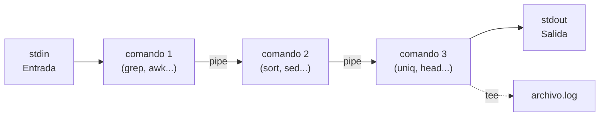

# Pipes y Herramientas de Texto

## 1. Flujos estándar y redirección

### Los tres canales de comunicación

Cada proceso en un sistema Unix/Linux nace con tres canales de comunicación abiertos, conocidos como **file descriptors** (descriptores de archivo):

| File Descriptor | Nombre | Abreviatura | Descripción |
|:-:|---------|-------------|-------------|
| **0** | Standard Input | `stdin` | Canal de entrada. Por defecto, el teclado. Es por donde el proceso recibe datos. |
| **1** | Standard Output | `stdout` | Canal de salida normal. Por defecto, la terminal. Es por donde el proceso emite resultados. |
| **2** | Standard Error | `stderr` | Canal de salida de errores. Por defecto, también la terminal. Es por donde el proceso emite mensajes de error. |

El hecho de que `stdout` y `stderr` sean canales independientes es una decisión de diseño fundamental. Permite separar la salida útil (resultados) de los mensajes de error, lo que hace posible procesar una sin que la otra interfiera.

```
               ┌─────────────────┐
  stdin (0) ──>│                 │──> stdout (1)
   (teclado)   │    Proceso      │
               │                 │──> stderr (2)
               └─────────────────┘
```

Por ejemplo, cuando ejecutas `ls /home /noexiste`, la lista de archivos de `/home` sale por `stdout` y el mensaje de error sobre `/noexiste` sale por `stderr`. Ambos aparecen en la terminal, pero son flujos distintos.

### Redirección de salida

La redirección permite cambiar el destino (o el origen) de estos canales. En lugar de que la salida vaya a la terminal, puedes enviarla a un archivo.

**Sobrescribir con `>`**

El operador `>` redirige `stdout` a un archivo. Si el archivo existe, lo sobrescribe; si no existe, lo crea:

```bash
# Guardar el listado de archivos en un fichero
ls -la > listado.txt

# El contenido anterior de listado.txt se pierde
echo "nueva línea" > listado.txt
```

**Añadir con `>>`**

El operador `>>` redirige `stdout` al final del archivo sin borrar el contenido previo:

```bash
# Anadir una linea al final del archivo
echo "Primera entrada del log" >> app.log
echo "Segunda entrada del log" >> app.log
```

### Redireccion de entrada

**Leer desde un archivo con `<`**

El operador `<` redirige un archivo hacia `stdin`. En lugar de leer del teclado, el proceso lee del archivo:

```bash
# Contar las lineas de un archivo usando redireccion de entrada
wc -l < datos.txt

# Ordenar el contenido de un archivo
sort < nombres.txt
```

:::info Diferencia con pasar el archivo como argumento
`wc -l datos.txt` y `wc -l < datos.txt` producen resultados ligeramente distintos. En el primer caso, `wc` recibe el nombre del archivo y lo muestra en la salida (`42 datos.txt`). En el segundo caso, `wc` lee de `stdin` y no sabe el nombre del archivo, asi que solo muestra el numero (`42`).
:::

### Redireccion de stderr

Los errores van por el descriptor 2, asi que para redirigirlos se usa el prefijo `2`:

```bash
# Redirigir errores a un archivo (sobrescribir)
find / -name "*.conf" 2> errores.log

# Redirigir errores a un archivo (anadir)
comando_que_falla 2>> errores.log
```

**Combinar stdout y stderr**

En muchas situaciones necesitas redirigir ambos flujos al mismo destino. Hay varias formas de hacerlo:

```bash
# Redirigir stdout a un archivo y stderr al mismo destino
comando > salida.log 2>&1

# Forma abreviada (Bash 4+): redirige ambos de una vez
comando &> salida.log

# Anadir ambos flujos a un archivo existente
comando >> salida.log 2>&1
comando &>> salida.log
```

La notacion `2>&1` significa _"redirige el descriptor 2 (stderr) al mismo destino que el descriptor 1 (stdout)"_. El ampersand indica que `1` es un descriptor de archivo, no un archivo literal llamado `1`.

:::tip El orden importa
La redireccion `2>&1` debe ir **despues** de `>`. El shell procesa las redirecciones de izquierda a derecha:

```bash
# CORRECTO: primero stdout va al archivo, luego stderr sigue a stdout
comando > salida.log 2>&1

# INCORRECTO: stderr se redirige a donde apunta stdout (la terminal),
# y luego stdout se redirige al archivo. Los errores siguen en la terminal.
comando 2>&1 > salida.log
```
:::

### /dev/null -- el agujero negro

`/dev/null` es un archivo especial que descarta todo lo que se escribe en el. Es util para silenciar salidas que no interesan:

```bash
# Ejecutar un comando descartando toda la salida
comando > /dev/null 2>&1

# Descartar solo los errores (mantener stdout)
find / -name "*.log" 2>/dev/null

# Descartar solo la salida normal (mantener errores)
comando > /dev/null
```

El patron `> /dev/null 2>&1` es tan comun en scripts de produccion que merece memorizarse. Silencia completamente un comando.

### Here documents y here strings

**Here documents (`<<`)**

Un here document permite pasar un bloque de texto multilinca como entrada estandar de un comando. Se delimita con una etiqueta (normalmente `EOF`, pero puede ser cualquier palabra):

```bash
cat <<EOF
Hola, esto es un here document.
Puede contener multiples lineas.
Tambien puede incluir variables: $USER
EOF
```

Si entrecomillas la etiqueta, se desactiva la expansion de variables:

```bash
cat <<'EOF'
Esta linea NO expande $USER
Tampoco interpreta $(whoami)
EOF
```

Los here documents son especialmente utiles para generar archivos de configuracion desde scripts:

```bash
cat <<EOF > /etc/nginx/conf.d/app.conf
server {
    listen 80;
    server_name ${DOMAIN};
    root /var/www/${APP_NAME};
}
EOF
```

**Here strings (`<<<`)**

Un here string pasa una cadena simple como `stdin`. Es mas conciso que un here document para una sola linea:

```bash
# En lugar de: echo "hola mundo" | wc -w
wc -w <<< "hola mundo"

# Util para pasar una variable como entrada
grep "error" <<< "$LOG_OUTPUT"
```

### tee -- escribir a stdout y a un archivo simultaneamente

El comando `tee` lee de `stdin`, escribe a `stdout` Y al archivo indicado. Es como una bifurcacion en una tuberia:

```bash
# Ver la salida en pantalla y guardarla en un archivo
ls -la | tee listado.txt

# Anadir al archivo en lugar de sobrescribir
echo "nueva linea" | tee -a registro.log

# Escribir a multiples archivos
comando | tee archivo1.txt archivo2.txt

# Uso comun: guardar log y seguir procesando
make build 2>&1 | tee build.log | grep -i error
```

`tee` es indispensable cuando necesitas depurar un pipeline sin interrumpir el flujo de datos.

---

## 2. Pipes: la filosofia Unix

### La filosofia: herramientas pequenas, conectadas

La filosofia Unix se resume en una idea poderosa: construir programas pequenos que hagan una sola cosa bien y conectarlos entre si para resolver problemas complejos. En lugar de crear un programa monolitico que lo haga todo, se combinan herramientas simples como piezas de Lego.

Los tres principios fundamentales son:

1. **Cada programa hace una cosa y la hace bien.**
2. **Los programas deben poder trabajar juntos.**
3. **Los programas deben manejar flujos de texto**, porque el texto es la interfaz universal.

### El operador pipe (`|`)

El operador `|` conecta la salida estandar (`stdout`) de un comando con la entrada estandar (`stdin`) del siguiente. El shell crea un buffer en memoria entre ambos procesos:

```bash
# La salida de ls se convierte en la entrada de grep
ls -la | grep ".txt"

# Encadenar multiples comandos
cat /var/log/syslog | grep "error" | sort | uniq -c | sort -rn
```

### Como funcionan los pipes internamente

Cuando el shell encuentra un pipe, realiza las siguientes operaciones a nivel de sistema:

1. **Crea un pipe** con la syscall `pipe()`, que devuelve dos file descriptors: uno para leer y otro para escribir.
2. **Hace `fork()`** para crear un proceso hijo para cada comando.
3. Usa **`dup2()`** para conectar el `stdout` del primer proceso al extremo de escritura del pipe y el `stdin` del segundo proceso al extremo de lectura.
4. Ambos procesos se ejecutan **en paralelo**. El kernel gestiona la sincronizacion: si el buffer del pipe se llena, el escritor se bloquea; si esta vacio, el lector espera.

Este diseno significa que los datos fluyen entre los procesos conforme se producen, sin necesidad de escribir archivos intermedios a disco.

### Pipeline paso a paso

Analicemos un pipeline clasico para contar las palabras mas frecuentes en un archivo:

```bash
cat access.log | awk '{print $7}' | sort | uniq -c | sort -rn | head -10
```

| Paso | Comando | Funcion |
|:----:|---------|---------|
| 1 | `cat access.log` | Lee el archivo y envia su contenido a stdout. |
| 2 | `awk '{print $7}'` | Extrae el septimo campo de cada linea (la URL en un log de Apache). |
| 3 | `sort` | Ordena las lineas alfabeticamente. Necesario para que `uniq` funcione. |
| 4 | `uniq -c` | Elimina duplicados consecutivos y cuenta las repeticiones. |
| 5 | `sort -rn` | Ordena numericamente (`-n`) en orden descendente (`-r`). |
| 6 | `head -10` | Muestra solo las 10 primeras lineas (las URLs mas visitadas). |

:::info PIPESTATUS: codigos de salida en un pipeline
Por defecto, `$?` solo contiene el codigo de salida del **ultimo** comando del pipeline. Para inspeccionar el codigo de cada comando, Bash ofrece el array `$PIPESTATUS`:

```bash
false | true | false
echo "${PIPESTATUS[0]} ${PIPESTATUS[1]} ${PIPESTATUS[2]}"
# Salida: 1 0 1
```

Otra opcion es activar `set -o pipefail`, que hace que el pipeline devuelva el codigo de salida del ultimo comando que fallo (en lugar del ultimo comando del pipeline):

```bash
set -o pipefail
false | true
echo $?  # Salida: 1 (en lugar de 0)
```
:::

### Named pipes (mkfifo)

Los pipes que hemos visto son anonimos: existen solo durante la ejecucion del pipeline. Tambien existen los **named pipes** (o FIFOs), que son archivos especiales en el sistema de ficheros que permiten comunicar dos procesos que no estan en el mismo pipeline:

```bash
# Crear un named pipe
mkfifo /tmp/mi_pipe

# En una terminal, escribir datos al pipe
echo "datos importantes" > /tmp/mi_pipe

# En otra terminal, leer del pipe
cat /tmp/mi_pipe

# Limpiar
rm /tmp/mi_pipe
```

Los named pipes son utiles para comunicacion entre procesos en scripts complejos, aunque en la practica son menos frecuentes que los pipes anonimos.

---

## 3. grep -- busqueda de patrones

### Que es grep

`grep` (Global Regular Expression Print) busca lineas que coincidan con un patron en uno o mas archivos. Es una de las herramientas mas utilizadas en Unix/Linux y probablemente la primera que se aprende a combinar con pipes.

### Uso basico

```bash
# Buscar un patron en un archivo
grep "error" app.log

# Buscar en multiples archivos
grep "TODO" *.py

# Buscar desde stdin (a traves de un pipe)
dmesg | grep "usb"
```

### Flags mas importantes

| Flag | Nombre | Descripcion | Ejemplo |
|------|--------|-------------|---------|
| `-i` | Case insensitive | Ignora mayusculas y minusculas | `grep -i "error" app.log` |
| `-r` | Recursive | Busca en todos los archivos del directorio recursivamente | `grep -r "TODO" src/` |
| `-n` | Line numbers | Muestra el numero de linea de cada coincidencia | `grep -n "def " app.py` |
| `-c` | Count | Cuenta el numero de lineas que coinciden | `grep -c "404" access.log` |
| `-l` | Files only | Muestra solo los nombres de los archivos con coincidencias | `grep -rl "deprecated" lib/` |
| `-v` | Invert | Muestra las lineas que **no** coinciden | `grep -v "^#" config.conf` |
| `-w` | Word | Coincide solo con la palabra completa | `grep -w "error" log.txt` |
| `-E` | Extended regex | Habilita expresiones regulares extendidas | `grep -E "error|warning" log.txt` |
| `-P` | Perl regex | Habilita expresiones regulares Perl (mas potentes) | `grep -P "\d{3}-\d{4}" datos.txt` |
| `-o` | Only matching | Muestra solo la parte que coincide, no la linea entera | `grep -oE "\b[0-9]+\b" datos.txt` |
| `-A n` | After | Muestra `n` lineas despues de cada coincidencia | `grep -A 3 "Exception" app.log` |
| `-B n` | Before | Muestra `n` lineas antes de cada coincidencia | `grep -B 2 "FATAL" app.log` |
| `-C n` | Context | Muestra `n` lineas antes y despues de cada coincidencia | `grep -C 5 "segfault" kern.log` |

### Expresiones regulares basicas con grep

| Patron | Significado | Ejemplo |
|--------|-------------|---------|
| `.` | Cualquier caracter | `grep "h.la" archivo` coincide con hola, hala, hula... |
| `*` | Cero o mas repeticiones del caracter anterior | `grep "ab*c" archivo` coincide con ac, abc, abbc... |
| `^` | Inicio de linea | `grep "^Error" log` lineas que empiezan por Error |
| `$` | Final de linea | `grep "\.conf$" lista` lineas que terminan en .conf |
| `[]` | Clase de caracteres | `grep "[aeiou]" archivo` lineas con vocales |
| `[^]` | Negacion de clase | `grep "[^0-9]" archivo` lineas con caracteres no numericos |
| `\` | Escape | `grep "\." archivo` busca un punto literal |

### Ejemplos practicos

```bash
# Buscar errores en un log mostrando numeros de linea
grep -n "ERROR" /var/log/app.log

# Contar cuantas peticiones 404 hubo
grep -c "404" /var/log/nginx/access.log

# Buscar TODOs en todo el proyecto, excluyendo node_modules
grep -rn "TODO" --exclude-dir=node_modules src/

# Encontrar archivos que contienen una funcion especifica
grep -rl "def calculate_total" src/

# Filtrar comentarios y lineas vacias de un archivo de configuracion
grep -v "^#" config.conf | grep -v "^$"

# Buscar IPs en un log (usando regex extendida)
grep -oE "\b[0-9]{1,3}(\.[0-9]{1,3}){3}\b" access.log

# Buscar errores con contexto (3 lineas antes y despues)
grep -C 3 "NullPointerException" app.log
```

:::tip egrep y fgrep
`egrep` es equivalente a `grep -E` (regex extendida) y `fgrep` es equivalente a `grep -F` (cadena fija, sin interpretar regex). Aunque ambos funcionan, se consideran obsoletos. Es preferible usar `grep -E` y `grep -F` directamente.
:::

---

## 4. sed -- editor de flujo

### Que es sed

`sed` (Stream Editor) es un editor de flujo que procesa texto linea por linea. Recibe texto por `stdin` (o desde un archivo), aplica una o mas transformaciones y emite el resultado por `stdout`. Es extremadamente util para hacer sustituciones, eliminar lineas y transformar texto en scripts automatizados.

### Sustitucion: el uso mas comun

La sintaxis de sustitucion sigue el patron `s/patron/reemplazo/flags`:

```bash
# Sustituir la primera ocurrencia en cada linea
echo "hola mundo hola" | sed 's/hola/adios/'
# Salida: adios mundo hola

# Sustituir TODAS las ocurrencias en cada linea (flag g = global)
echo "hola mundo hola" | sed 's/hola/adios/g'
# Salida: adios mundo adios

# Sustitucion case-insensitive (flag I, solo GNU sed)
echo "Hola HOLA hola" | sed 's/hola/hey/gI'
# Salida: hey hey hey
```

El delimitador no tiene que ser `/`. Si el patron contiene barras, puedes usar otro caracter para evitar escaparlas:

```bash
# Sustituir una ruta (usando | como delimitador)
sed 's|/usr/local/bin|/opt/bin|g' script.sh

# Tambien se puede usar #, @, o casi cualquier caracter
sed 's#viejo#nuevo#g' archivo.txt
```

### Edicion in-place

El flag `-i` modifica el archivo directamente en lugar de escribir a `stdout`:

```bash
# GNU sed (Linux): edicion in-place directa
sed -i 's/antiguo/nuevo/g' archivo.txt

# Crear backup antes de modificar
sed -i.bak 's/antiguo/nuevo/g' archivo.txt
```

:::warning macOS y BSD sed
En macOS, `sed -i` requiere un argumento obligatorio para la extension del backup. Para editar sin backup, hay que pasar una cadena vacia:

```bash
# macOS: edicion in-place sin backup
sed -i '' 's/antiguo/nuevo/g' archivo.txt

# macOS: edicion in-place con backup
sed -i '.bak' 's/antiguo/nuevo/g' archivo.txt
```

Si necesitas que tu script funcione en ambos sistemas, considera instalar GNU sed en macOS (`brew install gnu-sed`, disponible como `gsed`) o usar una construccion compatible:

```bash
# Compatible con GNU y BSD sed
sed -i.bak 's/antiguo/nuevo/g' archivo.txt && rm archivo.txt.bak
```
:::

### Eliminar lineas

El comando `d` elimina las lineas que coincidan con un patron:

```bash
# Eliminar lineas que contengan "DEBUG"
sed '/DEBUG/d' app.log

# Eliminar lineas vacias
sed '/^$/d' archivo.txt

# Eliminar comentarios (lineas que empiezan con #)
sed '/^#/d' config.conf

# Eliminar comentarios Y lineas vacias
sed '/^#/d; /^$/d' config.conf
```

### Imprimir lineas especificas

El flag `-n` suprime la salida por defecto, y el comando `p` imprime las lineas seleccionadas:

```bash
# Mostrar solo la linea 5
sed -n '5p' archivo.txt

# Mostrar las lineas 10 a 20
sed -n '10,20p' archivo.txt

# Mostrar la primera linea (equivalente a head -1)
sed -n '1p' archivo.txt

# Mostrar la ultima linea (equivalente a tail -1)
sed -n '$p' archivo.txt
```

### Rangos de direcciones

`sed` permite aplicar comandos solo a un rango de lineas o a lineas que coincidan con un patron:

```bash
# Sustituir solo en las lineas 2 a 5
sed '2,5s/foo/bar/g' archivo.txt

# Sustituir desde la linea que contiene "START" hasta la que contiene "END"
sed '/START/,/END/s/viejo/nuevo/g' archivo.txt

# Eliminar desde la linea 10 hasta el final del archivo
sed '10,$d' archivo.txt
```

### Multiples comandos

Puedes encadenar varios comandos con `-e` o separandolos con punto y coma:

```bash
# Usando -e
sed -e 's/foo/bar/g' -e 's/baz/qux/g' archivo.txt

# Usando punto y coma
sed 's/foo/bar/g; s/baz/qux/g' archivo.txt
```

### Ejemplos practicos

```bash
# Eliminar comentarios y lineas vacias de un archivo de configuracion
sed '/^#/d; /^$/d; /^[[:space:]]*$/d' config.conf

# Reemplazar la version en un chart.yaml
sed -i "s/version:.*/version: ${NEW_VERSION}/" chart.yaml

# Insertar una linea despues de un patron
sed '/^server {/a\    include /etc/nginx/security.conf;' nginx.conf

# Anadir un prefijo a todas las lineas
sed 's/^/[LOG] /' mensajes.txt

# Extraer texto entre dos marcadores
sed -n '/^BEGIN$/,/^END$/p' datos.txt

# Eliminar tags HTML (simplificado)
sed 's/<[^>]*>//g' pagina.html

# Reemplazar tabuladores por espacios
sed 's/\t/    /g' archivo.txt
```

---

## 5. awk -- procesamiento de campos

### Que es awk

`awk` es un lenguaje de procesamiento de texto orientado a campos. Mientras que `grep` busca patrones y `sed` transforma texto linea por linea, `awk` destaca en dividir cada linea en campos y operar sobre ellos. Es especialmente potente para procesar datos tabulares como CSVs, logs y salidas de comandos.

### Sintaxis basica

La estructura de un programa `awk` es:

```bash
awk 'patron {accion}' archivo
```

- Si se omite el **patron**, la accion se aplica a todas las lineas.
- Si se omite la **accion**, se imprime la linea completa (equivalente a `{print $0}`).

### Campos y variables predefinidas

`awk` divide cada linea en campos usando un separador (por defecto, espacios y tabuladores). Los campos se acceden con `$1`, `$2`, etc.:

| Variable | Significado |
|----------|-------------|
| `$0` | La linea completa |
| `$1`, `$2`, ... | Primer campo, segundo campo, etc. |
| `$NF` | Ultimo campo de la linea |
| `NR` | Numero de registro (linea) actual |
| `NF` | Numero de campos en la linea actual |
| `FS` | Separador de campos de entrada (por defecto: espacio/tabulador) |
| `OFS` | Separador de campos de salida (por defecto: espacio) |
| `RS` | Separador de registros (por defecto: nueva linea) |
| `ORS` | Separador de registros de salida (por defecto: nueva linea) |

```bash
# Imprimir el primer y tercer campo de cada linea
awk '{print $1, $3}' datos.txt

# Imprimir el ultimo campo
awk '{print $NF}' datos.txt

# Imprimir el numero de linea y el contenido
awk '{print NR, $0}' datos.txt
```

### Cambiar el separador de campos

Con `-F` puedes definir un separador distinto:

```bash
# Campos separados por dos puntos (como /etc/passwd)
awk -F: '{print $1, $7}' /etc/passwd

# Campos separados por coma (CSV)
awk -F, '{print $2}' datos.csv

# Campos separados por tabulador
awk -F'\t' '{print $1, $3}' datos.tsv

# Multiples separadores (coma o punto y coma)
awk -F'[,;]' '{print $1, $2}' datos.txt
```

### Bloques BEGIN y END

`awk` permite ejecutar codigo antes de procesar el archivo (`BEGIN`) y despues de procesarlo (`END`):

```bash
# Imprimir cabecera, contenido y resumen
awk 'BEGIN {print "Nombre\tShell"}
     {print $1, "\t", $7}
     END {print "Total:", NR, "usuarios"}' /etc/passwd
```

`BEGIN` es ideal para establecer variables, imprimir cabeceras o definir el separador. `END` se usa para calculos finales, totales o resumen.

### Condiciones y filtros

`awk` puede filtrar lineas con condiciones antes de la accion:

```bash
# Solo lineas donde el tercer campo sea mayor que 100
awk '$3 > 100 {print $1, $3}' datos.txt

# Solo lineas que contengan "ERROR"
awk '/ERROR/ {print $0}' app.log

# Solo lineas donde el numero de campos sea mayor que 3
awk 'NF > 3 {print $0}' datos.txt

# Combinando condiciones
awk '$3 > 100 && $4 == "activo" {print $1, $3}' datos.txt
```

### Formateo con printf

`awk` soporta `printf` al estilo de C para controlar el formato de salida:

```bash
# Alinear columnas
awk '{printf "%-20s %10.2f\n", $1, $2}' precios.txt

# Formato tabulado con cabecera
awk 'BEGIN {printf "%-15s %10s %10s\n", "Nombre", "Precio", "Stock"}
     {printf "%-15s %10.2f %10d\n", $1, $2, $3}' productos.txt
```

| Formato | Significado |
|---------|-------------|
| `%s` | Cadena de texto |
| `%d` | Numero entero |
| `%f` | Numero decimal |
| `%10s` | Cadena con ancho minimo de 10 (alineada a la derecha) |
| `%-10s` | Cadena con ancho minimo de 10 (alineada a la izquierda) |
| `%10.2f` | Decimal con 10 de ancho y 2 decimales |

### Ejemplos practicos

```bash
# Extraer la segunda columna de un CSV
awk -F, '{print $2}' datos.csv

# Sumar una columna numerica
awk '{sum += $3} END {print "Total:", sum}' ventas.txt

# Calcular la media de una columna
awk '{sum += $2; n++} END {print "Media:", sum/n}' notas.txt

# Mostrar lineas duplicadas por un campo
awk -F, 'seen[$1]++ {print $0}' datos.csv

# Transponer columnas (imprimir columna 2 primero, luego columna 1)
awk '{print $2, $1}' archivo.txt

# Contar ocurrencias por campo
awk '{count[$1]++} END {for (k in count) print k, count[k]}' access.log

# Filtrar y reformatear la salida de ps
ps aux | awk '$3 > 5.0 {printf "%-10s %5.1f%% CPU  %s\n", $1, $3, $11}'

# Procesar /etc/passwd: mostrar usuarios con shell bash
awk -F: '$7 ~ /bash/ {print $1, $7}' /etc/passwd
```

---

## 6. jq -- procesamiento de JSON

### Por que jq

JSON esta en todas partes: APIs REST, archivos de configuracion, salidas de herramientas como `kubectl`, `aws cli`, `gh`, `docker inspect` y cualquier servicio moderno. Procesar JSON con herramientas clasicas como `grep` o `awk` es fragil y propenso a errores. `jq` es un procesador de JSON en linea de comandos que entiende la estructura del documento y permite consultarlo, filtrarlo y transformarlo de forma segura.

### Instalacion

```bash
# macOS
brew install jq

# Debian/Ubuntu
sudo apt install jq

# RHEL/CentOS/Fedora
sudo yum install jq
```

### Uso basico

```bash
# Pretty-print (formatear JSON)
echo '{"nombre":"Ana","edad":30}' | jq '.'

# Extraer un campo
echo '{"nombre":"Ana","edad":30}' | jq '.nombre'
# Salida: "Ana"

# Extraer un campo sin comillas (raw output)
echo '{"nombre":"Ana","edad":30}' | jq -r '.nombre'
# Salida: Ana
```

### Filtros principales

| Filtro | Descripcion | Ejemplo |
|--------|-------------|---------|
| `.` | Elemento raiz | `jq '.'` |
| `.clave` | Accede a una clave del objeto | `jq '.nombre'` |
| `.clave.sub` | Acceso anidado | `jq '.metadata.name'` |
| `.[]` | Itera sobre los elementos de un array | `jq '.items[]'` |
| `.[0]` | Accede a un elemento por indice | `jq '.items[0]'` |
| `.[2:5]` | Slice de un array | `jq '.items[2:5]'` |
| `| ` | Pipe (encadena filtros) | `jq '.items[] | .name'` |

### Seleccionar y filtrar

El filtro `select()` permite filtrar elementos que cumplan una condicion:

```bash
# Filtrar pods en estado "Running"
kubectl get pods -o json | jq '.items[] | select(.status.phase == "Running") | .metadata.name'

# Filtrar elementos con un campo mayor que un valor
echo '[{"n":"a","v":1},{"n":"b","v":5},{"n":"c","v":3}]' | jq '.[] | select(.v > 2)'

# Filtrar por contenido de cadena
jq '.[] | select(.name | contains("api"))' servicios.json
```

### Construir nuevos objetos

`jq` permite construir objetos JSON nuevos a partir de los datos:

```bash
# Crear un objeto con campos seleccionados
kubectl get pods -o json | jq '.items[] | {
  nombre: .metadata.name,
  namespace: .metadata.namespace,
  estado: .status.phase
}'

# Crear un array con campos extraidos
jq '[.items[] | {name: .metadata.name, ready: .status.ready}]' pods.json
```

### Transformaciones con map

`map()` aplica una transformacion a cada elemento de un array:

```bash
# Extraer un campo de cada elemento
echo '[{"n":"a","v":1},{"n":"b","v":2}]' | jq 'map(.n)'
# Salida: ["a","b"]

# Transformar cada elemento
echo '[1,2,3,4,5]' | jq 'map(. * 2)'
# Salida: [2,4,6,8,10]

# Filtrar un array
echo '[1,2,3,4,5]' | jq 'map(select(. > 3))'
# Salida: [4,5]
```

### Funciones utiles

| Funcion | Descripcion | Ejemplo |
|---------|-------------|---------|
| `length` | Longitud de un array u objeto | `jq '.items | length'` |
| `keys` | Claves de un objeto | `jq 'keys'` |
| `values` | Valores de un objeto | `jq 'values'` |
| `sort_by(.campo)` | Ordenar array de objetos | `jq 'sort_by(.edad)'` |
| `group_by(.campo)` | Agrupar por un campo | `jq 'group_by(.tipo)'` |
| `unique` | Eliminar duplicados | `jq 'unique'` |
| `flatten` | Aplanar arrays anidados | `jq 'flatten'` |
| `to_entries` | Convertir objeto a array de {key, value} | `jq 'to_entries'` |
| `from_entries` | Convertir array de {key, value} a objeto | `jq 'from_entries'` |
| `@csv` | Formatear como CSV | `jq -r '.[] | [.a, .b] | @csv'` |

### Ejemplos con APIs y herramientas reales

```bash
# Listar repositorios de GitHub con nombre y estrellas
gh api user/repos | jq '.[] | {name: .name, stars: .stargazers_count}'

# Extraer nombres de pods en un namespace
kubectl get pods -n production -o json | jq -r '.items[].metadata.name'

# Obtener IDs de contenedores Docker en ejecucion
docker ps --format '{{json .}}' | jq -r '.ID'

# Procesar la respuesta de una API REST
curl -s "https://api.github.com/repos/torvalds/linux/releases" | \
  jq '.[:5] | .[] | {tag: .tag_name, fecha: .published_at, autor: .author.login}'

# Contar items agrupados por un campo
jq 'group_by(.status) | map({status: .[0].status, count: length})' data.json
```

:::tip Raw output con -r
Por defecto, `jq` devuelve los strings entrecomillados (`"valor"`). Usa `-r` (raw output) para obtener el texto sin comillas. Es imprescindible cuando vas a usar el resultado en un pipeline o en una variable de Bash:

```bash
# Con -r: se puede usar directamente en un for
for pod in $(kubectl get pods -o json | jq -r '.items[].metadata.name'); do
  echo "Procesando: $pod"
done

# Sin -r: los nombres vendrian con comillas, rompiendo el script
```
:::

---

## 7. Expresiones regulares

### Referencia rapida

Las expresiones regulares (regex) son patrones que describen conjuntos de cadenas. Son el lenguaje comun de `grep`, `sed`, `awk` y muchas otras herramientas. Existen tres niveles de complejidad:

| Tipo | Herramienta | Activacion |
|------|-------------|------------|
| **BRE** (Basic) | `grep`, `sed` | Por defecto |
| **ERE** (Extended) | `grep -E`, `sed -E`, `awk` | Flag `-E` |
| **PCRE** (Perl-compatible) | `grep -P` | Flag `-P` (solo GNU grep) |

### Metacaracteres

| Simbolo | Significado | BRE | ERE | Ejemplo |
|---------|-------------|:---:|:---:|---------|
| `.` | Cualquier caracter | Si | Si | `a.c` -> abc, aXc |
| `*` | Cero o mas del anterior | Si | Si | `ab*c` -> ac, abc, abbc |
| `+` | Uno o mas del anterior | `\+` | Si | `ab+c` -> abc, abbc |
| `?` | Cero o uno del anterior | `\?` | Si | `ab?c` -> ac, abc |
| `^` | Inicio de linea | Si | Si | `^Error` -> lineas que empiezan con Error |
| `$` | Fin de linea | Si | Si | `\.log$` -> lineas que terminan en .log |
| `[]` | Clase de caracteres | Si | Si | `[aeiou]` -> cualquier vocal |
| `[^]` | Negacion de clase | Si | Si | `[^0-9]` -> no es digito |
| `{}` | Cuantificador | `\{\}` | Si | `a{2,4}` -> aa, aaa, aaaa |
| `()` | Grupo de captura | `\(\)` | Si | `(ab)+` -> ab, abab |
| `\|` | Alternacion (OR) | `\|` | `|` | `cat\|dog` -> cat o dog |
| `\` | Escape | Si | Si | `\.` -> punto literal |

### Clases de caracteres POSIX y atajos

| Clase | Equivalente | Significado |
|-------|-------------|-------------|
| `[[:alpha:]]` | `[a-zA-Z]` | Letras |
| `[[:digit:]]` | `[0-9]` | Digitos |
| `[[:alnum:]]` | `[a-zA-Z0-9]` | Letras y digitos |
| `[[:space:]]` | `[ \t\n\r]` | Espacios en blanco |
| `[[:upper:]]` | `[A-Z]` | Mayusculas |
| `[[:lower:]]` | `[a-z]` | Minusculas |

En PCRE (`grep -P`), tambien se dispone de atajos:

| Atajo | Equivalente | Significado |
|-------|-------------|-------------|
| `\d` | `[0-9]` | Digito |
| `\D` | `[^0-9]` | No digito |
| `\w` | `[a-zA-Z0-9_]` | Caracter de palabra |
| `\W` | `[^a-zA-Z0-9_]` | No caracter de palabra |
| `\s` | `[ \t\n\r]` | Espacio en blanco |
| `\S` | `[^ \t\n\r]` | No espacio en blanco |
| `\b` | | Limite de palabra |

### Cuantificadores

| Cuantificador | Significado |
|---------------|-------------|
| `*` | Cero o mas (greedy) |
| `+` | Uno o mas (greedy) |
| `?` | Cero o uno |
| `{n}` | Exactamente n |
| `{n,}` | Al menos n |
| `{n,m}` | Entre n y m |
| `*?`, `+?` | Versiones no-greedy (solo PCRE) |

### Grupos y capturas

Los parentesis `()` agrupan y capturan. En `sed`, las capturas se referencian con `\1`, `\2`, etc.:

```bash
# Invertir nombre y apellido separados por coma
echo "Garcia, Ana" | sed -E 's/([^,]+), (.*)/\2 \1/'
# Salida: Ana Garcia

# Duplicar una palabra
echo "hola" | sed -E 's/(.*)/\1 \1/'
# Salida: hola hola
```

### Cuando usar cada tipo

- **BRE**: es el valor por defecto de `grep` y `sed`. Suficiente para patrones simples. Los metacaracteres `+`, `?`, `{}`, `()` y `|` requieren escape con `\`.
- **ERE**: activalo con `-E`. Recomendado para la mayoria de los casos. Todos los metacaracteres funcionan sin escape.
- **PCRE**: activalo con `-P` en GNU grep. Necesario cuando requieres atajos como `\d`, `\w`, lookahead/lookbehind o cuantificadores no-greedy.

:::tip Usa ERE por defecto
En la practica, casi siempre es mejor usar `grep -E` y `sed -E` para evitar tener que escapar metacaracteres. El unico coste es escribir dos caracteres mas, y el resultado es mucho mas legible.
:::

---

## 8. Combinando herramientas: pipelines reales

La verdadera potencia de estas herramientas aparece cuando se combinan en pipelines que resuelven problemas reales. Estos son ejemplos completos y ejecutables.

### Ejemplo 1: Top 10 IPs en un log de acceso

Dado un archivo de log de Apache/Nginx con el formato estandar (IP en el primer campo):

```bash
awk '{print $1}' access.log | sort | uniq -c | sort -rn | head -10
```

**Explicacion paso a paso:**

1. `awk '{print $1}'` extrae la IP (primer campo) de cada linea.
2. `sort` ordena las IPs alfabeticamente (necesario para `uniq`).
3. `uniq -c` cuenta las ocurrencias consecutivas.
4. `sort -rn` ordena numericamente en orden descendente.
5. `head -10` muestra las 10 IPs mas frecuentes.

**Salida tipica:**

```
   4523 192.168.1.100
   3891 10.0.0.45
   2105 203.0.113.50
   ...
```

### Ejemplo 2: Buscar y reemplazar en multiples archivos

Reemplazar una cadena en todos los archivos Python de un proyecto:

```bash
grep -rl "old_function_name" src/ --include="*.py" | \
  while read -r file; do
    sed -i "s/old_function_name/new_function_name/g" "$file"
    echo "Actualizado: $file"
  done
```

Alternativa mas concisa con `xargs`:

```bash
grep -rl "old_function_name" src/ --include="*.py" | \
  xargs sed -i 's/old_function_name/new_function_name/g'
```

### Ejemplo 3: Extraer datos de una API JSON

Obtener los 5 repositorios mas populares de un usuario de GitHub, mostrando nombre y estrellas:

```bash
curl -s "https://api.github.com/users/torvalds/repos?per_page=100" | \
  jq -r '.[] | "\(.stargazers_count)\t\(.name)"' | \
  sort -rn | \
  head -5 | \
  awk -F'\t' '{printf "%s (%s estrellas)\n", $2, $1}'
```

### Ejemplo 4: Monitorizar procesos con alto consumo de CPU

```bash
ps aux | \
  awk 'NR > 1 && $3 > 10.0 {printf "%-10s %5.1f%%  %s\n", $1, $3, $11}' | \
  sort -t'%' -k1 -rn
```

### Ejemplo 5: Analizar errores en un log de aplicacion

Extraer los tipos de error mas frecuentes de un log con formato `[TIMESTAMP] ERROR tipo: mensaje`:

```bash
grep "ERROR" app.log | \
  sed -E 's/.*ERROR ([^:]+):.*/\1/' | \
  sort | \
  uniq -c | \
  sort -rn | \
  head -10
```

### Ejemplo 6: Generar un informe CSV desde datos JSON

Convertir una lista de pods de Kubernetes a CSV:

```bash
kubectl get pods -o json | \
  jq -r '.items[] | [.metadata.name, .metadata.namespace, .status.phase] | @csv' | \
  (echo '"Nombre","Namespace","Estado"' && cat) > pods_report.csv
```

### Ejemplo 7: Limpiar y procesar un CSV

Dado un CSV con campos sucios (espacios extra, comillas inconsistentes), limpiarlo y extraer un subconjunto:

```bash
cat datos_sucios.csv | \
  sed 's/^[[:space:]]*//; s/[[:space:]]*$//' | \
  sed 's/"//g' | \
  awk -F, 'NR == 1 || $3 > 1000 {print $1","$2","$3}' | \
  sort -t, -k3 -rn > datos_limpios.csv
```

---

## 9. Resumen

Estos son los puntos clave de esta unidad:

- Todo proceso Unix tiene tres flujos: **stdin** (fd 0), **stdout** (fd 1) y **stderr** (fd 2). La redireccion (`>`, `>>`, `<`, `2>`, `2>&1`, `&>`) permite cambiar su origen o destino.
- **/dev/null** descarta cualquier dato que se envie a el. El patron `> /dev/null 2>&1` silencia un comando por completo.
- **Here documents** (`<<EOF`) y **here strings** (`<<<`) permiten pasar texto como stdin sin archivos intermedios.
- **tee** bifurca un flujo para enviarlo a stdout y a un archivo simultaneamente.
- El **pipe** (`|`) conecta la salida de un comando con la entrada del siguiente, siguiendo la filosofia Unix de combinar herramientas pequenas.
- **grep** busca lineas que coinciden con un patron. Con `-E` activa regex extendida; con `-r` busca recursivamente.
- **sed** transforma texto linea por linea. Su uso mas comun es la sustitucion (`s/viejo/nuevo/g`). En macOS requiere `sed -i ''` para edicion in-place.
- **awk** procesa texto por campos. Es ideal para datos tabulares: extraer columnas, filtrar por condiciones y calcular agregados.
- **jq** es imprescindible para procesar JSON desde la linea de comandos. Soporta filtros, seleccion, transformacion y construccion de objetos.
- Las **expresiones regulares** son el lenguaje comun de estas herramientas. Prefiere ERE (`-E`) por legibilidad.
- La potencia real aparece al **combinar herramientas** en pipelines: cada comando hace una tarea simple y el pipe los conecta para resolver problemas complejos.


