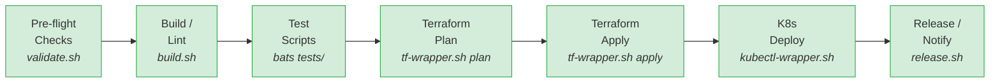

# Scripting en Pipelines CI/CD

Los scripts de Bash son el pegamento entre las herramientas de un pipeline CI/CD. En las unidades anteriores aprendimos a usar GitHub Actions para automatizar workflows y Terraform para gestionar infraestructura. En esta unidad vamos a conectar ambos mundos: escribir scripts que orquesten herramientas, validar configuraciones antes del despliegue y testear esos scripts con la misma disciplina que el código de aplicación.

---

## 1. Scripts como pasos en CI/CD

### El problema: comandos inline en YAML

Cuando empezamos a escribir pipelines de CI/CD, la tentación natural es poner toda la lógica directamente en el archivo YAML del workflow:

```yaml
jobs:
  deploy:
    runs-on: ubuntu-latest
    steps:
      - uses: actions/checkout@v4
      - name: Build and deploy
        run: |
          echo "Checking dependencies..."
          if ! command -v terraform &> /dev/null; then
            echo "ERROR: terraform not found"
            exit 1
          fi
          terraform init -backend-config="bucket=$TF_STATE_BUCKET"
          terraform fmt -check
          if [ $? -ne 0 ]; then
            echo "ERROR: Terraform files not formatted"
            exit 1
          fi
          terraform validate
          terraform plan -out=tfplan
          if [ "$APPLY" = "true" ]; then
            terraform apply -auto-approve tfplan
          fi
          echo "Sending notification..."
          curl -X POST "$SLACK_WEBHOOK" -d '{"text":"Deploy complete"}'
```

Este enfoque tiene problemas graves:

| Problema | Descripción |
|---|---|
| **No testeable** | No puedes ejecutar esa lógica localmente sin simular todo el entorno de GitHub Actions. |
| **No reutilizable** | Si otro workflow necesita la misma lógica, hay que copiar y pegar. |
| **Difícil de depurar** | Un error en la línea 15 de un bloque YAML multilinea es complicado de localizar. |
| **Sin control de versiones granular** | Los cambios en la lógica del script se mezclan con cambios en la estructura del workflow. |
| **Sin linting** | Tu editor no puede aplicar shellcheck ni autocompletado dentro de un string YAML. |

### La solución: scripts externos

El patrón correcto es separar la lógica en scripts independientes que viven en el repositorio:

```
mi-proyecto/
  .github/
    workflows/
      deploy.yml        # Orquestación: QUE ejecutar y CUANDO
  scripts/
    terraform-wrapper.sh  # Lógica: COMO ejecutar Terraform
    validate.sh           # Lógica: COMO validar configuraciones
    notify.sh             # Lógica: COMO enviar notificaciones
```

Esto permite:

- **Testear localmente**: ejecutas `./scripts/validate.sh` en tu máquina antes de hacer push.
- **Reutilizar**: múltiples workflows referencian el mismo script.
- **Depurar**: aplicas `shellcheck`, `set -x`, y ejecutas paso a paso.
- **Revisar**: los cambios en scripts tienen diffs claros en pull requests.

### Referenciar scripts desde GitHub Actions

La forma más simple es usar `run` apuntando al script:

```yaml
jobs:
  build:
    runs-on: ubuntu-latest
    steps:
      - uses: actions/checkout@v4

      - name: Run validation
        run: ./scripts/validate.sh
        shell: bash
```

:::tip Especifica siempre shell: bash
Aunque `bash` es el shell por defecto en runners Linux, especificarlo explícitamente garantiza consistencia. En runners Windows el default es `pwsh` (PowerShell), y si tu script asume Bash, fallará silenciosamente o con errores confusos.
:::

### Permisos de ejecución

Un error frecuente es que el script no tenga permisos de ejecución en el repositorio. Git rastrea el bit de ejecución, así que asegúrate de configurarlo antes del commit:

```bash
chmod +x scripts/validate.sh
git add scripts/validate.sh
git commit -m "feat: add validation script with exec permissions"
```

Si olvidas este paso, verás un error `Permission denied` en el runner. La alternativa es invocarlo explícitamente con `bash`:

```yaml
- name: Run validation
  run: bash scripts/validate.sh
```

### Scripts multilinea en YAML

Para lógica corta (2-3 líneas) que no justifica un archivo separado, puedes usar bloques multilinea con `|`:

```yaml
- name: Setup environment
  run: |
    echo "Setting up environment..."
    npm install
    npm test
```

El operador `|` preserva los saltos de línea. Cada línea se ejecuta como un comando independiente dentro del mismo shell. Si un comando falla y tienes `set -e` (o `shell: bash`), el step se detiene.

:::warning Límite razonable para scripts inline
Si tu bloque `run: |` supera las 10-15 líneas, es momento de extraerlo a un archivo en `scripts/`. Un buen criterio: si el script necesita funciones, parámetros o lógica condicional compleja, merece su propio archivo.
:::

---

## 2. Variables de entorno en CI/CD

Las variables de entorno son el mecanismo principal para pasar configuracion a los scripts dentro de un pipeline. GitHub Actions ofrece tres niveles de variables: las predefinidas del sistema, las personalizadas y los secrets.

### Variables predefinidas de GitHub

GitHub expone automáticamente un conjunto de variables en todos los runners. Estas son las más útiles:

| Variable | Contenido | Ejemplo |
|---|---|---|
| `GITHUB_SHA` | SHA completo del commit que disparó el workflow | `a1b2c3d4e5f6...` |
| `GITHUB_REF` | Referencia completa (rama o tag) | `refs/heads/main` |
| `GITHUB_REF_NAME` | Nombre corto de la rama o tag | `main` |
| `GITHUB_REPOSITORY` | Propietario y nombre del repo | `mi-org/mi-proyecto` |
| `GITHUB_ACTOR` | Usuario que disparó el evento | `salvamiguel` |
| `GITHUB_RUN_ID` | ID único de la ejecución del workflow | `5678901234` |
| `GITHUB_RUN_NUMBER` | Número secuencial de ejecución del workflow | `42` |
| `GITHUB_WORKSPACE` | Directorio de trabajo del runner | `/home/runner/work/repo/repo` |
| `GITHUB_EVENT_NAME` | Tipo de evento que disparó el workflow | `push`, `pull_request` |
| `RUNNER_OS` | Sistema operativo del runner | `Linux`, `Windows`, `macOS` |

Puedes usarlas directamente en tus scripts:

```bash
#!/usr/bin/env bash
set -euo pipefail

echo "Desplegando commit ${GITHUB_SHA:0:7} en rama $GITHUB_REF_NAME"
echo "Ejecutado por: $GITHUB_ACTOR"
echo "Run ID: $GITHUB_RUN_ID"
```

### Variables personalizadas con env

Puedes definir variables a tres niveles: workflow, job y step. La variable más específica gana:

```yaml
env:
  APP_ENV: production          # Nivel workflow: disponible en todos los jobs

jobs:
  deploy:
    runs-on: ubuntu-latest
    env:
      REGION: eu-west-1        # Nivel job: disponible en todos los steps de este job

    steps:
      - name: Deploy
        env:
          DEBUG: "true"        # Nivel step: solo disponible en este step
        run: |
          echo "Env: $APP_ENV, Region: $REGION, Debug: $DEBUG"
```

### Secrets

Los secrets son variables cifradas que se configuran en `Settings > Secrets and variables > Actions` del repositorio. GitHub los enmascara automáticamente en los logs, pero conviene ser cuidadoso:

```yaml
- name: Configure cloud credentials
  env:
    AWS_ACCESS_KEY_ID: ${{ secrets.AWS_ACCESS_KEY_ID }}
    AWS_SECRET_ACCESS_KEY: ${{ secrets.AWS_SECRET_ACCESS_KEY }}
  run: ./scripts/terraform-wrapper.sh plan
```

:::warning Nunca hagas echo de un secret
Aunque GitHub enmascara los secrets en los logs, hay formas en las que pueden filtrarse: codificándolos en base64, partiéndolos en subcadenas, o redireciéndolos a archivos que luego se suben como artefactos. La regla es simple: nunca hagas `echo` de un secret bajo ninguna circunstancia.

```bash
# PELIGROSO - nunca hagas esto
echo "Token: $MY_SECRET"
echo "$MY_SECRET" | base64    # El valor codificado NO se enmascara

# CORRECTO - usa el secret directamente
curl -H "Authorization: Bearer $MY_SECRET" https://api.example.com
```
:::

### Pasar datos entre steps

GitHub Actions proporciona dos mecanismos para compartir datos entre steps del mismo job:

**`$GITHUB_OUTPUT` -- outputs del step:**

```yaml
- name: Get version
  id: version
  run: |
    VERSION=$(cat package.json | jq -r '.version')
    echo "app_version=$VERSION" >> $GITHUB_OUTPUT

- name: Use version
  run: |
    echo "Version: ${{ steps.version.outputs.app_version }}"
```

**`$GITHUB_ENV` -- variables de entorno para steps posteriores:**

```yaml
- name: Set deployment target
  run: |
    if [ "$GITHUB_REF_NAME" = "main" ]; then
      echo "DEPLOY_ENV=production" >> $GITHUB_ENV
    else
      echo "DEPLOY_ENV=staging" >> $GITHUB_ENV
    fi

- name: Deploy
  run: |
    echo "Desplegando en $DEPLOY_ENV"
    ./scripts/deploy.sh "$DEPLOY_ENV"
```

La diferencia clave: `$GITHUB_OUTPUT` crea valores asociados a un step especifico (accesibles con `${{ steps.id.outputs.name }}`), mientras que `$GITHUB_ENV` crea variables de entorno disponibles para todos los steps posteriores del job.

---

## 3. Wrapper script para Terraform

### ¿Qué es un wrapper script

Un wrapper script es un script de Bash que envuelve la ejecución de una herramienta con lógica adicional: validaciones previas, logging estructurado, manejo de errores y códigos de salida significativos. En lugar de ejecutar `terraform plan` directamente, ejecutas un script que orquesta todo el flujo.

### ¿Por qué usar un wrapper

Ejecutar `terraform plan` directamente en un pipeline parece sencillo, pero en la práctica necesitas:

- Verificar que el formato es correcto (`terraform fmt -check`) antes de planificar.
- Validar la sintaxis (`terraform validate`) antes de gastar tiempo en un plan.
- Guardar el plan en un archivo para aplicarlo de forma determinista.
- Registrar con timestamps qué pasó en cada fase, para diagnosticar fallos.
- Devolver códigos de salida que el pipeline pueda interpretar.
- Implementar reintentos para errores transitorios de red.

### Wrapper completo

import GitHubCode from '@site/src/components/shared/GitHubCode';

<GitHubCode
  title="terraform_wrapper.sh: wrapper para Terraform"
  url="https://github.com/salvamiguel/scripting-examples/blob/main/terraform_wrapper.sh"
  language="bash"
/>

### Uso desde GitHub Actions

```yaml
name: Terraform Pipeline

on:
  push:
    branches: [main]
    paths: ['infra/**']
  pull_request:
    branches: [main]
    paths: ['infra/**']

jobs:
  terraform:
    name: Terraform ${{ github.event_name == 'push' && 'Apply' || 'Plan' }}
    runs-on: ubuntu-latest

    env:
      AWS_ACCESS_KEY_ID: ${{ secrets.AWS_ACCESS_KEY_ID }}
      AWS_SECRET_ACCESS_KEY: ${{ secrets.AWS_SECRET_ACCESS_KEY }}
      TF_WORKSPACE: staging

    steps:
      - uses: actions/checkout@v4

      - name: Setup Terraform
        uses: hashicorp/setup-terraform@v3
        with:
          terraform_version: 1.9.5

      - name: Terraform Plan
        if: github.event_name == 'pull_request'
        run: ./scripts/terraform-wrapper.sh plan -e staging -d infra/
        shell: bash

      - name: Terraform Apply
        if: github.event_name == 'push' && github.ref == 'refs/heads/main'
        run: ./scripts/terraform-wrapper.sh apply -e production -d infra/ -a
        shell: bash
```

:::info Conexion con los modulos de Terraform y GitOps
Este patron conecta directamente con lo aprendido en las unidades anteriores. En el modulo de Terraform (S1-S2) vimos como estructurar configuraciones con HCL. En el modulo de GitOps (S3-S4) vimos como GitHub Actions orquesta el despliegue. El wrapper script es la pieza que une ambos mundos: encapsula la logica de Terraform en un script testeable y reutilizable que GitHub Actions ejecuta como un step mas.
:::

---

## 4. Wrapper script para kubectl

### El patron de despliegue seguro

Desplegar en Kubernetes directamente con `kubectl apply` es arriesgado. Un manifiesto mal formado puede tumbar un servicio en produccion. El wrapper aplica el mismo principio que con Terraform: validar antes de actuar y tener un plan de reversion.

### Wrapper completo

<GitHubCode
  title="kubectl_wrapper.sh: wrapper para kubectl"
  url="https://github.com/salvamiguel/scripting-examples/blob/main/kubectl_wrapper.sh"
  language="bash"
/>

### Uso desde GitHub Actions

```yaml
- name: Deploy to Kubernetes
  run: ./scripts/kubectl-wrapper.sh apply -f k8s/deployment.yaml -n production -t 180s
  shell: bash
  env:
    KUBECONFIG: ${{ secrets.KUBECONFIG }}
```

La clave de este wrapper es el **rollback automatico**: si el rollout falla (por ejemplo, porque la nueva imagen tiene un error y los pods no arrancan), el script revierte automaticamente al estado anterior sin intervencion humana.

---

## 5. Validacion de configuraciones

Antes de ejecutar cualquier despliegue, un script de validacion puede detectar errores comunes que ahorrarian minutos (o horas) de depuracion. Este patron se conoce como **pre-flight checks**.

### Script de validacion completo

<GitHubCode
  title="validate.sh: script de validacion"
  url="https://github.com/salvamiguel/scripting-examples/blob/main/validate.sh"
  language="bash"
/>

:::tip Validacion como primer paso del pipeline
Coloca siempre el script de validacion como el primer step de tu job de despliegue. Un fallo rapido en la validacion ahorra el tiempo de init, plan y apply. Ademas, los mensajes de error son mucho mas claros que los errores cripticos de Terraform o kubectl.

```yaml
steps:
  - uses: actions/checkout@v4
  - name: Pre-flight checks
    run: ./scripts/validate.sh
    shell: bash
  - name: Deploy
    run: ./scripts/terraform-wrapper.sh apply -e production
    shell: bash
```
:::

---

## 6. Testing de scripts con bats

### Que es bats

**bats** (Bash Automated Testing System) es un framework de testing para scripts de Bash. Permite escribir tests con una sintaxis simple y ejecutarlos como parte del pipeline de CI/CD, aplicando al scripting las mismas practicas de testing que usamos con codigo de aplicacion.

### Instalacion

```bash
# Con npm (la forma mas sencilla)
npm install -g bats

# En macOS con Homebrew
brew install bats-core

# Desde el repositorio oficial
git clone https://github.com/bats-core/bats-core.git
cd bats-core
./install.sh /usr/local
```

Para funcionalidades adicionales, instala las librerias auxiliares:

```bash
# Aserciones mas expresivas
npm install -g bats-assert

# Funciones auxiliares para testing
npm install -g bats-support
```

### Estructura de un test

Los archivos de test de bats usan la extension `.bats` y siguen esta estructura:

```bash
#!/usr/bin/env bats

# Cada bloque @test define un caso de prueba
@test "validate.sh exits 0 on valid configuration" {
    # Preparar entorno de prueba
    export AWS_ACCESS_KEY_ID="test-key"
    export AWS_SECRET_ACCESS_KEY="test-secret"
    export AWS_DEFAULT_REGION="eu-west-1"

    # Ejecutar el script bajo test
    run ./scripts/validate.sh

    # Verificar resultado
    [ "$status" -eq 0 ]
}

@test "validate.sh exits 1 when required vars are missing" {
    # No definimos las variables requeridas
    unset AWS_ACCESS_KEY_ID 2>/dev/null || true

    run ./scripts/validate.sh

    [ "$status" -eq 1 ]
    [[ "$output" =~ "no esta definida" ]]
}

@test "terraform-wrapper.sh rejects invalid action" {
    run ./scripts/terraform-wrapper.sh invalid-action

    [ "$status" -eq 1 ]
    [[ "$output" =~ "Accion invalida" ]]
}

@test "terraform-wrapper.sh requires at least one argument" {
    run ./scripts/terraform-wrapper.sh

    [ "$status" -ne 0 ]
    [[ "$output" =~ "Uso:" ]]
}
```

### La variable especial `run`

El comando `run` es el nucleo de bats. Ejecuta un comando y captura:

| Variable | Contenido |
|---|---|
| `$status` | Codigo de salida del comando |
| `$output` | Salida completa (stdout + stderr) |
| `$lines` | Array con cada linea de la salida |
| `${lines[0]}` | Primera linea de la salida |

### setup() y teardown()

Estas funciones se ejecutan antes y despues de cada test, respectivamente. Son ideales para preparar y limpiar el entorno:

```bash
#!/usr/bin/env bats

# Se ejecuta ANTES de cada @test
setup() {
    # Crear directorio temporal para cada test
    TEST_DIR=$(mktemp -d)
    export TEST_DIR

    # Copiar scripts al directorio temporal
    cp -r scripts/ "$TEST_DIR/"

    # Crear archivos de configuracion de prueba
    mkdir -p "$TEST_DIR/k8s"
    cat > "$TEST_DIR/k8s/deployment.yaml" << 'EOF'
apiVersion: apps/v1
kind: Deployment
metadata:
  name: test-app
spec:
  replicas: 1
  selector:
    matchLabels:
      app: test
  template:
    metadata:
      labels:
        app: test
    spec:
      containers:
        - name: test
          image: nginx:latest
EOF
}

# Se ejecuta DESPUES de cada @test
teardown() {
    # Limpiar directorio temporal
    rm -rf "$TEST_DIR"
}

@test "YAML validation passes for valid manifest" {
    run python3 -c "import yaml; yaml.safe_load(open('$TEST_DIR/k8s/deployment.yaml'))"
    [ "$status" -eq 0 ]
}

@test "YAML validation fails for invalid manifest" {
    echo "invalid: yaml: [broken" > "$TEST_DIR/k8s/bad.yaml"
    run python3 -c "import yaml; yaml.safe_load(open('$TEST_DIR/k8s/bad.yaml'))"
    [ "$status" -ne 0 ]
}
```

### Funciones auxiliares

Para tests mas complejos, puedes definir funciones auxiliares en un archivo separado:

```bash
# tests/helpers.bash

# Verifica que un comando existe
assert_command_exists() {
    local cmd="$1"
    if ! command -v "$cmd" &> /dev/null; then
        echo "Command not found: $cmd"
        return 1
    fi
}

# Verifica que un archivo contiene un patron
assert_file_contains() {
    local file="$1"
    local pattern="$2"
    if ! grep -q "$pattern" "$file"; then
        echo "Pattern '$pattern' not found in $file"
        echo "File contents:"
        cat "$file"
        return 1
    fi
}

# Crea un mock de un comando
mock_command() {
    local cmd="$1"
    local exit_code="${2:-0}"
    local output="${3:-}"

    local mock_dir="$TEST_DIR/mocks"
    mkdir -p "$mock_dir"

    cat > "$mock_dir/$cmd" << MOCK
#!/usr/bin/env bash
echo "$output"
exit $exit_code
MOCK
    chmod +x "$mock_dir/$cmd"
    export PATH="$mock_dir:$PATH"
}
```

Uso en los tests:

```bash
#!/usr/bin/env bats

load 'helpers'

setup() {
    TEST_DIR=$(mktemp -d)
}

teardown() {
    rm -rf "$TEST_DIR"
}

@test "wrapper detects missing terraform" {
    # Crear un PATH vacio para simular que terraform no existe
    mock_command "terraform" 127 "command not found"

    run ./scripts/terraform-wrapper.sh plan
    [ "$status" -ne 0 ]
    [[ "$output" =~ "no esta instalado" ]]
}
```

### Ejecutar bats en CI

```yaml
jobs:
  test-scripts:
    name: Test Bash Scripts
    runs-on: ubuntu-latest
    steps:
      - uses: actions/checkout@v4

      - name: Install bats
        run: |
          npm install -g bats bats-assert bats-support

      - name: Run script tests
        run: bats tests/ --formatter tap
        shell: bash
```

:::tip Testear scripts es tan importante como testear codigo
Un script de despliegue roto puede causar mas danos que un bug en la aplicacion. Si tu script hace `terraform destroy` en lugar de `terraform apply` por un error de logica, las consecuencias son inmediatas e irreversibles. Testear scripts con bats es una inversion minima con un retorno enorme.
:::

---

## 7. Automatizacion de releases

Los scripts de Bash son ideales para automatizar el proceso de release: generar changelogs, calcular versiones, crear tags y notificar al equipo.

### Script de release

<GitHubCode
  title="release.sh: script de automatizacion de releases"
  url="https://github.com/salvamiguel/scripting-examples/blob/main/release.sh"
  language="bash"
/>

### Uso desde GitHub Actions

```yaml
name: Release

on:
  workflow_dispatch:
    inputs:
      bump:
        description: 'Tipo de version bump'
        required: true
        type: choice
        options: [patch, minor, major]

jobs:
  release:
    runs-on: ubuntu-latest
    permissions:
      contents: write
    steps:
      - uses: actions/checkout@v4
        with:
          fetch-depth: 0    # Necesario para git log y tags

      - name: Configure Git
        run: |
          git config user.name "github-actions[bot]"
          git config user.email "github-actions[bot]@users.noreply.github.com"

      - name: Create Release
        run: ./scripts/release.sh ${{ inputs.bump }}
        shell: bash
        env:
          SLACK_WEBHOOK: ${{ secrets.SLACK_WEBHOOK }}

      - name: Push release
        run: |
          git push origin main
          git push origin --tags
```

---

## 8. Buenas practicas de scripting en pipelines

### Tabla de referencia

| Practica | Descripcion | Ejemplo |
|---|---|---|
| **Fail fast** | Usa `set -euo pipefail` en la primera linea de cada script | Detiene la ejecucion al primer error |
| **Idempotencia** | Ejecutar el script dos veces debe ser seguro | Usa `terraform plan` antes de `apply`, comprueba si un recurso existe antes de crearlo |
| **Logging estructurado** | Prefija cada mensaje con timestamp, nivel y contexto | `[INFO] 2024-03-15 10:30:00 Iniciando despliegue...` |
| **Codigos de salida** | Usa codigos diferentes para tipos de error distintos | `exit 2` para errores de formato, `exit 3` para errores de init |
| **Scripts en el repo** | Mantiene los scripts en `scripts/`, nunca inline en YAML | Permite testing local y code review |
| **Portabilidad** | Evita bashismos cuando el script deba correr en `sh` | Usa `$(command)` en lugar de `` `command` `` |
| **Testa localmente** | Ejecuta el script en tu maquina antes de hacer push | `./scripts/validate.sh` funciona identico en local y en CI |
| **Variables de entorno** | No hardcodees valores; usa `env:` en el workflow | Permite reutilizar el script en diferentes entornos |
| **Manejo de secretos** | Nunca hagas echo de secrets ni los guardes en archivos | Pasalos como variables de entorno y usalos directamente |
| **Dry-run** | Ofrece un modo de ejecucion sin efectos secundarios | `--dry-run` para verificar sin aplicar cambios |

### Estructura recomendada de un script de pipeline

Todo script que se ejecute en un pipeline deberia seguir esta plantilla:

```bash
#!/usr/bin/env bash
set -euo pipefail

# =============================================================================
# Descripcion breve del script
# Uso: ./script.sh <args>
# =============================================================================

# --- 1. Funciones de logging ---
log_info()  { echo "[INFO]  $(date '+%H:%M:%S') $*"; }
log_error() { echo "[ERROR] $(date '+%H:%M:%S') $*" >&2; }

# --- 2. Parseo de argumentos ---
# Validar que se recibieron los argumentos esperados

# --- 3. Validaciones previas ---
# Verificar prerrequisitos: herramientas, variables, permisos

# --- 4. Logica principal ---
# Ejecutar las acciones del script

# --- 5. Limpieza y salida ---
# trap para limpiar recursos temporales
# Codigo de salida significativo
```

:::danger Nunca ignores los codigos de salida
Sin `set -e`, un comando que falla no detiene el script. Esto puede llevar a situaciones donde `terraform plan` falla pero `terraform apply` se ejecuta igualmente con un plan anterior o sin plan. El resultado: cambios no deseados en infraestructura de produccion.

```bash
# SIN set -e: terraform apply se ejecuta aunque plan falle
terraform plan -out=tfplan    # Fallo silencioso
terraform apply tfplan        # Se ejecuta con un plan viejo o inexistente

# CON set -euo pipefail: el script se detiene en el primer error
set -euo pipefail
terraform plan -out=tfplan    # Si falla, el script se detiene aqui
terraform apply tfplan        # Solo se ejecuta si plan tuvo exito
```
:::

---

## 9. Resumen

Estos son los puntos clave de esta unidad:

- Los **scripts externos** son preferibles a los comandos inline en YAML: son testeables, reutilizables y mas faciles de depurar.
- Las **variables de entorno** en GitHub Actions operan a tres niveles (workflow, job, step) y los secrets se pasan siempre mediante `env:`, nunca interpolados en `run:`.
- Los **wrapper scripts** encapsulan la ejecucion de herramientas como Terraform y kubectl con validacion, logging y manejo de errores.
- La **validacion previa** (pre-flight checks) detecta errores antes de que causen danos: herramientas ausentes, variables no definidas, YAML invalido, secretos hardcodeados.
- **bats** permite testear scripts con la misma disciplina que el codigo de aplicacion, con `setup()`, `teardown()` y aserciones expresivas.
- La **automatizacion de releases** con scripts estandariza el proceso de versionado, changelog y notificacion.
- `set -euo pipefail` es **obligatorio** en cualquier script de pipeline para garantizar un comportamiento fail-fast.


