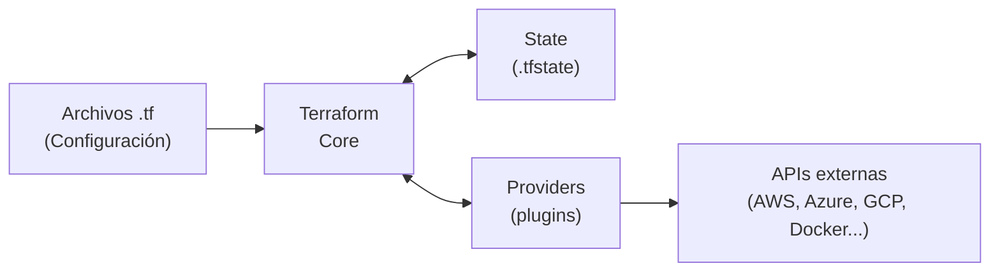
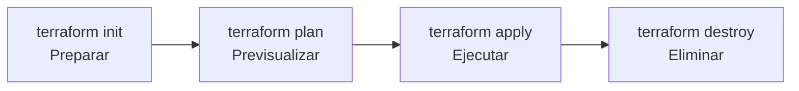

import InstallExtension from '@site/src/components/shared/InstallExtension';

# Introduccion a Terraform

## 1. Que es Infrastructure as Code (IaC)

### El problema: gestion manual de infraestructura

Durante anos, la forma habitual de gestionar infraestructura era conectarse a un portal web o a un servidor via SSH y realizar cambios manualmente: crear maquinas virtuales, configurar redes, abrir puertos, instalar paquetes. Este enfoque presenta problemas graves a medida que la infraestructura crece:

- **Inconsistencia**: dos entornos que deberian ser identicos (staging y produccion) acaban divergiendo porque alguien aplico un cambio en uno y no en el otro.
- **No reproducible**: si un servidor se pierde, reconstruirlo requiere recordar (o documentar) cada paso manual. En la practica, esa documentacion rara vez esta actualizada.
- **Error humano**: un clic equivocado en la consola web puede abrir un security group al mundo o borrar una base de datos. No hay revision de codigo ni aprobacion previa.
- **No auditable**: no queda registro claro de quien hizo que cambio, cuando y por que. Ante un incidente, la investigacion se convierte en un ejercicio de arqueologia.
- **Escalabilidad imposible**: gestionar 5 servidores manualmente es viable; gestionar 500 es insostenible.


### La solucion: definir infraestructura como codigo

Infrastructure as Code (IaC) es la practica de definir y gestionar la infraestructura mediante archivos de configuracion versionados en un repositorio, en lugar de procesos manuales. La infraestructura se trata con las mismas practicas que el codigo de aplicacion: control de versiones, code review, testing, CI/CD.

import ClickOpsVsIaC from '@site/src/components/demos/terraform/ClickOpsVsIaC';

<ClickOpsVsIaC />

### Principios fundamentales

**Declaratividad vs imperatividad**

Existen dos enfoques para describir infraestructura:

- **Declarativo**: describes el estado deseado (_"quiero 3 instancias EC2 con Ubuntu 22.04"_) y la herramienta calcula los pasos para llegar a ese estado. Si ya existen 2, crea 1 mas. Si ya existen 3, no hace nada. Terraform y CloudFormation siguen este modelo.
- **Imperativo**: describes los pasos a ejecutar (_"crea una instancia EC2, luego otra, luego otra"_). Si lo ejecutas dos veces, tendras 6 instancias. Ansible y scripts de Bash siguen este modelo (aunque Ansible tiene modulos con comportamiento idempotente).

:::tip Regla general
El enfoque declarativo es preferible para infraestructura porque reduce errores: defines el _que_, no el _como_. La herramienta se encarga de calcular las diferencias entre el estado actual y el deseado.
:::

**Idempotencia**

Una operacion es idempotente si ejecutarla multiples veces produce el mismo resultado que ejecutarla una sola vez. En IaC, esto significa que si tu configuracion declara 3 servidores y ya existen 3 servidores con esa configuracion, aplicar de nuevo no cambia nada. Este principio es fundamental para evitar efectos secundarios inesperados.

**Versionado**

Al estar la infraestructura definida en archivos de texto, se almacena en un sistema de control de versiones como Git. Esto permite:

- Ver el historial completo de cambios.
- Hacer rollback a una version anterior.
- Usar pull requests para revisar cambios antes de aplicarlos.
- Asociar cambios de infraestructura con tickets o incidencias.

**Automatizacion**

IaC permite integrar la gestion de infraestructura en pipelines de CI/CD. Un cambio en un archivo de configuracion puede desencadenar automaticamente un `plan` para revisar los cambios propuestos y, tras aprobacion, un `apply` para ejecutarlos. Esto elimina la intervencion manual y acelera los ciclos de entrega.

### Ventajas de IaC

| Ventaja | Descripcion |
|---------|-------------|
| **Reproducibilidad** | El mismo codigo genera el mismo entorno, siempre. Puedes crear entornos identicos de desarrollo, staging y produccion. |
| **Consistencia** | Se elimina el _configuration drift_: las diferencias no documentadas entre entornos. |
| **Velocidad** | Crear o destruir un entorno completo toma minutos en lugar de horas o dias. |
| **Auditoria** | Cada cambio queda registrado en Git con autor, fecha, mensaje y diff. |
| **Colaboracion** | Equipos pueden trabajar en paralelo sobre la infraestructura usando ramas, pull requests y code review. |
| **Costes** | Entornos efimeros que se crean y destruyen bajo demanda reducen el gasto en cloud. |

---

## 2. Panorama de herramientas IaC

### Comparativa detallada

| Caracteristica | Terraform | Pulumi | CloudFormation | Ansible |
|----------------|-----------|--------|----------------|---------|
| **Proveedor** | HashiCorp (IBM) | Pulumi Inc. | AWS | Red Hat (IBM) |
| **Modelo** | Declarativo | Imperativo | Declarativo | Imperativo / Procedural |
| **Lenguaje** | HCL | Python, TypeScript, Go, C#, Java | JSON / YAML | YAML |
| **Multi-cloud** | Si (AWS, Azure, GCP, +3000 providers) | Si | Solo AWS | Si (via modulos) |
| **State** | Archivo local o remoto | Archivo local o Pulumi Cloud | Gestionado por AWS | Sin state |
| **Curva de aprendizaje** | Media (HCL es sencillo) | Baja si conoces el lenguaje | Media | Baja |
| **Comunidad** | Muy grande | Creciente | Grande (ecosistema AWS) | Muy grande |
| **Licencia** | BSL 1.1 (OpenTofu como fork abierto) | Apache 2.0 | Propietario | GPL |

### Cuando usar cada una

**Terraform** es la eleccion por defecto para equipos que gestionan infraestructura multi-cloud o que necesitan un ecosistema maduro de providers. Su lenguaje HCL esta disenado especificamente para infraestructura, lo que lo hace legible y conciso. Es la herramienta mas adoptada: mas del 45% de las organizaciones con practicas DevOps la usan segun encuestas de HashiCorp y la Cloud Native Computing Foundation.

**Pulumi** es ideal cuando el equipo prefiere usar un lenguaje de programacion que ya conoce (Python, TypeScript) en lugar de aprender HCL. Permite usar condicionales, bucles y abstracciones del lenguaje nativo, lo cual es util para logicas complejas.

**CloudFormation** es la opcion natural si tu infraestructura esta exclusivamente en AWS. Tiene integracion nativa con todos los servicios de AWS y no requiere gestionar el state externamente.

**Ansible** destaca en la configuracion de servidores (instalar paquetes, configurar servicios, gestionar usuarios) mas que en la creacion de infraestructura. En la practica, muchos equipos combinan Terraform para provisionar infraestructura y Ansible para configurarla.

:::info Terraform vs OpenTofu
En 2023, HashiCorp cambio la licencia de Terraform de MPL 2.0 a BSL 1.1 (Business Source License). Como respuesta, la comunidad creo **OpenTofu**, un fork de Terraform bajo la Linux Foundation con licencia abierta. Ambos son compatibles en sintaxis y providers. En este curso usaremos Terraform, pero todo lo aprendido es directamente aplicable a OpenTofu.
:::

---

## 3. Arquitectura de Terraform

Terraform se compone de tres elementos fundamentales que interactuan entre si:

### Terraform Core

Es el binario principal (`terraform`). Su funcion es:

1. Leer los archivos de configuracion (`.tf`).
2. Leer el state actual de la infraestructura.
3. Calcular las diferencias entre la configuracion deseada y el state actual.
4. Generar un plan de ejecucion (que recursos crear, modificar o destruir).
5. Ejecutar ese plan comunicandose con los providers.

Terraform Core implementa un **grafo de dependencias**: analiza las relaciones entre recursos y determina el orden correcto de creacion. Ademas, paraleliza operaciones sobre recursos que no tienen dependencias entre si.

### Providers

Los providers son plugins que permiten a Terraform interactuar con las APIs de servicios externos. Cada provider expone un conjunto de **resource types** y **data sources**.

Algunos providers destacados:

- **Cloud**: `aws`, `azurerm`, `google` (GCP), `digitalocean`, `oci`
- **Plataformas**: `kubernetes`, `helm`, `docker`
- **SaaS**: `github`, `cloudflare`, `datadog`, `pagerduty`
- **Utilidades**: `local`, `random`, `null`, `tls`, `http`

El [Terraform Registry](https://registry.terraform.io/) alberga mas de 3000 providers mantenidos por HashiCorp, por los propios proveedores de cloud o por la comunidad.

### State

El state es un archivo (por defecto `terraform.tfstate`) en formato JSON que almacena el mapeo entre los recursos definidos en la configuracion y los recursos reales en el proveedor. Es la **fuente de verdad** que Terraform usa para saber que existe actualmente.

Sin el state, Terraform no podria saber si un recurso que aparece en la configuracion ya existe o necesita ser creado. Tampoco podria detectar que un recurso que existia ha sido eliminado de la configuracion y debe destruirse.

:::warning El state contiene datos sensibles
El archivo de state puede contener contrasenas, claves de acceso, direcciones IP privadas y otros datos sensibles. **Nunca** lo subas a un repositorio publico. En produccion, utiliza un backend remoto (S3, GCS, Terraform Cloud) con cifrado y control de acceso.
:::

### Diagrama conceptual



El flujo es siempre el mismo:

1. Terraform Core lee la configuracion (archivos `.tf`) y el state.
2. Calcula las diferencias y genera un plan.
3. Ejecuta el plan invocando las APIs a traves de los providers.
4. Actualiza el state con el resultado.

---

## 4. Instalacion y configuracion

### macOS

La forma mas sencilla es usar [Homebrew](https://brew.sh/):

```bash
brew tap hashicorp/tap
brew install hashicorp/tap/terraform
```

### Linux (Debian/Ubuntu)

```bash
# Anadir la clave GPG de HashiCorp
wget -O- https://apt.releases.hashicorp.com/gpg | sudo gpg --dearmor -o /usr/share/keyrings/hashicorp-archive-keyring.gpg

# Anadir el repositorio
echo "deb [signed-by=/usr/share/keyrings/hashicorp-archive-keyring.gpg] https://apt.releases.hashicorp.com $(lsb_release -cs) main" | sudo tee /etc/apt/sources.list.d/hashicorp.list

# Instalar
sudo apt update && sudo apt install terraform
```

### Linux (RHEL/CentOS/Fedora)

```bash
sudo yum install -y yum-utils
sudo yum-config-manager --add-repo https://rpm.releases.hashicorp.com/RHEL/hashicorp.repo
sudo yum install terraform
```

### Windows

Con [Chocolatey](https://chocolatey.org/):

```bash
choco install terraform
```

Con [Scoop](https://scoop.sh/):

```bash
scoop install terraform
```

### Verificacion

Independientemente del sistema operativo, verifica que la instalacion es correcta:

```bash
terraform version
```

Deberias ver algo similar a:

```
Terraform v1.9.x
on darwin_arm64
```

:::tip Gestion de versiones con tfenv
Si necesitas trabajar con diferentes versiones de Terraform en distintos proyectos, utiliza [tfenv](https://github.com/tfutils/tfenv), un gestor de versiones similar a `nvm` para Node.js:

```bash
# Instalar tfenv (macOS)
brew install tfenv

# Instalar una version especifica
tfenv install 1.9.5

# Usar esa version
tfenv use 1.9.5
```
:::

### Configuracion de VSCode

Instala la extension oficial **HashiCorp Terraform** desde el marketplace de VSCode. Esta extension proporciona:

- Resaltado de sintaxis para archivos `.tf` y `.tfvars`.
- Autocompletado de recursos, atributos y funciones.
- Formateo automatico con `terraform fmt`.
- Navegacion a la definicion de variables y modulos.
- Validacion de la configuracion en tiempo real.

<InstallExtension id="hashicorp.terraform" label="HashiCorp Terraform" />

#### settings.json
Ademas, anade esta configuracion a tu `settings.json` de VSCode para habilitar el formateo automatico al guardar:

```json
{
  "[terraform]": {
    "editor.defaultFormatter": "hashicorp.terraform",
    "editor.formatOnSave": true
  },
  "[terraform-vars]": {
    "editor.defaultFormatter": "hashicorp.terraform",
    "editor.formatOnSave": true
  }
}
```

---

## 5. Primer recurso con Terraform

Vamos a crear nuestro primer recurso con Terraform sin necesidad de una cuenta en ningun proveedor cloud. Usaremos el provider `local`, que permite crear y gestionar archivos en el sistema de archivos local.

import LabActions from '@site/src/components/shared/LabActions';

<LabActions
  repo="https://github.com/salvamiguel/tf-first-example"
  title="Descarga el código de este ejemplo"
  codespace={false}
  devcontainer={false}
  fork={true}
/>

### Crear el proyecto

```bash
mkdir tf-first-example && cd tf-first-example
```

### Escribir la configuracion

Crea un archivo llamado `main.tf` con el siguiente contenido:

```hcl
# Bloque terraform: configuracion global del proyecto
terraform {
  # Declaramos los providers que necesitamos y sus versiones
  required_providers {
    local = {
      source  = "hashicorp/local"
      version = "~> 2.5"
    }
  }

  # Version minima de Terraform necesaria
  required_version = ">= 1.0"
}

# Bloque provider: configuracion especifica del provider
# El provider "local" no necesita configuracion adicional
provider "local" {}

# Bloque resource: define un recurso que Terraform gestionara
# Sintaxis: resource "<TIPO>" "<NOMBRE_LOCAL>" { ... }
resource "local_file" "saludo" {
  content  = "Hola desde Terraform! Este archivo ha sido creado automaticamente."
  filename = "${path.module}/saludo.txt"
}
```

Analicemos cada bloque:

| Bloque | Proposito |
|--------|-----------|
| `terraform {}` | Configuracion global: que providers se necesitan y en que versiones, y que version minima de Terraform se requiere. |
| `required_providers {}` | Dentro del bloque `terraform`, declara cada provider con su `source` (registro/organizacion/nombre) y restriccion de `version`. |
| `provider "local" {}` | Configura el provider `local`. Algunos providers requieren credenciales aqui (por ejemplo, `provider "aws"` necesita `region`). |
| `resource "local_file" "saludo"` | Define un recurso de tipo `local_file` con el nombre local `saludo`. Dentro van los argumentos del recurso. |

### Inicializar el proyecto: `terraform init`

```bash
terraform init
```

Este comando descarga los providers declarados y prepara el directorio de trabajo. La salida sera similar a:

```
Initializing the backend...

Initializing provider plugins...
- Finding hashicorp/local versions matching "~> 2.5"...
- Installing hashicorp/local v2.5.2...
- Installed hashicorp/local v2.5.2 (signed by HashiCorp)

Terraform has been successfully initialized!
```

Despues de `init`, veras que se ha creado:
- Un directorio `.terraform/` con los plugins descargados.
- Un archivo `.terraform.lock.hcl` con las versiones exactas de los providers (similar a un `package-lock.json` en Node.js).

:::info El archivo .terraform.lock.hcl
Este archivo **debe** incluirse en el repositorio Git. Garantiza que todos los miembros del equipo usen exactamente las mismas versiones de providers. El directorio `.terraform/`, en cambio, debe anadirse al `.gitignore`.
:::

### Previsualizar los cambios: `terraform plan`

```bash
terraform plan
```

Terraform compara la configuracion con el state (que esta vacio, ya que es la primera ejecucion) y muestra que acciones realizara:

```
Terraform used the selected providers to generate the following execution plan.
Resource actions are indicated with the following symbols:
  + create

Terraform will perform the following actions:

  # local_file.saludo will be created
  + resource "local_file" "saludo" {
      + content              = "Hola desde Terraform! Este archivo ha sido creado automaticamente."
      + content_base64sha256 = (known after apply)
      + content_base64sha512 = (known after apply)
      + content_md5          = (known after apply)
      + content_sha1         = (known after apply)
      + content_sha256       = (known after apply)
      + content_sha512       = (known after apply)
      + directory_permission = "0777"
      + file_permission      = "0777"
      + filename             = "./saludo.txt"
      + id                   = (known after apply)
    }

Plan: 1 to add, 0 to change, 0 to destroy.
```

El simbolo `+` indica que el recurso sera creado. Los valores marcados como `(known after apply)` son atributos computados que solo se conoceran tras la creacion.

:::tip Buena practica
Siempre ejecuta `terraform plan` antes de `terraform apply`. Revisalo con calma, especialmente los recursos marcados con `-` (destroy) o `~` (update in-place). Un plan es tu ultima linea de defensa antes de modificar infraestructura real.
:::

### Aplicar los cambios: `terraform apply`

```bash
terraform apply
```

Terraform mostrara el mismo plan y pedira confirmacion:

```
Do you want to perform these actions?
  Terraform will perform the actions described above.
  Only 'yes' will be accepted to approve.

  Enter a value: yes
```

Escribe `yes` y pulsa Enter. La salida sera:

```
local_file.saludo: Creating...
local_file.saludo: Creation complete after 0s [id=a1b2c3d4...]

Apply complete! Resources: 1 added, 0 changed, 0 destroyed.
```

Ahora puedes verificar que el archivo se ha creado:

```bash
cat saludo.txt
```

```
Hola desde Terraform! Este archivo ha sido creado automaticamente.
```

Ademas, se ha generado el archivo `terraform.tfstate` con el estado del recurso creado.

### Destruir la infraestructura: `terraform destroy`

```bash
terraform destroy
```

Terraform mostrara un plan de destruccion (los recursos marcados con `-`) y pedira confirmacion:

```
local_file.saludo: Refreshing state... [id=a1b2c3d4...]

Terraform used the selected providers to generate the following execution plan.
Resource actions are indicated with the following symbols:
  - destroy

Terraform will perform the following actions:

  # local_file.saludo will be destroyed
  - resource "local_file" "saludo" {
      - content              = "Hola desde Terraform!..." -> null
      - filename             = "./saludo.txt" -> null
      ...
    }

Plan: 0 to add, 0 to change, 1 to destroy.

Do you want to perform these actions?
  Enter a value: yes

local_file.saludo: Destroying... [id=a1b2c3d4...]
local_file.saludo: Destruction complete after 0s

Destroy complete! Resources: 1 destroyed.
```

:::danger terraform destroy en produccion
El comando `terraform destroy` elimina **todos** los recursos gestionados por la configuracion. En un entorno de produccion, esto puede significar borrar bases de datos, servidores, redes y todo lo que Terraform gestione. Usalo con extrema precaucion y nunca sin revisar el plan primero.
:::

---

## 6. Sintaxis basica de HCL

HCL (HashiCorp Configuration Language) es el lenguaje que Terraform utiliza para definir infraestructura. Esta disenado para ser legible tanto por humanos como por maquinas, situandose a medio camino entre JSON y un lenguaje de programacion.

import HCLAnatomy from '@site/src/components/demos/terraform/HCLAnatomy';

<HCLAnatomy />

### Estructura de un bloque

La unidad basica de HCL es el **bloque**. Un bloque tiene un tipo, cero o mas etiquetas, y un cuerpo entre llaves:

```hcl
tipo "etiqueta1" "etiqueta2" {
  argumento1 = "valor"
  argumento2 = 42
}
```

### Tipos de bloques principales

#### `resource` -- Define un recurso de infraestructura

```hcl
resource "aws_instance" "web" {
  ami           = "ami-0c55b159cbfafe1f0"
  instance_type = "t3.micro"

  tags = {
    Name = "WebServer"
  }
}
```

El primer label (`aws_instance`) es el tipo de recurso. El segundo (`web`) es el nombre local que usaras para referenciarte a el dentro de la configuracion.

#### `data` -- Consulta datos existentes (no los crea)

```hcl
data "aws_ami" "ubuntu" {
  most_recent = true

  filter {
    name   = "name"
    values = ["ubuntu/images/hvm-ssd/ubuntu-jammy-22.04-amd64-server-*"]
  }

  owners = ["099720109477"] # Canonical
}
```

Los data sources permiten leer informacion de recursos que ya existen y no son gestionados por tu configuracion.

#### `variable` -- Define una variable de entrada

```hcl
variable "instance_type" {
  description = "Tipo de instancia EC2"
  type        = string
  default     = "t3.micro"

  validation {
    condition     = contains(["t3.micro", "t3.small", "t3.medium"], var.instance_type)
    error_message = "Solo se permiten instancias t3.micro, t3.small o t3.medium."
  }
}
```

Las variables permiten parametrizar la configuracion para reutilizarla en diferentes contextos.

#### `output` -- Expone valores tras el apply

```hcl
output "instance_ip" {
  description = "IP publica de la instancia"
  value       = aws_instance.web.public_ip
}
```

Los outputs son utiles para mostrar informacion relevante al usuario o para pasar datos entre modulos.

#### `locals` -- Define valores intermedios reutilizables

```hcl
locals {
  environment = "produccion"
  common_tags = {
    Environment = local.environment
    ManagedBy   = "Terraform"
    Team        = "DevOps"
  }
}
```

Los locals son como constantes o variables calculadas internas a la configuracion. A diferencia de las variables, no se pueden pasar desde fuera.

#### `module` -- Reutiliza un conjunto de recursos

```hcl
module "vpc" {
  source  = "terraform-aws-modules/vpc/aws"
  version = "5.1.0"

  name = "mi-vpc"
  cidr = "10.0.0.0/16"

  azs             = ["eu-west-1a", "eu-west-1b"]
  private_subnets = ["10.0.1.0/24", "10.0.2.0/24"]
  public_subnets  = ["10.0.101.0/24", "10.0.102.0/24"]
}
```

Los modulos son paquetes reutilizables de configuracion. Pueden venir del Terraform Registry, de un repositorio Git o de un directorio local.

#### `terraform` -- Configuracion global

```hcl
terraform {
  required_version = ">= 1.5"

  required_providers {
    aws = {
      source  = "hashicorp/aws"
      version = "~> 5.0"
    }
  }

  backend "s3" {
    bucket = "mi-empresa-terraform-state"
    key    = "produccion/terraform.tfstate"
    region = "eu-west-1"
  }
}
```

#### `provider` -- Configura un proveedor

```hcl
provider "aws" {
  region = "eu-west-1"

  default_tags {
    tags = {
      ManagedBy = "Terraform"
    }
  }
}
```

### Tipos de datos

HCL soporta los siguientes tipos primitivos y complejos:

```hcl
# String
nombre = "mi-servidor"

# Number (entero o decimal)
puerto    = 8080
cpu_limit = 0.5

# Bool
publico = true

# List (secuencia ordenada del mismo tipo)
zonas = ["eu-west-1a", "eu-west-1b", "eu-west-1c"]

# Map (pares clave-valor del mismo tipo)
tags = {
  Environment = "produccion"
  Team        = "backend"
}

# Object (estructura con tipos definidos por campo)
variable "servidor" {
  type = object({
    nombre = string
    cpu    = number
    puertos = list(number)
  })
}

# Tuple (secuencia con tipos fijos por posicion)
variable "config" {
  type = tuple([string, number, bool])
}
```

### Comentarios

```hcl
# Comentario de una linea

// Tambien valido para una linea (menos comun)

/*
  Comentario
  de multiples
  lineas
*/
```

### Interpolacion y expresiones

Puedes insertar valores dinamicos dentro de strings usando la sintaxis `${}`:

```hcl
resource "local_file" "config" {
  content  = "Servidor: ${var.nombre}, Puerto: ${var.puerto}"
  filename = "${path.module}/config-${var.entorno}.txt"
}
```

:::warning Interpolacion innecesaria
No uses `"${var.nombre}"` cuando el valor entero es una referencia. Escribe directamente `var.nombre` sin comillas. La interpolacion solo es necesaria cuando combinas una referencia con texto literal:

```hcl
# Correcto
instance_type = var.tipo

# Innecesario (funciona, pero es ruido)
instance_type = "${var.tipo}"

# Interpolacion necesaria (combinacion con texto)
name = "web-${var.entorno}-${count.index}"
```
:::

### Ejemplo completo combinando varios elementos

Este ejemplo ilustra como se combinan los diferentes bloques en una configuracion coherente:

```hcl
terraform {
  required_providers {
    local = {
      source  = "hashicorp/local"
      version = "~> 2.5"
    }
    random = {
      source  = "hashicorp/random"
      version = "~> 3.6"
    }
  }
}

provider "local" {}
provider "random" {}

# --- Variables de entrada ---

variable "proyecto" {
  description = "Nombre del proyecto"
  type        = string
  default     = "demo-edem"
}

variable "entorno" {
  description = "Entorno de despliegue"
  type        = string
  default     = "desarrollo"
}

# --- Valores locales ---

locals {
  prefijo = "${var.proyecto}-${var.entorno}"
  metadata = {
    proyecto = var.proyecto
    entorno  = var.entorno
    fecha    = timestamp()
  }
}

# --- Recursos ---

# Genera un ID aleatorio para garantizar unicidad
resource "random_id" "sufijo" {
  byte_length = 4
}

# Crea un archivo de configuracion con los metadatos del proyecto
resource "local_file" "config" {
  filename = "${path.module}/${local.prefijo}-config-${random_id.sufijo.hex}.json"
  content = jsonencode({
    nombre  = local.prefijo
    id      = random_id.sufijo.hex
    metadata = local.metadata
  })
}

# --- Outputs ---

output "archivo_generado" {
  description = "Ruta del archivo de configuracion generado"
  value       = local_file.config.filename
}

output "id_unico" {
  description = "ID aleatorio generado"
  value       = random_id.sufijo.hex
}
```

Para ejecutar este ejemplo:

```bash
terraform init
terraform apply -auto-approve
```

El flag `-auto-approve` omite la confirmacion interactiva. Es util en desarrollo y en pipelines de CI/CD, pero **nunca** lo uses en entornos de produccion sin un paso previo de revision con `terraform plan`.

---

## 7. Resumen

Estos son los puntos clave de esta unidad:

- **IaC** es la practica de definir infraestructura mediante archivos de configuracion versionados, eliminando la gestion manual y sus problemas asociados.
- El enfoque **declarativo** (definir el estado deseado) es preferible al imperativo para infraestructura, porque es idempotente y reduce errores.
- **Terraform** es la herramienta IaC mas adoptada, multi-cloud, con un ecosistema de mas de 3000 providers y una comunidad activa.
- La arquitectura de Terraform se compone de **Core** (motor), **providers** (plugins para APIs) y **state** (fuente de verdad).
- El flujo basico es: `terraform init` (preparar) -> `terraform plan` (previsualizar) -> `terraform apply` (ejecutar) -> `terraform destroy` (eliminar):


- **HCL** es el lenguaje de Terraform, con bloques como `resource`, `variable`, `output`, `locals`, `module`, `provider` y `terraform`.
- El **state** es un archivo critico que contiene datos sensibles y debe protegerse adecuadamente.
- Siempre ejecuta `terraform plan` antes de `terraform apply` para revisar los cambios propuestos.
