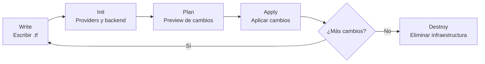
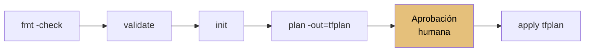

import CloudTabs from '@site/src/components/shared/CloudTabs';
import { CloudTab } from '@site/src/components/shared/CloudTabs';

# Plan, Apply y Destroy

## El flujo de trabajo de Terraform

Terraform sigue un flujo de trabajo declarativo: describes el estado deseado de tu infraestructura en archivos de configuración `.tf`, y Terraform se encarga de calcular qué cambios son necesarios para alcanzar ese estado. No le dices a Terraform "crea un servidor", sino "quiero que exista un servidor con estas características". Si ya existe, no hace nada. Si no existe, lo crea. Si ha cambiado, lo actualiza.

El ciclo de vida completo de un proyecto Terraform se resume en este flujo:



Cada paso tiene un propósito claro y un comando asociado. Vamos a recorrerlos uno a uno con detalle.

---

## terraform init

### Qué hace

`terraform init` es el primer comando que ejecutas en cualquier proyecto Terraform. Es el equivalente a `npm install` o `pip install -r requirements.txt`: prepara el directorio de trabajo descargando todo lo necesario.

Concretamente, `terraform init`:

1. **Descarga los providers** declarados en los bloques `required_providers` o inferidos de los resources.
2. **Configura el backend** donde se almacenará el state (local por defecto, o remoto si está configurado).
3. **Descarga módulos** referenciados en la configuración.
4. **Genera el lockfile** `.terraform.lock.hcl` para fijar las versiones exactas de los providers.

### Cuándo ejecutarlo

Debes ejecutar `terraform init` en estas situaciones:

- **Primera vez** que trabajas con un proyecto Terraform (o al clonarlo).
- **Al añadir o cambiar un provider** (por ejemplo, añadir el provider de AWS).
- **Al cambiar la configuración del backend** (por ejemplo, migrar de local a S3).
- **Al añadir o actualizar un módulo** externo.

### Flags útiles

| Flag | Descripción |
|------|-------------|
| `-upgrade` | Actualiza providers y módulos a la última versión compatible con las constraints |
| `-reconfigure` | Reconfigura el backend descartando cualquier configuración previa |
| `-backend-config=KEY=VALUE` | Pasa parámetros de backend desde la línea de comandos (útil para CI/CD) |
| `-migrate-state` | Migra el state al nuevo backend configurado |

### El directorio .terraform/ y el lockfile

Al ejecutar `init`, Terraform crea un directorio `.terraform/` en la raíz del proyecto. Este directorio contiene:

- Los binarios de los providers descargados.
- Cache de módulos remotos.
- Configuración del backend.

También genera (o actualiza) el archivo `.terraform.lock.hcl`, que registra las versiones exactas y los hashes de los providers descargados.

:::tip
Commitea siempre `.terraform.lock.hcl` a tu repositorio Git. Esto garantiza que todos los miembros del equipo usen exactamente las mismas versiones de providers. En cambio, añade `.terraform/` a tu `.gitignore` -- contiene binarios grandes y configuración local que no debe compartirse.
:::

Tu `.gitignore` debería incluir como mínimo:

```bash
# .gitignore para proyectos Terraform
.terraform/
*.tfstate
*.tfstate.backup
*.tfplan
*.tfvars
!example.tfvars
```

### Ejemplo de output

```bash
$ terraform init

Initializing the backend...

Initializing provider plugins...
- Finding hashicorp/local versions matching "~> 2.0"...
- Installing hashicorp/local v2.5.1...
- Installed hashicorp/local v2.5.1 (signed by HashiCorp)

Terraform has created a lock file .terraform.lock.hcl to record the provider
selections it made above. Include this file in your version control repository
so that Terraform can guarantee to make the same selections by default when
you run "terraform init" in the future.

Terraform has been successfully initialized!

You may now begin working with Terraform. Try running "terraform plan" to see
any changes that are required for your infrastructure.
```

Si ejecutas `init` por segunda vez sin cambios, Terraform detecta que ya está todo inicializado y el proceso es casi instantáneo:

```bash
$ terraform init

Initializing the backend...

Initializing provider plugins...
- Reusing previous version of hashicorp/local from the dependency lock file
- Using previously-installed hashicorp/local v2.5.1

Terraform has been successfully initialized!
```

---

## terraform plan

### Qué hace

`terraform plan` es el comando más importante del flujo de trabajo diario. Compara el estado deseado (tus archivos `.tf`) con el estado actual (el state file) y genera un **plan de ejecución** que muestra exactamente qué cambios hará Terraform.

Es una operación de solo lectura: no modifica nada en la infraestructura real. Es el equivalente a un "dry run".

import TerraformPlanSim from '@site/src/components/demos/terraform/TerraformPlanSim';

<TerraformPlanSim />

### Lectura del output

El output de `terraform plan` usa una notación clara para indicar el tipo de cambio:

| Símbolo | Color | Significado |
|---------|-------|-------------|
| `+` | Verde | **Create** -- se creará un recurso nuevo |
| `~` | Amarillo | **Update in-place** -- se modificará un recurso existente sin recrearlo |
| `-` | Rojo | **Destroy** -- se eliminará un recurso |
| `-/+` | Rojo/Verde | **Replace** -- se destruirá y recreará el recurso (destroy then create) |
| `+/-` | Verde/Rojo | **Replace** -- se creará primero el nuevo y luego se destruirá el viejo (create then destroy) |
| `<=` | Cyan | **Read** -- se leerá un data source |

Además del símbolo, Terraform muestra para cada atributo si su valor es `(known after apply)`, lo que significa que ese valor solo se conocerá después de que el recurso se cree (por ejemplo, un ID generado por el proveedor cloud).

### Flags útiles

| Flag | Descripción |
|------|-------------|
| `-out=ARCHIVO` | Guarda el plan en un archivo binario para aplicarlo después |
| `-target=RECURSO` | Limita el plan a un recurso específico y sus dependencias |
| `-var="KEY=VALUE"` | Pasa una variable desde la línea de comandos |
| `-var-file=ARCHIVO` | Carga variables desde un archivo `.tfvars` |
| `-refresh-only` | Solo actualiza el state con el estado real, sin planificar cambios |
| `-destroy` | Genera un plan de destrucción (equivalente a `terraform plan` para destroy) |
| `-compact-warnings` | Muestra warnings en formato compacto |
| `-parallelism=N` | Limita el número de operaciones concurrentes (default: 10) |

### Guardar un plan para aplicar después

Uno de los patrones más importantes es guardar el plan en un archivo y aplicarlo posteriormente:

```bash
# Generar y guardar el plan
terraform plan -out=plan.tfplan

# Revisar el plan (puedes compartirlo con el equipo)
terraform show plan.tfplan

# Aplicar exactamente ese plan, sin recalcular
terraform apply plan.tfplan
```

Este patrón garantiza que lo que revisaste es exactamente lo que se aplica. Entre el momento del `plan` y el `apply`, nada cambia: Terraform aplica las mismas operaciones que mostró en el plan.

:::warning
Revisa siempre el plan antes de ejecutar `apply`. Es tu última línea de defensa antes de modificar infraestructura real. Un `plan` te puede alertar de destrucciones inesperadas, cambios en recursos críticos o errores de configuración. Acostúmbrate a leer el plan completo, especialmente las secciones marcadas con `-` (destroy) y `-/+` (replace).
:::

### Ejemplo completo de output

Supongamos que tenemos esta configuración que crea un archivo local:

```hcl
resource "local_file" "ejemplo" {
  content  = "Hola desde Terraform"
  filename = "${path.module}/saludo.txt"
}
```

Al ejecutar `terraform plan`:

```bash
$ terraform plan

Terraform used the selected providers to generate the following execution plan.
Resource actions are indicated with the following symbols:
  + create

Terraform will perform the following actions:

  # local_file.ejemplo will be created
  + resource "local_file" "ejemplo" {
      + content              = "Hola desde Terraform"
      + content_base64sha256 = (known after apply)
      + content_base64sha512 = (known after apply)
      + content_md5          = (known after apply)
      + content_sha1         = (known after apply)
      + content_sha256       = (known after apply)
      + content_sha512       = (known after apply)
      + directory_permission = "0777"
      + file_permission      = "0777"
      + filename             = "./saludo.txt"
      + id                   = (known after apply)
    }

Plan: 1 to add, 0 to change, 0 to destroy.
```

La línea final es el resumen: `Plan: 1 to add, 0 to change, 0 to destroy.` Esto te da una visión rápida de la magnitud de los cambios.

Ahora, si modificamos el contenido del archivo:

```hcl
resource "local_file" "ejemplo" {
  content  = "Hola desde Terraform - actualizado"
  filename = "${path.module}/saludo.txt"
}
```

```bash
$ terraform plan

Terraform used the selected providers to generate the following execution plan.
Resource actions are indicated with the following symbols:
-/+ destroy and then create replacement

Terraform will perform the following actions:

  # local_file.ejemplo must be replaced
  -/+ resource "local_file" "ejemplo" {
      ~ content              = "Hola desde Terraform" -> "Hola desde Terraform - actualizado"
      ~ content_base64sha256 = "abc123..." -> (known after apply)
      ~ content_base64sha512 = "def456..." -> (known after apply)
      ~ content_md5          = "789ghi..." -> (known after apply)
      ~ content_sha1         = "jkl012..." -> (known after apply)
      ~ content_sha256       = "mno345..." -> (known after apply)
      ~ content_sha512       = "pqr678..." -> (known after apply)
        # (3 unchanged attributes hidden)
    }

Plan: 1 to add, 0 to change, 1 to destroy.
```

Observa que el provider `local_file` no soporta actualizaciones in-place: necesita destruir el archivo y recrearlo. Esto se indica con el símbolo `-/+`.

---

## terraform apply

### Qué hace

`terraform apply` es el comando que materializa los cambios en la infraestructura real. Toma el plan de ejecución (calculado en el momento o desde un archivo guardado) y ejecuta las operaciones necesarias: crear, modificar o destruir recursos.

### Confirmación interactiva

Por defecto, `terraform apply` muestra primero el plan y luego pide confirmación:

```bash
$ terraform apply

Terraform used the selected providers to generate the following execution plan.
Resource actions are indicated with the following symbols:
  + create

Terraform will perform the following actions:

  # local_file.ejemplo will be created
  + resource "local_file" "ejemplo" {
      + content              = "Hola desde Terraform"
      + content_base64sha256 = (known after apply)
      + content_base64sha512 = (known after apply)
      + content_md5          = (known after apply)
      + content_sha1         = (known after apply)
      + content_sha256       = (known after apply)
      + content_sha512       = (known after apply)
      + directory_permission = "0777"
      + file_permission      = "0777"
      + filename             = "./saludo.txt"
      + id                   = (known after apply)
    }

Plan: 1 to add, 0 to change, 0 to destroy.

Do you want to perform these actions?
  Terraform will perform the actions described above.
  Only 'yes' will be accepted to approve.

  Enter a value: yes

local_file.ejemplo: Creating...
local_file.ejemplo: Creation complete after 0s [id=a1b2c3d4e5f6...]

Apply complete! Resources: 1 added, 0 changed, 0 destroyed.
```

Terraform requiere que escribas literalmente `yes` (no `y`, no `Y`, no `si`). Cualquier otra entrada cancela la operación.

### Aplicar un plan guardado

Si previamente guardaste el plan con `-out`, puedes aplicarlo directamente sin que Terraform recalcule:

```bash
# Paso 1: generar y guardar el plan
terraform plan -out=plan.tfplan

# Paso 2: aplicar el plan guardado (no pide confirmacion)
terraform apply plan.tfplan
```

:::info
Cuando aplicas un plan guardado, Terraform **no pide confirmación interactiva**. Se asume que ya revisaste el plan al generarlo. Esto es por diseño: un plan guardado es un contrato sobre lo que va a suceder.
:::

### El flag -auto-approve

Existe el flag `-auto-approve` que salta la confirmación interactiva:

```bash
terraform apply -auto-approve
```

:::danger
No uses `-auto-approve` en ejecuciones locales manuales. Este flag existe para pipelines de CI/CD donde un humano ya revisó y aprobó el plan en un paso previo. Usarlo localmente sin revisar el plan es una receta para destruir infraestructura accidentalmente. En un pipeline de CI/CD, el flujo seguro es: `terraform plan -out=plan.tfplan` en un step, revisión humana (por ejemplo vía pull request), y `terraform apply plan.tfplan` en otro step.
:::

### Qué pasa si falla a mitad

Terraform aplica los cambios recurso por recurso. Si falla a mitad de la ejecución (por ejemplo, por un timeout de red, un error de permisos, o un límite de cuota), el state reflejará un **estado parcial**: algunos recursos ya creados, otros no.

Esto no es un problema catastrófico. Terraform está diseñado para manejar esta situación:

1. El state se actualiza con cada recurso completado exitosamente.
2. Al volver a ejecutar `terraform apply`, Terraform detecta los recursos ya creados y solo intenta crear/modificar los que faltan.
3. Es **idempotente**: puedes ejecutar `apply` múltiples veces de forma segura.

```bash
# Si fallo a mitad, simplemente vuelve a ejecutar
terraform apply
```

:::info
Si un recurso quedó en un estado inconsistente (parcialmente creado), puede que necesites intervención manual: eliminar el recurso desde la consola del proveedor cloud y luego ejecutar `terraform apply` de nuevo, o usar `terraform state rm` para eliminar la referencia del state.
:::

---

## terraform destroy

### Qué hace

`terraform destroy` elimina **todos** los recursos gestionados por Terraform en el directorio actual. Lee el state file y genera un plan de destrucción para cada recurso que existe en el state.

### Confirmación obligatoria

Al igual que `apply`, `terraform destroy` pide confirmación antes de proceder:

```bash
$ terraform destroy

local_file.ejemplo: Refreshing state... [id=a1b2c3d4e5f6...]

Terraform used the selected providers to generate the following execution plan.
Resource actions are indicated with the following symbols:
  - destroy

Terraform will perform the following actions:

  # local_file.ejemplo will be destroyed
  - resource "local_file" "ejemplo" {
      - content              = "Hola desde Terraform" -> null
      - content_base64sha256 = "abc123..." -> null
      - content_base64sha512 = "def456..." -> null
      - content_md5          = "789ghi..." -> null
      - content_sha1         = "jkl012..." -> null
      - content_sha256       = "mno345..." -> null
      - content_sha512       = "pqr678..." -> null
      - directory_permission = "0777" -> null
      - file_permission      = "0777" -> null
      - filename             = "./saludo.txt" -> null
      - id                   = "a1b2c3d4e5f6..." -> null
    }

Plan: 0 to add, 0 to change, 1 to destroy.

Do you really want to destroy all resources?
  Terraform will destroy all your managed infrastructure, as shown above.
  There is no undo. Only 'yes' will be accepted to confirm.

  Enter a value: yes

local_file.ejemplo: Destroying... [id=a1b2c3d4e5f6...]
local_file.ejemplo: Destruction complete after 0s

Destroy complete! Resources: 1 destroyed.
```

### Destrucción selectiva con -target

Si solo necesitas destruir un recurso concreto sin afectar a los demás:

```bash
# Destruir solo un recurso específico
terraform destroy -target=local_file.ejemplo

# Destruir un recurso dentro de un módulo
terraform destroy -target=module.mi_modulo.aws_instance.servidor
```

:::danger
`terraform destroy` es una operación irreversible. Una vez destruidos, los recursos desaparecen. En el caso de bases de datos, esto significa pérdida total de datos si no tienes backups. En el caso de instancias, se pierden los datos en disco efímero. Usa este comando con extremo cuidado, especialmente en entornos de producción. Verifica siempre que estás en el directorio y workspace correctos antes de ejecutar `destroy`.
:::

### Alternativa: eliminar recursos vía apply

Una alternativa más controlada a `terraform destroy` es simplemente comentar o eliminar los bloques de recursos en tus archivos `.tf` y ejecutar `terraform apply`. Terraform detectará que esos recursos ya no están en la configuración pero sí en el state, y los marcará para destrucción.

```hcl
# Antes: el recurso existe
resource "local_file" "ejemplo" {
  content  = "Hola desde Terraform"
  filename = "${path.module}/saludo.txt"
}

# Despues: comentamos o eliminamos el bloque
# resource "local_file" "ejemplo" {
#   content  = "Hola desde Terraform"
#   filename = "${path.module}/saludo.txt"
# }
```

```bash
$ terraform plan

  # local_file.ejemplo will be destroyed
  # (because local_file.ejemplo is not in configuration)
  - resource "local_file" "ejemplo" { ... }

Plan: 0 to add, 0 to change, 1 to destroy.
```

Esta técnica tiene varias ventajas:

- Puedes revisar el plan de destrucción antes de ejecutarlo.
- Es más fácil de integrar en code review (el diff del pull request muestra qué se elimina).
- Permite destruir recursos de forma selectiva y controlada.

---

## Comandos auxiliares

Además de los cuatro comandos principales (`init`, `plan`, `apply`, `destroy`), Terraform ofrece varios comandos auxiliares que facilitan el desarrollo y la depuración.

### terraform fmt

Formatea automáticamente tus archivos `.tf` según las convenciones de estilo de HCL. Es el equivalente a `prettier` para JavaScript o `black` para Python.

```bash
# Formatear todos los archivos .tf del directorio actual
terraform fmt

# Formatear recursivamente todo el proyecto
terraform fmt -recursive

# Verificar si el codigo esta formateado (util en CI)
terraform fmt -check

# Verificar y mostrar las diferencias
terraform fmt -check -diff
```

En un pipeline de CI, `-check` retorna un código de salida distinto de cero si algún archivo no está formateado correctamente:

```bash
$ terraform fmt -check -diff
main.tf
--- old/main.tf
+++ new/main.tf
@@ -1,4 +1,4 @@
 resource "local_file" "ejemplo" {
-  content  = "Hola"
-    filename = "./saludo.txt"
+  content  = "Hola"
+  filename = "./saludo.txt"
 }
```

:::tip
Integra `terraform fmt -check` como el primer paso de tu pipeline de CI. Es rápido, no requiere providers ni credenciales, y garantiza consistencia de estilo en todo el equipo. También puedes configurar tu editor (VS Code, IntelliJ) para ejecutar `terraform fmt` automáticamente al guardar.
:::

### terraform validate

Valida la sintaxis y la semántica de tus archivos de configuración. Comprueba que:

- La sintaxis HCL es correcta.
- Los bloques de recursos usan tipos válidos.
- Las referencias entre recursos son consistentes.
- Los atributos requeridos están presentes.

```bash
$ terraform validate
Success! The configuration is valid.
```

Si hay errores:

```bash
$ terraform validate
╷
│ Error: Missing required argument
│
│   on main.tf line 1, in resource "local_file" "ejemplo":
│    1: resource "local_file" "ejemplo" {
│
│ The argument "filename" is required, but no definition was found.
╵
```

:::info
`terraform validate` requiere que hayas ejecutado `terraform init` previamente (necesita los providers para validar los tipos de recursos y atributos). Sin embargo, no requiere credenciales de acceso al proveedor cloud. Esto lo hace ideal como segundo paso en CI, justo después de `terraform fmt -check`.
:::

### terraform console

Abre un REPL (Read-Eval-Print Loop) interactivo donde puedes evaluar expresiones HCL contra el state actual y la configuración:

```bash
$ terraform console
> 1 + 2
3
> "hola-${lower("MUNDO")}"
"hola-mundo"
> length(["a", "b", "c"])
3
> max(5, 12, 9)
12
> formatdate("DD/MM/YYYY", timestamp())
"29/03/2026"
> cidrsubnet("10.0.0.0/16", 8, 1)
"10.0.1.0/24"
```

Es especialmente útil para:

- Probar funciones de Terraform antes de usarlas en la configuración.
- Explorar el state de recursos existentes.
- Depurar expresiones complejas con `for` o condicionales.
- Verificar el resultado de interpolaciones.

```bash
$ terraform console
> local_file.ejemplo.id
"a1b2c3d4e5f6..."
> local_file.ejemplo.filename
"./saludo.txt"
```

Para salir del console, escribe `exit` o pulsa `Ctrl+D`.

### terraform show

Muestra el state actual o un plan guardado en formato legible:

```bash
# Mostrar el state actual completo
terraform show

# Mostrar un plan guardado
terraform show plan.tfplan

# Mostrar en formato JSON (util para automatizacion)
terraform show -json plan.tfplan
```

Ejemplo de output:

```bash
$ terraform show
# local_file.ejemplo:
resource "local_file" "ejemplo" {
    content              = "Hola desde Terraform"
    content_base64sha256 = "abc123..."
    content_md5          = "789ghi..."
    content_sha1         = "jkl012..."
    content_sha256       = "mno345..."
    content_sha512       = "pqr678..."
    directory_permission = "0777"
    file_permission      = "0777"
    filename             = "./saludo.txt"
    id                   = "a1b2c3d4e5f6..."
}
```

### terraform output

Consulta los valores de los outputs definidos en la configuración:

```bash
# Mostrar todos los outputs
terraform output

# Mostrar un output especifico
terraform output nombre_del_output

# Mostrar en formato raw (sin comillas, util para scripts)
terraform output -raw nombre_del_output

# Mostrar en formato JSON
terraform output -json
```

Ejemplo:

```hcl
output "ruta_archivo" {
  value       = local_file.ejemplo.filename
  description = "Ruta del archivo creado"
}

output "contenido" {
  value       = local_file.ejemplo.content
  description = "Contenido del archivo"
}
```

```bash
$ terraform output
contenido     = "Hola desde Terraform"
ruta_archivo  = "./saludo.txt"

$ terraform output -raw ruta_archivo
./saludo.txt
```

---

## Flujo completo: ejemplo práctico

Vamos a recorrer el flujo completo de Terraform con un ejemplo real usando el provider `local`, que permite crear y gestionar archivos en el sistema de archivos local. Este provider es perfecto para aprender porque no necesita credenciales ni acceso a ningún servicio externo.

import LabActions from '@site/src/components/shared/LabActions';

<LabActions
  repo="https://github.com/salvamiguel/tf-complete-flow-example"
  title="Descarga el código de este ejemplo"
  codespace={false}
  devcontainer={false}
  fork={true}
/>

### Paso 1: Escribir la configuración

Crea un directorio para el proyecto y el archivo de configuración:

```bash
mkdir tf-complete-flow-example && cd tf-complete-flow-example
```

Crea el archivo `main.tf`:

```hcl
terraform {
  required_version = ">= 1.0"

  required_providers {
    local = {
      source  = "hashicorp/local"
      version = "~> 2.0"
    }
  }
}

variable "nombre" {
  description = "Nombre para el saludo"
  type        = string
  default     = "Mundo"
}

resource "local_file" "saludo" {
  content  = "Hola, ${var.nombre}! Creado con Terraform."
  filename = "${path.module}/saludo.txt"
}

output "ruta" {
  value       = local_file.saludo.filename
  description = "Ruta del archivo creado"
}

output "contenido" {
  value       = local_file.saludo.content
  description = "Contenido del archivo"
}
```

### Paso 2: Inicializar el proyecto

```bash
$ terraform init

Initializing the backend...

Initializing provider plugins...
- Finding hashicorp/local versions matching "~> 2.0"...
- Installing hashicorp/local v2.5.1...
- Installed hashicorp/local v2.5.1 (signed by HashiCorp)

Terraform has created a lock file .terraform.lock.hcl to record the provider
selections it made above. Include this file in your version control repository
so that Terraform can guarantee to make the same selections by default when
you run "terraform init" in the future.

Terraform has been successfully initialized!
```

Verifica lo que se ha creado:

```bash
$ ls -la
total 24
drwxr-xr-x  5 user  staff   160 Mar 29 10:00 .
drwxr-xr-x  3 user  staff    96 Mar 29 10:00 ..
drwxr-xr-x  3 user  staff    96 Mar 29 10:00 .terraform
-rw-r--r--  1 user  staff  1234 Mar 29 10:00 .terraform.lock.hcl
-rw-r--r--  1 user  staff   456 Mar 29 10:00 main.tf
```

### Paso 3: Validar la configuración

```bash
$ terraform validate
Success! The configuration is valid.
```

### Paso 4: Generar el plan

```bash
$ terraform plan

Terraform used the selected providers to generate the following execution plan.
Resource actions are indicated with the following symbols:
  + create

Terraform will perform the following actions:

  # local_file.saludo will be created
  + resource "local_file" "saludo" {
      + content              = "Hola, Mundo! Creado con Terraform."
      + content_base64sha256 = (known after apply)
      + content_base64sha512 = (known after apply)
      + content_md5          = (known after apply)
      + content_sha1         = (known after apply)
      + content_sha256       = (known after apply)
      + content_sha512       = (known after apply)
      + directory_permission = "0777"
      + file_permission      = "0777"
      + filename             = "./saludo.txt"
      + id                   = (known after apply)
    }

Plan: 1 to add, 0 to change, 0 to destroy.

Changes to Outputs:
  + contenido = "Hola, Mundo! Creado con Terraform."
  + ruta      = "./saludo.txt"
```

Todo correcto: un recurso a crear, cero a modificar, cero a destruir.

### Paso 5: Aplicar el plan

```bash
$ terraform apply

  # (se muestra el mismo plan que arriba)

Plan: 1 to add, 0 to change, 0 to destroy.

Do you want to perform these actions?
  Terraform will perform the actions described above.
  Only 'yes' will be accepted to approve.

  Enter a value: yes

local_file.saludo: Creating...
local_file.saludo: Creation complete after 0s [id=a94a8fe5ccb...]

Apply complete! Resources: 1 added, 0 changed, 0 destroyed.

Outputs:

contenido = "Hola, Mundo! Creado con Terraform."
ruta      = "./saludo.txt"
```

### Paso 6: Verificar el resultado

```bash
$ cat saludo.txt
Hola, Mundo! Creado con Terraform.

$ terraform output
contenido = "Hola, Mundo! Creado con Terraform."
ruta      = "./saludo.txt"

$ terraform show
# local_file.saludo:
resource "local_file" "saludo" {
    content              = "Hola, Mundo! Creado con Terraform."
    content_base64sha256 = "..."
    directory_permission = "0777"
    file_permission      = "0777"
    filename             = "./saludo.txt"
    id                   = "a94a8fe5ccb..."
}

Outputs:

contenido = "Hola, Mundo! Creado con Terraform."
ruta      = "./saludo.txt"
```

### Paso 7: Modificar la configuración

Ahora cambiamos el contenido del archivo editando `main.tf`:

```hcl
resource "local_file" "saludo" {
  content  = "Hola, ${var.nombre}! Creado con Terraform. Version 2."
  filename = "${path.module}/saludo.txt"
}
```

### Paso 8: Plan de la modificación

```bash
$ terraform plan

Terraform used the selected providers to generate the following execution plan.
Resource actions are indicated with the following symbols:
-/+ destroy and then create replacement

Terraform will perform the following actions:

  # local_file.saludo must be replaced
  -/+ resource "local_file" "saludo" {
      ~ content              = "Hola, Mundo! Creado con Terraform." -> "Hola, Mundo! Creado con Terraform. Version 2."
      ~ content_base64sha256 = "..." -> (known after apply)
      ~ content_base64sha512 = "..." -> (known after apply)
      ~ content_md5          = "..." -> (known after apply)
      ~ content_sha1         = "..." -> (known after apply)
      ~ content_sha256       = "..." -> (known after apply)
      ~ content_sha512       = "..." -> (known after apply)
      ~ id                   = "a94a8fe5ccb..." -> (known after apply)
        # (3 unchanged attributes hidden)
    }

Plan: 1 to add, 0 to change, 1 to destroy.

Changes to Outputs:
  ~ contenido = "Hola, Mundo! Creado con Terraform." -> "Hola, Mundo! Creado con Terraform. Version 2."
```

El plan muestra claramente: se destruirá el archivo actual y se creará uno nuevo con el contenido actualizado.

### Paso 9: Aplicar la modificación

```bash
$ terraform apply

  # (se muestra el plan de arriba)

  Enter a value: yes

local_file.saludo: Destroying... [id=a94a8fe5ccb...]
local_file.saludo: Destruction complete after 0s
local_file.saludo: Creating...
local_file.saludo: Creation complete after 0s [id=b85b9gf6ddc...]

Apply complete! Resources: 1 added, 0 changed, 1 destroyed.

Outputs:

contenido = "Hola, Mundo! Creado con Terraform. Version 2."
ruta      = "./saludo.txt"
```

### Paso 10: Destruir la infraestructura

Cuando hayas terminado, limpia todos los recursos:

```bash
$ terraform destroy

local_file.saludo: Refreshing state... [id=b85b9gf6ddc...]

Terraform used the selected providers to generate the following execution plan.
Resource actions are indicated with the following symbols:
  - destroy

Terraform will perform the following actions:

  # local_file.saludo will be destroyed
  - resource "local_file" "saludo" {
      - content              = "Hola, Mundo! Creado con Terraform. Version 2." -> null
      - directory_permission = "0777" -> null
      - file_permission      = "0777" -> null
      - filename             = "./saludo.txt" -> null
      - id                   = "b85b9gf6ddc..." -> null
    }

Plan: 0 to add, 0 to change, 1 to destroy.

Changes to Outputs:
  - contenido = "Hola, Mundo! Creado con Terraform. Version 2." -> null
  - ruta      = "./saludo.txt" -> null

Do you really want to destroy all resources?
  Terraform will destroy all your managed infrastructure, as shown above.
  There is no undo. Only 'yes' will be accepted to confirm.

  Enter a value: yes

local_file.saludo: Destroying... [id=b85b9gf6ddc...]
local_file.saludo: Destruction complete after 0s

Destroy complete! Resources: 1 destroyed.
```

Verificación final:

```bash
$ ls saludo.txt
ls: saludo.txt: No such file or directory

$ terraform show
The state file is empty. No resources are represented.
```

El archivo ha sido eliminado y el state está vacío. El ciclo completo se ha cerrado.

---

## Resumen

| Comando | Descripción |
|---------|-------------|
| `terraform init` | Inicializa el directorio, descarga providers y configura el backend |
| `terraform plan` | Muestra un preview de los cambios sin aplicarlos |
| `terraform apply` | Aplica los cambios a la infraestructura real |
| `terraform destroy` | Elimina todos los recursos gestionados |
| `terraform fmt` | Formatea el código HCL según las convenciones estándar |
| `terraform validate` | Valida la sintaxis y semántica de la configuración |
| `terraform console` | Abre un REPL interactivo para evaluar expresiones |
| `terraform show` | Muestra el state actual o un plan guardado |
| `terraform output` | Consulta los valores de los outputs definidos |

El flujo recomendado para el trabajo diario es:


Y el flujo recomendado para CI/CD es:



Dominar este flujo es la base de todo el trabajo con Terraform. Cada comando tiene un propósito claro y un momento preciso en el que debe usarse. Con la práctica, este ciclo se convierte en algo natural y automático.
