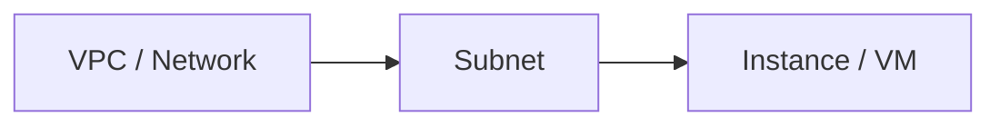

import { FaAws, FaDocker, FaFile } from "react-icons/fa";
import { VscAzure } from "react-icons/vsc";
import { SiGooglecloud, SiKubernetes } from "react-icons/si";
import CloudTabs from '@site/src/components/shared/CloudTabs';
import { CloudTab } from '@site/src/components/shared/CloudTabs';


# Providers y Resources

En el capítulo anterior vimos que Terraform es una herramienta declarativa de Infrastructure as Code. Ahora vamos a profundizar en los dos bloques fundamentales de cualquier configuración Terraform: los **providers** (que conectan Terraform con el mundo exterior) y los **resources** (que definen la infraestructura que queremos crear).

---

## 1. Providers

### Qué son los providers

Un provider es un **plugin** que permite a Terraform interactuar con una API externa. Cada provider traduce los bloques de configuración HCL en llamadas a la API del servicio correspondiente. Sin providers, Terraform no sabría cómo comunicarse con AWS, Azure, Google Cloud, Docker ni ningún otro servicio.

Cuando ejecutas `terraform init`, Terraform descarga e instala los providers necesarios en el directorio `.terraform/` de tu proyecto. A partir de ese momento, Terraform puede crear, leer, actualizar y eliminar recursos en el servicio correspondiente.

:::info
Terraform por sí solo no sabe nada de AWS, Azure ni ningún otro servicio. Todo el conocimiento específico de cada plataforma lo aportan los providers. Es una arquitectura de plugins que hace a Terraform enormemente extensible.
:::

### Terraform Registry

El [Terraform Registry](https://registry.terraform.io/) es el repositorio central donde se publican los providers. Existen tres niveles de confianza:

| Nivel | Descripción | Ejemplo |
|-------|-------------|---------|
| **Official** | Mantenidos por HashiCorp | `hashicorp/aws`, `hashicorp/azurerm` |
| **Partner** | Mantenidos por empresas asociadas | `mongodb/mongodbatlas`, `datadog/datadog` |
| **Community** | Mantenidos por la comunidad | Diversos providers de nicho |

En el Registry puedes consultar la documentación de cada provider, ver las versiones disponibles, los resources y data sources que ofrece, y ejemplos de uso. Es la referencia principal cuando trabajas con Terraform.

### Configuración básica de un provider

Para usar un provider, lo declaras en un bloque `provider`:

<CloudTabs>
<CloudTab provider="aws">

```hcl
provider "aws" {
  region = "eu-west-1"
}
```

</CloudTab>
<CloudTab provider="gcp">

```hcl
provider "google" {
  project = "my-project"
  region  = "europe-west1"
}
```

</CloudTab>
<CloudTab provider="azure">

```hcl
provider "azurerm" {
  features {}
}
```

</CloudTab>
</CloudTabs>

Este bloque le dice a Terraform: "quiero trabajar con AWS en la región de Irlanda". Cada provider tiene sus propios argumentos de configuración. En el caso de AWS, el argumento `region` es obligatorio, mientras que las credenciales se suelen gestionar mediante variables de entorno (`AWS_ACCESS_KEY_ID`, `AWS_SECRET_ACCESS_KEY`) o perfiles de configuración de AWS CLI.

:::warning
Nunca escribas credenciales directamente en los archivos `.tf`. Usa variables de entorno, AWS CLI profiles, o mecanismos como Vault. Si las credenciales acaban en un repositorio Git, se consideran comprometidas y deben rotarse inmediatamente.
:::

### Bloque required_providers

Dentro del bloque `terraform {}`, debes especificar los providers que tu configuración necesita y, opcionalmente, sus restricciones de versión:

<CloudTabs>
<CloudTab provider="aws">

```hcl
terraform {
  required_version = ">= 1.0"

  required_providers {
    aws = {
      source  = "hashicorp/aws"
      version = "~> 5.0"
    }
    random = {
      source  = "hashicorp/random"
      version = ">= 3.0, < 4.0"
    }
  }
}
```

</CloudTab>
<CloudTab provider="gcp">

```hcl
terraform {
  required_version = ">= 1.0"

  required_providers {
    google = {
      source  = "hashicorp/google"
      version = "~> 5.0"
    }
    random = {
      source  = "hashicorp/random"
      version = ">= 3.0, < 4.0"
    }
  }
}
```

</CloudTab>
<CloudTab provider="azure">

```hcl
terraform {
  required_version = ">= 1.0"

  required_providers {
    azurerm = {
      source  = "hashicorp/azurerm"
      version = "~> 3.0"
    }
    random = {
      source  = "hashicorp/random"
      version = ">= 3.0, < 4.0"
    }
  }
}
```

</CloudTab>
</CloudTabs>

El campo `source` sigue el formato `namespace/provider`. Si no lo especificas, Terraform asume el namespace `hashicorp` por defecto, pero es buena práctica ser explícito.

### Versionado de providers

Controlar la versión del provider es crítico para la estabilidad de tu infraestructura. Terraform soporta varias expresiones de version constraint:

| Operador | Significado | Ejemplo |
|----------|-------------|---------|
| `= 5.0.0` | Versión exacta | Solo la 5.0.0 |
| `>= 5.0` | Mayor o igual | 5.0, 5.1, 6.0... |
| `~> 5.0` | Compatible con (pessimistic) | >= 5.0, < 6.0 |
| `~> 5.0.1` | Compatible con patch | >= 5.0.1, < 5.1.0 |
| `>= 5.0, < 5.5` | Rango combinado | Desde 5.0 hasta 5.4.x |

:::tip
El operador `~>` es el más común y recomendado. `~> 5.0` permite actualizaciones menores (5.1, 5.2...) pero no mayores (6.0), lo que equilibra estabilidad y actualizaciones de seguridad.
:::

Cuando ejecutas `terraform init`, Terraform genera un archivo `.terraform.lock.hcl` que registra las versiones exactas descargadas. Este archivo **debe versionarse en Git** para garantizar que todo el equipo trabaja con las mismas versiones.

### Provider alias: múltiples configuraciones

En ocasiones necesitas usar el mismo provider con configuraciones diferentes. Por ejemplo, desplegar recursos en dos regiones distintas. Para esto se utiliza el argumento `alias`:

<CloudTabs>
<CloudTab provider="aws">

```hcl
# Provider por defecto (sin alias)
provider "aws" {
  region = "eu-west-1"
}

# Provider con alias para otra region
provider "aws" {
  alias  = "us_east"
  region = "us-east-1"
}
```

</CloudTab>
<CloudTab provider="gcp">

```hcl
# Provider por defecto (sin alias)
provider "google" {
  project = "my-project"
  region  = "europe-west1"
}

# Provider con alias para otra region
provider "google" {
  alias   = "us_east"
  project = "my-project"
  region  = "us-east1"
}
```

</CloudTab>
<CloudTab provider="azure">

```hcl
# Provider por defecto (sin alias)
provider "azurerm" {
  features {}
}

# Provider con alias para otra suscripcion
provider "azurerm" {
  alias           = "secondary"
  subscription_id = "00000000-0000-0000-0000-000000000000"
  features {}
}
```

</CloudTab>
</CloudTabs>

Para usar un provider con alias en un resource, lo indicas con el meta-argumento `provider`:

<CloudTabs>
<CloudTab provider="aws">

```hcl
resource "aws_instance" "web_eu" {
  ami           = "ami-0c55b159cbfafe1f0"
  instance_type = "t2.micro"
  # Usa el provider por defecto (eu-west-1)
}

resource "aws_instance" "web_us" {
  provider      = aws.us_east
  ami           = "ami-0abcdef1234567890"
  instance_type = "t2.micro"
  # Usa el provider con alias (us-east-1)
}
```

</CloudTab>
<CloudTab provider="gcp">

```hcl
resource "google_compute_instance" "web_eu" {
  name         = "web-eu"
  machine_type = "e2-micro"
  zone         = "europe-west1-b"
  # Usa el provider por defecto (europe-west1)

  boot_disk {
    initialize_params {
      image = "debian-cloud/debian-12"
    }
  }

  network_interface {
    network = "default"
  }
}

resource "google_compute_instance" "web_us" {
  provider     = google.us_east
  name         = "web-us"
  machine_type = "e2-micro"
  zone         = "us-east1-b"
  # Usa el provider con alias (us-east1)

  boot_disk {
    initialize_params {
      image = "debian-cloud/debian-12"
    }
  }

  network_interface {
    network = "default"
  }
}
```

</CloudTab>
<CloudTab provider="azure">

```hcl
resource "azurerm_linux_virtual_machine" "web_primary" {
  name                = "web-primary"
  resource_group_name = azurerm_resource_group.primary.name
  location            = azurerm_resource_group.primary.location
  size                = "Standard_B1s"
  admin_username      = "adminuser"
  # Usa el provider por defecto

  admin_ssh_key {
    username   = "adminuser"
    public_key = file("~/.ssh/id_rsa.pub")
  }

  os_disk {
    caching              = "ReadWrite"
    storage_account_type = "Standard_LRS"
  }

  source_image_reference {
    publisher = "Canonical"
    offer     = "0001-com-ubuntu-server-jammy"
    sku       = "22_04-lts"
    version   = "latest"
  }

  network_interface_ids = [azurerm_network_interface.primary.id]
}

resource "azurerm_linux_virtual_machine" "web_secondary" {
  provider            = azurerm.secondary
  name                = "web-secondary"
  resource_group_name = azurerm_resource_group.secondary.name
  location            = azurerm_resource_group.secondary.location
  size                = "Standard_B1s"
  admin_username      = "adminuser"
  # Usa el provider con alias (secondary)

  admin_ssh_key {
    username   = "adminuser"
    public_key = file("~/.ssh/id_rsa.pub")
  }

  os_disk {
    caching              = "ReadWrite"
    storage_account_type = "Standard_LRS"
  }

  source_image_reference {
    publisher = "Canonical"
    offer     = "0001-com-ubuntu-server-jammy"
    sku       = "22_04-lts"
    version   = "latest"
  }

  network_interface_ids = [azurerm_network_interface.secondary.id]
}
```

</CloudTab>
</CloudTabs>

:::info
Los casos más habituales para usar alias son:
- Desplegar en múltiples regiones
- Gestionar recursos en múltiples cuentas de AWS
- Usar diferentes perfiles de credenciales
:::

### Providers más comunes

Estos son los providers que encontrarás con más frecuencia en el ecosistema Terraform:

| Provider | Uso principal |
|----------|---------------|
| [hashicorp/aws](https://registry.terraform.io/providers/hashicorp/aws/latest) | <FaAws /> Amazon Web Services |
| [hashicorp/azurerm](https://registry.terraform.io/providers/hashicorp/azurerm/latest) | <VscAzure /> Microsoft Azure |
| [hashicorp/google](https://registry.terraform.io/providers/hashicorp/google/latest) | <SiGooglecloud /> Google Cloud Platform |
| [kreuzwerker/docker](https://registry.terraform.io/providers/kreuzwerker/docker/latest) | <FaDocker /> Contenedores Docker locales |
| [hashicorp/kubernetes](https://registry.terraform.io/providers/hashicorp/kubernetes/latest) | <SiKubernetes /> Clusters de Kubernetes |
| [hashicorp/local](https://registry.terraform.io/providers/hashicorp/local/latest) | <FaFile /> Archivos en el sistema local |
| [hashicorp/null](https://registry.terraform.io/providers/hashicorp/null/latest) | Recursos sin infraestructura real (provisioners, triggers) |
| [hashicorp/random](https://registry.terraform.io/providers/hashicorp/random/latest) | Generación de valores aleatorios (IDs, passwords, etc.) |

Los providers `local`, `null` y `random` merecen atención especial porque no representan infraestructura cloud, pero son extremadamente útiles como utilidades auxiliares en configuraciones reales.

---

## 2. Resources

### Qué es un resource

Un resource es el **bloque fundamental** de Terraform. Cada resource representa un objeto de infraestructura: una instancia EC2, un bucket S3, un security group, un registro DNS, una base de datos... Cuando Terraform aplica tu configuración, traduce cada bloque resource en las llamadas API necesarias para crear, modificar o destruir ese objeto.

### Sintaxis de un resource

```hcl
resource "tipo_de_resource" "nombre_local" {
  argumento1 = "valor1"
  argumento2 = "valor2"
}
```

- **tipo_de_resource**: identifica que recurso del provider quieres crear. El prefijo antes del primer `_` indica el provider (por ejemplo, `aws_instance` pertenece al provider `aws`).
- **nombre_local**: un identificador que usas dentro de tu configuración Terraform para referirte a este recurso. No tiene relación con el nombre real del recurso en la nube.

La combinación de tipo y nombre local debe ser única en toda tu configuración. Es decir, no puedes tener dos `resource "aws_instance" "web"` en el mismo proyecto.

### Ciclo de vida de un resource

Terraform gestiona cada resource a través de cuatro operaciones fundamentales, conocidas como CRUD:

1. **Create** -- Cuando el resource existe en tu configuración pero no en el state (ni en la infraestructura real), Terraform lo crea.
2. **Read** -- En cada `terraform plan` y `terraform apply`, Terraform consulta el estado actual del resource en la API del provider para compararlo con la configuración deseada.
3. **Update** -- Si hay diferencias entre la configuración deseada y el estado actual, Terraform aplica los cambios necesarios. Algunos cambios son in-place (se modifica el recurso existente) y otros son destructivos (se destruye y recrea el recurso).
4. **Delete** -- Cuando eliminas un resource de tu configuración, Terraform lo destruye en la infraestructura real.

:::danger
Algunos cambios en resources provocan un **destroy + create** (en lugar de un update in-place). Por ejemplo, cambiar la AMI de una instancia EC2 destruye la instancia antigua y crea una nueva. Revisa siempre el `terraform plan` antes de aplicar para detectar estos casos. En el plan aparecen marcados como `# forces replacement`.
:::

### Ejemplo completo: crear una instancia

<CloudTabs>
<CloudTab provider="aws">

```hcl
terraform {
  required_providers {
    aws = {
      source  = "hashicorp/aws"
      version = "~> 5.0"
    }
  }
}

provider "aws" {
  region = "eu-west-1"
}

resource "aws_instance" "web" {
  ami           = "ami-0c55b159cbfafe1f0"
  instance_type = "t2.micro"

  tags = {
    Name        = "WebServer"
    Environment = "development"
    ManagedBy   = "terraform"
  }
}
```

</CloudTab>
<CloudTab provider="gcp">

```hcl
terraform {
  required_providers {
    google = {
      source  = "hashicorp/google"
      version = "~> 5.0"
    }
  }
}

provider "google" {
  project = "my-project"
  region  = "europe-west1"
}

resource "google_compute_instance" "web" {
  name         = "webserver"
  machine_type = "e2-micro"
  zone         = "europe-west1-b"

  boot_disk {
    initialize_params {
      image = "debian-cloud/debian-12"
    }
  }

  network_interface {
    network = "default"
    access_config {}  # Asigna una IP publica
  }

  labels = {
    name        = "webserver"
    environment = "development"
    managed_by  = "terraform"
  }
}
```

</CloudTab>
<CloudTab provider="azure">

```hcl
terraform {
  required_providers {
    azurerm = {
      source  = "hashicorp/azurerm"
      version = "~> 3.0"
    }
  }
}

provider "azurerm" {
  features {}
}

resource "azurerm_resource_group" "web" {
  name     = "web-resources"
  location = "West Europe"
}

resource "azurerm_virtual_network" "web" {
  name                = "web-vnet"
  address_space       = ["10.0.0.0/16"]
  location            = azurerm_resource_group.web.location
  resource_group_name = azurerm_resource_group.web.name
}

resource "azurerm_subnet" "web" {
  name                 = "web-subnet"
  resource_group_name  = azurerm_resource_group.web.name
  virtual_network_name = azurerm_virtual_network.web.name
  address_prefixes     = ["10.0.1.0/24"]
}

resource "azurerm_network_interface" "web" {
  name                = "web-nic"
  location            = azurerm_resource_group.web.location
  resource_group_name = azurerm_resource_group.web.name

  ip_configuration {
    name                          = "internal"
    subnet_id                     = azurerm_subnet.web.id
    private_ip_address_allocation = "Dynamic"
  }
}

resource "azurerm_linux_virtual_machine" "web" {
  name                = "WebServer"
  resource_group_name = azurerm_resource_group.web.name
  location            = azurerm_resource_group.web.location
  size                = "Standard_B1s"
  admin_username      = "adminuser"

  admin_ssh_key {
    username   = "adminuser"
    public_key = file("~/.ssh/id_rsa.pub")
  }

  network_interface_ids = [azurerm_network_interface.web.id]

  os_disk {
    caching              = "ReadWrite"
    storage_account_type = "Standard_LRS"
  }

  source_image_reference {
    publisher = "Canonical"
    offer     = "0001-com-ubuntu-server-jammy"
    sku       = "22_04-lts"
    version   = "latest"
  }

  tags = {
    Name        = "WebServer"
    Environment = "development"
    ManagedBy   = "terraform"
  }
}
```

</CloudTab>
</CloudTabs>

Al ejecutar `terraform apply`, Terraform:
1. Contacta con la API de AWS en `eu-west-1`
2. Crea una instancia EC2 con la AMI y tipo especificados
3. Aplica los tags indicados
4. Guarda el estado resultante (incluyendo el ID de la instancia, la IP pública, etc.) en el archivo de state

### Atributos computados vs configurados

Los **atributos configurados** son los que tú defines en el bloque resource (como `ami`, `instance_type`, `tags`). Los **atributos computados** son valores que el provider genera y devuelve tras crear el recurso. Tú no los defines, pero puedes leerlos:

```hcl
resource "aws_instance" "web" {
  ami           = "ami-0c55b159cbfafe1f0"   # configurado
  instance_type = "t2.micro"                 # configurado

  # Atributos computados (disponibles tras apply):
  # - id             (ej: "i-0abc123def456")
  # - public_ip      (ej: "54.12.34.56")
  # - private_ip     (ej: "10.0.1.25")
  # - arn            (ej: "arn:aws:ec2:...")
}
```

Estos atributos computados son la base de las referencias entre recursos.

### Referencias entre resources

Para conectar recursos entre sí, usas la sintaxis `tipo.nombre.atributo`:

```hcl
resource "aws_eip" "web_ip" {
  instance = aws_instance.web.id
}

output "public_ip" {
  value = aws_eip.web_ip.public_ip
}
```

En este ejemplo, `aws_instance.web.id` hace referencia al atributo computado `id` del resource `aws_instance.web`. Terraform entiende que primero debe crear la instancia EC2, obtener su ID, y luego asociarle la Elastic IP.

---

## 3. Dependencias

### Dependencias implícitas

Cuando un resource referencia un atributo de otro resource, Terraform detecta automáticamente la dependencia. No necesitas hacer nada adicional:

<CloudTabs>
<CloudTab provider="aws">

```hcl
resource "aws_vpc" "main" {
  cidr_block = "10.0.0.0/16"

  tags = {
    Name = "main-vpc"
  }
}

resource "aws_subnet" "public" {
  vpc_id     = aws_vpc.main.id       # dependencia implicita
  cidr_block = "10.0.1.0/24"

  tags = {
    Name = "public-subnet"
  }
}

resource "aws_instance" "web" {
  ami           = "ami-0c55b159cbfafe1f0"
  instance_type = "t2.micro"
  subnet_id     = aws_subnet.public.id  # dependencia implicita

  tags = {
    Name = "web-server"
  }
}
```

</CloudTab>
<CloudTab provider="gcp">

```hcl
resource "google_compute_network" "main" {
  name                    = "main-vpc"
  auto_create_subnetworks = false
}

resource "google_compute_subnetwork" "public" {
  name          = "public-subnet"
  ip_cidr_range = "10.0.1.0/24"
  region        = "europe-west1"
  network       = google_compute_network.main.id  # dependencia implicita
}

resource "google_compute_instance" "web" {
  name         = "web-server"
  machine_type = "e2-micro"
  zone         = "europe-west1-b"

  boot_disk {
    initialize_params {
      image = "debian-cloud/debian-12"
    }
  }

  network_interface {
    subnetwork = google_compute_subnetwork.public.id  # dependencia implicita
    access_config {}
  }
}
```

</CloudTab>
<CloudTab provider="azure">

```hcl
resource "azurerm_resource_group" "main" {
  name     = "main-resources"
  location = "West Europe"
}

resource "azurerm_virtual_network" "main" {
  name                = "main-vnet"
  address_space       = ["10.0.0.0/16"]
  location            = azurerm_resource_group.main.location
  resource_group_name = azurerm_resource_group.main.name  # dependencia implicita
}

resource "azurerm_subnet" "public" {
  name                 = "public-subnet"
  resource_group_name  = azurerm_resource_group.main.name
  virtual_network_name = azurerm_virtual_network.main.name  # dependencia implicita
  address_prefixes     = ["10.0.1.0/24"]
}

resource "azurerm_network_interface" "web" {
  name                = "web-nic"
  location            = azurerm_resource_group.main.location
  resource_group_name = azurerm_resource_group.main.name

  ip_configuration {
    name                          = "internal"
    subnet_id                     = azurerm_subnet.public.id  # dependencia implicita
    private_ip_address_allocation = "Dynamic"
  }
}

resource "azurerm_linux_virtual_machine" "web" {
  name                = "web-server"
  resource_group_name = azurerm_resource_group.main.name
  location            = azurerm_resource_group.main.location
  size                = "Standard_B1s"
  admin_username      = "adminuser"

  admin_ssh_key {
    username   = "adminuser"
    public_key = file("~/.ssh/id_rsa.pub")
  }

  network_interface_ids = [azurerm_network_interface.web.id]  # dependencia implicita

  os_disk {
    caching              = "ReadWrite"
    storage_account_type = "Standard_LRS"
  }

  source_image_reference {
    publisher = "Canonical"
    offer     = "0001-com-ubuntu-server-jammy"
    sku       = "22_04-lts"
    version   = "latest"
  }
}
```

</CloudTab>
</CloudTabs>

Terraform construye automáticamente la cadena de dependencias:



Creará los recursos en ese orden y los destruirá en orden inverso.

### Dependencias explícitas: depends_on

En ocasiones, existe una dependencia entre recursos que Terraform no puede detectar por referencias de atributos. Para estos casos, usas `depends_on`:

```hcl
resource "aws_iam_role_policy" "s3_access" {
  name   = "s3-access"
  role   = aws_iam_role.app.id
  policy = jsonencode({
    Version = "2012-10-17"
    Statement = [
      {
        Effect   = "Allow"
        Action   = ["s3:GetObject", "s3:PutObject"]
        Resource = "${aws_s3_bucket.data.arn}/*"
      }
    ]
  })
}

resource "aws_instance" "app" {
  ami           = "ami-0c55b159cbfafe1f0"
  instance_type = "t2.micro"

  iam_instance_profile = aws_iam_instance_profile.app.name

  # La instancia necesita que la policy este creada antes de arrancar,
  # pero no hay referencia directa de atributos entre ambos recursos
  depends_on = [aws_iam_role_policy.s3_access]
}
```

:::warning
Usa `depends_on` solo cuando realmente no haya forma de expresar la dependencia mediante referencias de atributos. Abusar de `depends_on` tiene efectos negativos:
- Dificulta la lectura del código (las dependencias reales quedan ocultas)
- Puede forzar a Terraform a serializar operaciones que podría paralelizar
- Puede generar ciclos de dependencia difíciles de depurar

En la mayoría de los casos, si necesitas `depends_on`, es una señal de que tu diseño podría mejorarse.
:::

### Grafo de dependencias (DAG)

Terraform organiza internamente todas las dependencias en un **Directed Acyclic Graph** (DAG). Puedes visualizar este grafo con:

```bash
terraform graph
```

Este comando produce una salida en formato DOT que puedes renderizar con herramientas como Graphviz:

```bash
terraform graph | dot -Tpng > grafo.png
```

El DAG permite a Terraform:
- Determinar el **orden correcto** de creación y destrucción
- **Paralelizar** operaciones que no tienen dependencias entre sí
- Detectar **ciclos de dependencia** (y rechazar la configuración si los hay)

:::tip
Si tu `terraform plan` tarda demasiado, revisa el grafo de dependencias. Un árbol de dependencias demasiado profundo impide la paralelización. A veces, reorganizar la configuración puede reducir significativamente los tiempos de apply.
:::

import TerraformDagViz from '@site/src/components/demos/terraform/TerraformDagViz';

<TerraformDagViz />

---

## 4. Data Sources

### Qué son los data sources

Un data source permite **consultar información** de recursos que ya existen en tu infraestructura sin que Terraform los gestione. Es una operación de solo lectura: Terraform consulta la API del provider, obtiene los datos y los pone a disposición del resto de tu configuración.

La diferencia fundamental con un resource es clara:
- **resource**: Terraform crea, modifica y destruye el objeto.
- **data source**: Terraform solo lee información del objeto. No lo modifica ni lo destruye jamás.

### Sintaxis

```hcl
data "tipo_de_data_source" "nombre_local" {
  # filtros y argumentos para la consulta
}
```

### Ejemplo: consultar la imagen más reciente

Uno de los usos más habituales es obtener la imagen de máquina más reciente de una distribución:

<CloudTabs>
<CloudTab provider="aws">

```hcl
data "aws_ami" "ubuntu" {
  most_recent = true
  owners      = ["099720109477"]  # Canonical (empresa detras de Ubuntu)

  filter {
    name   = "name"
    values = ["ubuntu/images/hvm-ssd/ubuntu-*-22.04-amd64-server-*"]
  }

  filter {
    name   = "virtualization-type"
    values = ["hvm"]
  }
}

resource "aws_instance" "web" {
  ami           = data.aws_ami.ubuntu.id  # Usa la AMI consultada
  instance_type = "t2.micro"

  tags = {
    Name = "web-server"
  }
}
```

</CloudTab>
<CloudTab provider="gcp">

```hcl
data "google_compute_image" "ubuntu" {
  family  = "ubuntu-2204-lts"
  project = "ubuntu-os-cloud"
}

resource "google_compute_instance" "web" {
  name         = "web-server"
  machine_type = "e2-micro"
  zone         = "europe-west1-b"

  boot_disk {
    initialize_params {
      image = data.google_compute_image.ubuntu.self_link  # Usa la imagen consultada
    }
  }

  network_interface {
    network = "default"
    access_config {}
  }
}
```

</CloudTab>
<CloudTab provider="azure">

```hcl
data "azurerm_platform_image" "ubuntu" {
  location  = "West Europe"
  publisher = "Canonical"
  offer     = "0001-com-ubuntu-server-jammy"
  sku       = "22_04-lts"
}

resource "azurerm_linux_virtual_machine" "web" {
  name                = "web-server"
  resource_group_name = azurerm_resource_group.web.name
  location            = azurerm_resource_group.web.location
  size                = "Standard_B1s"
  admin_username      = "adminuser"

  admin_ssh_key {
    username   = "adminuser"
    public_key = file("~/.ssh/id_rsa.pub")
  }

  network_interface_ids = [azurerm_network_interface.web.id]

  os_disk {
    caching              = "ReadWrite"
    storage_account_type = "Standard_LRS"
  }

  source_image_reference {
    publisher = data.azurerm_platform_image.ubuntu.publisher  # Usa la imagen consultada
    offer     = data.azurerm_platform_image.ubuntu.offer
    sku       = data.azurerm_platform_image.ubuntu.sku
    version   = data.azurerm_platform_image.ubuntu.version
  }
}
```

</CloudTab>
</CloudTabs>

Observa la sintaxis de referencia: `data.aws_ami.ubuntu.id`. El prefijo `data.` distingue las referencias a data sources de las referencias a resources.

### Cuándo usar data sources

Los data sources son la herramienta correcta en estos escenarios:

| Caso de uso | Ejemplo |
|-------------|---------|
| AMIs recientes | `data "aws_ami"` para evitar hardcodear IDs que cambian |
| Infraestructura existente | `data "aws_vpc"` para referenciar una VPC creada por otro equipo |
| Zonas de disponibilidad | `data "aws_availability_zones"` para listar las AZs de una región |
| Datos de la cuenta | `data "aws_caller_identity"` para obtener el account ID |
| Certificados | `data "aws_acm_certificate"` para buscar un certificado SSL existente |
| Políticas IAM gestionadas | `data "aws_iam_policy"` para referenciar policies de AWS |

### Ejemplo: VPC existente con subnets

Un patrón muy común es consultar una VPC creada previamente (quizá por otro equipo o stack) y crear recursos dentro de ella:

```hcl
data "aws_vpc" "existing" {
  filter {
    name   = "tag:Name"
    values = ["production-vpc"]
  }
}

data "aws_subnets" "private" {
  filter {
    name   = "vpc-id"
    values = [data.aws_vpc.existing.id]
  }

  filter {
    name   = "tag:Tier"
    values = ["private"]
  }
}

resource "aws_instance" "app" {
  ami           = data.aws_ami.ubuntu.id
  instance_type = "t3.small"
  subnet_id     = data.aws_subnets.private.ids[0]

  tags = {
    Name = "app-server"
  }
}
```

:::info
Los data sources se evalúan durante la fase de **plan**, no durante apply. Esto significa que si la infraestructura consultada no existe en el momento de ejecutar `terraform plan`, obtendrás un error. Tenlo en cuenta cuando trabajes con recursos que aún no se han creado.
:::

---

## 5. Meta-argumentos de resources

Los meta-argumentos son argumentos especiales que Terraform soporta en cualquier bloque `resource`, independientemente del provider. Son funcionalidades del propio Terraform, no del provider.

### count

El meta-argumento `count` permite crear **múltiples instancias** del mismo resource. El valor de `count` indica cuántas copias se crean:

```hcl
resource "aws_instance" "worker" {
  count         = 3
  ami           = "ami-0c55b159cbfafe1f0"
  instance_type = "t2.micro"

  tags = {
    Name = "worker-${count.index}"
  }
}
```

Este bloque crea tres instancias EC2: `worker-0`, `worker-1` y `worker-2`. Dentro del bloque, `count.index` contiene el índice de la instancia actual (empezando en 0).

Para referenciar una instancia específica creada con `count`, usas la sintaxis de índice:

```hcl
output "first_worker_ip" {
  value = aws_instance.worker[0].public_ip
}

output "all_worker_ips" {
  value = aws_instance.worker[*].public_ip  # splat expression
}
```

:::warning
`count` tiene una limitación importante: si eliminas un elemento del medio de la lista (por ejemplo, pasas de 3 a 2), Terraform reindexará los elementos y puede destruir y recrear recursos innecesariamente. Para listas de recursos heterogéneos, usa `for_each` en su lugar.
:::

### for_each

El meta-argumento `for_each` permite crear múltiples instancias de un resource usando un **map o set** en lugar de un número:

```hcl
resource "aws_instance" "servers" {
  for_each = {
    web = "t2.micro"
    api = "t2.small"
    db  = "t2.medium"
  }

  ami           = "ami-0c55b159cbfafe1f0"
  instance_type = each.value

  tags = {
    Name = each.key
    Role = each.key
  }
}
```

Dentro del bloque, `each.key` y `each.value` proporcionan acceso a la clave y valor del elemento actual. Las instancias se identifican por clave (no por índice), lo que hace que las operaciones de eliminación y adición sean mucho más predecibles que con `count`.

Para referenciar una instancia específica:

```hcl
output "web_ip" {
  value = aws_instance.servers["web"].public_ip
}
```

:::info
`for_each` se profundiza en detalle en el capítulo de workspaces, donde veremos patrones avanzados como iterar sobre módulos y combinar `for_each` con expresiones `for`.
:::

### provider

El meta-argumento `provider` permite seleccionar un provider con alias para un resource específico:

```hcl
resource "aws_instance" "replica" {
  provider      = aws.us_east
  ami           = "ami-0abcdef1234567890"
  instance_type = "t2.micro"
}
```

Si no especificas `provider`, Terraform usa el provider por defecto (el que no tiene alias).

### depends_on

Ya lo hemos visto en la sección de dependencias. Permite declarar dependencias explícitas que Terraform no puede inferir:

```hcl
resource "aws_instance" "app" {
  # ...

  depends_on = [
    aws_iam_role_policy.s3_access,
    aws_security_group_rule.allow_http,
  ]
}
```

`depends_on` acepta una lista de referencias a otros resources o módulos.

### lifecycle

El bloque `lifecycle` permite personalizar cómo Terraform gestiona el ciclo de vida de un resource:

```hcl
resource "aws_instance" "critical" {
  ami           = "ami-0c55b159cbfafe1f0"
  instance_type = "t2.micro"

  lifecycle {
    create_before_destroy = true    # Crea el nuevo antes de destruir el viejo
    prevent_destroy       = true    # Prohibe la destruccion (terraform apply fallara)
    ignore_changes        = [tags]  # Ignora cambios en tags (no genera diff)
  }
}
```

Los argumentos disponibles en `lifecycle` son:

| Argumento | Efecto |
|-----------|--------|
| `create_before_destroy` | Crea el recurso nuevo antes de destruir el anterior. Útil para zero-downtime deployments. |
| `prevent_destroy` | Terraform rechaza cualquier plan que implique destruir este recurso. Protección contra borrados accidentales. |
| `ignore_changes` | Lista de atributos que Terraform debe ignorar al comparar el estado deseado con el real. Útil cuando otros procesos modifican tags u otros atributos fuera de Terraform. |
| `replace_triggered_by` | Fuerza el reemplazo del recurso cuando los recursos o atributos indicados cambian. |

:::tip
`prevent_destroy = true` es una práctica recomendada para recursos críticos como bases de datos de producción. Si alguien intenta un `terraform destroy` o modifica la configuración de forma que implique destrucción, Terraform se detendrá con un error antes de ejecutar nada.
:::

:::info
El bloque `lifecycle` se profundiza en el capítulo de state, donde veremos cómo interactúa con `terraform state mv`, imports y otros comandos de gestión de estado.
:::

---

## 6. Resumen

Puntos clave de este capítulo:

- Los **providers** son plugins que conectan Terraform con APIs externas. Se configuran en el bloque `provider {}` y se versionan en `required_providers`.
- Usa el operador `~>` para versión constraints y versiona siempre el archivo `.terraform.lock.hcl`.
- Los **resources** son los bloques que definen la infraestructura real. Cada resource tiene atributos configurados (los que tú defines) y atributos computados (los que devuelve el provider).
- Las **dependencias implícitas** se crean automáticamente cuando un resource referencia atributos de otro. Usa `depends_on` solo como último recurso.
- Los **data sources** permiten consultar infraestructura existente sin gestionarla. Recuerda el prefijo `data.` en las referencias.
- Los **meta-argumentos** (`count`, `for_each`, `provider`, `depends_on`, `lifecycle`) son funcionalidades del core de Terraform disponibles en cualquier resource, independientemente del provider.
- Revisa siempre el `terraform plan` antes de aplicar, especialmente para detectar operaciones de destroy + create inesperadas.
